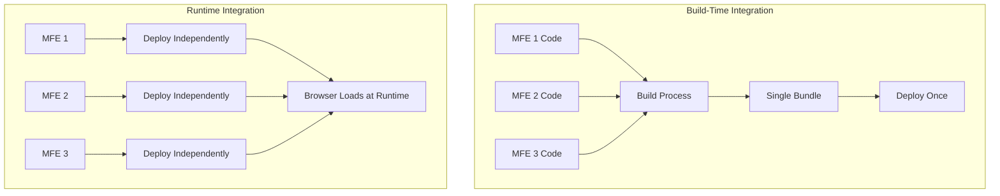
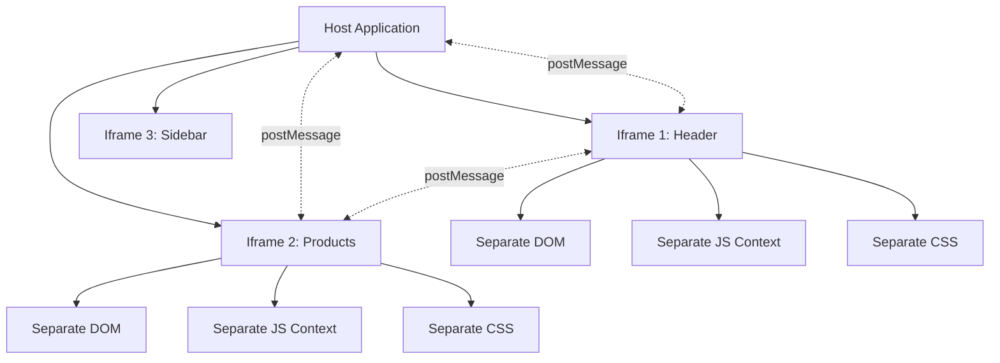
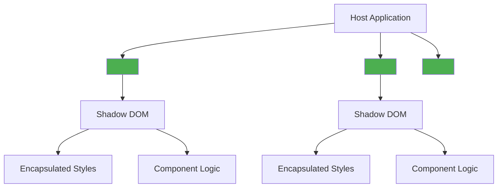
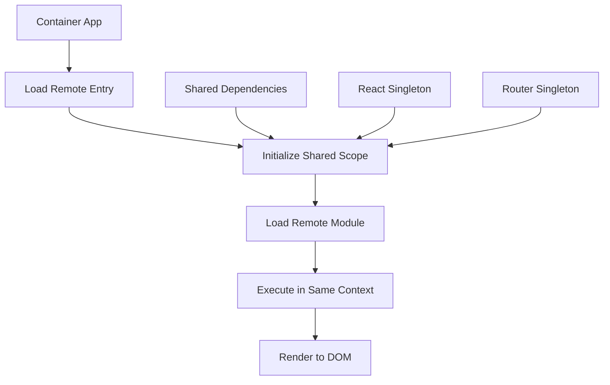
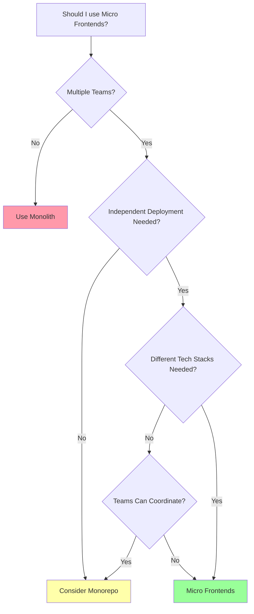

# Architecture Patterns

## Q1: What is the difference between build-time and runtime integration for micro frontends?

### Answer:
Build-time and runtime integration represent two fundamentally different approaches to composing micro frontends. Build-time integration compiles all micro frontends together during the build process, creating a single deployable artifact. Runtime integration loads and composes micro frontends dynamically in the browser, allowing independent deployment.

Runtime integration is preferred for true micro frontend architecture as it enables independent deployment, technology diversity, and team autonomy. Build-time integration is simpler but sacrifices these benefits, essentially creating a monolithic frontend from separate codebases.

### Integration Comparison:



### Code Example:

```javascript
// BUILD-TIME INTEGRATION
// Package.json - all micro frontends as dependencies
{
  "dependencies": {
    "@myapp/header": "^1.2.0",
    "@myapp/products": "^2.1.0",
    "@myapp/checkout": "^1.5.0"
  }
}

// App.jsx - Import at build time
import Header from '@myapp/header';
import Products from '@myapp/products';
import Checkout from '@myapp/checkout';

function App() {
  return (
    <div>
      <Header />
      <Routes>
        <Route path="/products" element={<Products />} />
        <Route path="/checkout" element={<Checkout />} />
      </Routes>
    </div>
  );
}

// RUNTIME INTEGRATION
// webpack.config.js - Module Federation
module.exports = {
  plugins: [
    new ModuleFederationPlugin({
      name: 'container',
      remotes: {
        header: 'header@http://localhost:3001/remoteEntry.js',
        products: 'products@http://localhost:3002/remoteEntry.js',
        checkout: 'checkout@http://localhost:3003/remoteEntry.js',
      },
      shared: {
        react: { singleton: true },
        'react-dom': { singleton: true },
      },
    }),
  ],
};

// App.jsx - Dynamic imports at runtime
import React, { lazy, Suspense } from 'react';

const Header = lazy(() => import('header/Header'));
const Products = lazy(() => import('products/Products'));
const Checkout = lazy(() => import('checkout/Checkout'));

function App() {
  return (
    <div>
      <Suspense fallback={<div>Loading...</div>}>
        <Header />
        <Routes>
          <Route path="/products" element={<Products />} />
          <Route path="/checkout" element={<Checkout />} />
        </Routes>
      </Suspense>
    </div>
  );
}

// RUNTIME WITH DYNAMIC CONFIGURATION
// config.json - Loaded at runtime
{
  "microFrontends": {
    "header": {
      "url": "https://cdn.example.com/header/v1.2.0/remoteEntry.js",
      "scope": "header",
      "module": "./Header"
    },
    "products": {
      "url": "https://cdn.example.com/products/v2.1.0/remoteEntry.js",
      "scope": "products",
      "module": "./Products"
    }
  }
}

// Dynamic loader
async function loadMicroFrontend(name, config) {
  await __webpack_init_sharing__('default');

  const container = window[config.scope];
  await container.init(__webpack_share_scopes__.default);

  const factory = await container.get(config.module);
  return factory();
}

// Usage
const config = await fetch('/config.json').then(r => r.json());
const HeaderModule = await loadMicroFrontend('header', config.microFrontends.header);
```

### Comparison Table:

| Aspect | Build-Time Integration | Runtime Integration |
|--------|------------------------|---------------------|
| **Deployment** | All together | Independent |
| **Bundle Size** | Larger single bundle | Smaller, lazy-loaded |
| **Technology** | Must match | Can differ |
| **Versioning** | Coupled versions | Independent versions |
| **Build Time** | Slower (all MFEs) | Faster (per MFE) |
| **Rollback** | Rollback everything | Rollback individual MFE |
| **Complexity** | Simple | More complex |
| **Team Autonomy** | Limited | High |

### Key Points:
- Build-time integration creates monolithic deployments despite separate codebases
- Runtime integration enables true micro frontend benefits (independent deployment)
- Build-time is simpler but loses team autonomy and deployment flexibility
- Runtime integration requires more infrastructure (CDN, versioning, orchestration)
- Module Federation is the most popular runtime integration solution
- Runtime integration supports technology diversity across teams

### Common Pitfalls:
- Choosing build-time integration and expecting micro frontend benefits
- Not considering bundle size implications of build-time integration
- Implementing runtime integration without proper version management
- Overcomplicating simple applications with runtime integration
- Not having fallback strategies for runtime loading failures

### Interview Tips:
- Explain that build-time is like a monorepo with separate packages
- Emphasize independent deployment as the key benefit of runtime
- Discuss when build-time might be acceptable (small teams, simpler apps)
- Mention Module Federation as the modern solution for runtime integration
- Show awareness of the complexity trade-offs

### Further Reading:
- [Micro Frontend Architecture Patterns](https://martinfowler.com/articles/micro-frontends.html)
- [Webpack Module Federation Documentation](https://webpack.js.org/concepts/module-federation/)

---

## Q2: What are the pros and cons of using iframes for micro frontend integration?

### Answer:
Iframes provide the strongest isolation for micro frontends by creating separate browsing contexts, but they come with significant limitations around user experience, performance, and communication complexity. Each iframe runs in its own context with separate DOM, JavaScript, and CSS, making them naturally isolated but challenging to coordinate.

While iframes are the simplest isolation mechanism, they're often considered a last resort for micro frontends due to limitations in routing, styling, accessibility, and performance. However, they remain valuable for embedding untrusted third-party content or creating strict security boundaries.

### Iframe Architecture:



### Code Example:

```javascript
// BASIC IFRAME IMPLEMENTATION
// Container app
function App() {
  return (
    <div className="app">
      <iframe
        src="http://localhost:3001/header"
        title="Header"
        style={{ width: '100%', height: '80px', border: 'none' }}
      />
      <iframe
        src="http://localhost:3002/products"
        title="Products"
        style={{ width: '100%', height: 'calc(100vh - 80px)', border: 'none' }}
      />
    </div>
  );
}

// IFRAME WITH COMMUNICATION
// Parent app (container)
function Container() {
  const [user, setUser] = useState(null);
  const headerIframeRef = useRef(null);
  const productsIframeRef = useRef(null);

  useEffect(() => {
    // Listen for messages from iframes
    const handleMessage = (event) => {
      // Security: Verify origin
      if (event.origin !== 'http://localhost:3001' &&
          event.origin !== 'http://localhost:3002') {
        return;
      }

      const { type, payload } = event.data;

      if (type === 'USER_LOGIN') {
        setUser(payload.user);
        // Broadcast to all iframes
        broadcastToIframes({ type: 'USER_UPDATED', payload: { user: payload.user } });
      } else if (type === 'NAVIGATE') {
        window.location.href = payload.url;
      }
    };

    window.addEventListener('message', handleMessage);
    return () => window.removeEventListener('message', handleMessage);
  }, []);

  const broadcastToIframes = (message) => {
    headerIframeRef.current?.contentWindow.postMessage(
      message,
      'http://localhost:3001'
    );
    productsIframeRef.current?.contentWindow.postMessage(
      message,
      'http://localhost:3002'
    );
  };

  return (
    <div>
      <iframe
        ref={headerIframeRef}
        src="http://localhost:3001/header"
        title="Header"
        style={{ width: '100%', height: '80px', border: 'none' }}
      />
      <iframe
        ref={productsIframeRef}
        src="http://localhost:3002/products"
        title="Products"
        style={{ width: '100%', height: 'calc(100vh - 80px)', border: 'none' }}
      />
    </div>
  );
}

// Child app (inside iframe)
function HeaderMicroFrontend() {
  const [user, setUser] = useState(null);

  useEffect(() => {
    // Listen for messages from parent
    const handleMessage = (event) => {
      // Security: Verify origin
      if (event.origin !== 'http://localhost:3000') {
        return;
      }

      const { type, payload } = event.data;

      if (type === 'USER_UPDATED') {
        setUser(payload.user);
      }
    };

    window.addEventListener('message', handleMessage);
    return () => window.removeEventListener('message', handleMessage);
  }, []);

  const handleLogin = async (credentials) => {
    const user = await loginUser(credentials);

    // Send message to parent
    window.parent.postMessage(
      {
        type: 'USER_LOGIN',
        payload: { user }
      },
      'http://localhost:3000'
    );
  };

  return (
    <header>
      {user ? (
        <UserMenu user={user} />
      ) : (
        <LoginButton onClick={handleLogin} />
      )}
    </header>
  );
}

// ADVANCED: IFRAME SIZING AND RESIZING
// Auto-resize iframe based on content
function AutoSizeIframe({ src, title }) {
  const iframeRef = useRef(null);

  useEffect(() => {
    const handleMessage = (event) => {
      if (event.data.type === 'RESIZE') {
        const iframe = iframeRef.current;
        if (iframe) {
          iframe.style.height = `${event.data.height}px`;
        }
      }
    };

    window.addEventListener('message', handleMessage);
    return () => window.removeEventListener('message', handleMessage);
  }, []);

  return (
    <iframe
      ref={iframeRef}
      src={src}
      title={title}
      style={{ width: '100%', border: 'none' }}
    />
  );
}

// Inside iframe - send height updates
function IframeContent() {
  useEffect(() => {
    const sendHeight = () => {
      const height = document.body.scrollHeight;
      window.parent.postMessage(
        { type: 'RESIZE', height },
        '*' // Or specify parent origin
      );
    };

    sendHeight();

    // Update on window resize
    window.addEventListener('resize', sendHeight);

    // Update when content changes
    const observer = new MutationObserver(sendHeight);
    observer.observe(document.body, {
      childList: true,
      subtree: true,
      attributes: true
    });

    return () => {
      window.removeEventListener('resize', sendHeight);
      observer.disconnect();
    };
  }, []);

  return <div>Content that may change size</div>;
}

// SECURITY: SANDBOX ATTRIBUTES
function SecureIframe({ src, title }) {
  return (
    <iframe
      src={src}
      title={title}
      sandbox="allow-scripts allow-same-origin allow-forms"
      // allow-scripts: Allow JavaScript
      // allow-same-origin: Allow accessing parent if same origin
      // allow-forms: Allow form submission
      // allow-popups: Allow opening new windows
      // allow-top-navigation: Allow navigation of top frame
      style={{ width: '100%', height: '600px', border: 'none' }}
    />
  );
}
```

### Pros and Cons:

**Pros:**
- **Perfect Isolation**: Separate DOM, CSS, JavaScript contexts
- **Security**: Strong security boundary for untrusted content
- **Technology Agnostic**: Any framework, any version, no conflicts
- **Simple Setup**: No complex build configuration required
- **Browser Support**: Works in all browsers without polyfills
- **Error Containment**: Crashes don't affect other parts

**Cons:**
- **Performance**: Each iframe is a full page load (heavy)
- **URL Routing**: Difficult to sync URL with iframe content
- **SEO**: Poor search engine indexing of iframe content
- **Accessibility**: Screen readers struggle with iframe navigation
- **Styling**: Cannot share global styles, must duplicate
- **Responsive**: Difficult to size iframes to content
- **Communication**: Async postMessage is cumbersome
- **User Experience**: Back button, history, scrolling issues

### Key Points:
- Iframes provide strongest isolation but weakest integration
- Best for embedding untrusted third-party content
- postMessage is the only communication mechanism (async, limited)
- Performance suffers from multiple page loads and separate contexts
- URL routing and deep linking are major challenges
- Consider iframes when security isolation is paramount

### Common Pitfalls:
- Not validating postMessage origin (security risk)
- Assuming iframes will be fast (they're heavy)
- Not handling iframe load errors gracefully
- Forgetting to size iframes appropriately
- Not considering SEO implications
- Overusing iframes when lighter integration methods exist

### Interview Tips:
- Explain iframes as "complete isolation but poor integration"
- Discuss postMessage security concerns (origin validation)
- Mention when iframes are appropriate (third-party, untrusted content)
- Compare to lighter integration methods (Web Components, Module Federation)
- Show awareness of UX limitations (routing, styling, accessibility)
- Discuss sandbox attributes for additional security

### Further Reading:
- [MDN: iframe Element](https://developer.mozilla.org/en-US/docs/Web/HTML/Element/iframe)
- [Cross-Document Messaging with postMessage](https://developer.mozilla.org/en-US/docs/Web/API/Window/postMessage)

---

## Q3: How can Web Components be used for micro frontend architecture?

### Answer:
Web Components provide a standards-based approach to micro frontends by creating custom, reusable HTML elements with encapsulated styles and behavior. They use native browser APIs (Custom Elements, Shadow DOM, HTML Templates) to create truly isolated components that work with any framework or vanilla JavaScript.

Web Components are ideal for micro frontends because they offer style encapsulation through Shadow DOM, framework agnosticism, and native browser support without build tools. They represent a middle ground between iframes (too isolated) and direct integration (not isolated enough).

### Web Components Architecture:



### Code Example:

```javascript
// BASIC WEB COMPONENT MICRO FRONTEND
// header-mfe.js - Header micro frontend as Web Component
class HeaderMFE extends HTMLElement {
  constructor() {
    super();

    // Create shadow DOM for style encapsulation
    this.attachShadow({ mode: 'open' });

    this.user = null;
  }

  connectedCallback() {
    this.render();
    this.attachEventListeners();
  }

  disconnectedCallback() {
    // Cleanup
    this.removeEventListeners();
  }

  // Observed attributes trigger attributeChangedCallback
  static get observedAttributes() {
    return ['user-data'];
  }

  attributeChangedCallback(name, oldValue, newValue) {
    if (name === 'user-data' && newValue) {
      this.user = JSON.parse(newValue);
      this.render();
    }
  }

  render() {
    this.shadowRoot.innerHTML = `
      <style>
        :host {
          display: block;
          width: 100%;
        }

        header {
          background: #1976d2;
          color: white;
          padding: 1rem;
          display: flex;
          justify-content: space-between;
          align-items: center;
        }

        .logo {
          font-size: 1.5rem;
          font-weight: bold;
        }

        .user-menu {
          display: flex;
          gap: 1rem;
          align-items: center;
        }

        button {
          background: white;
          color: #1976d2;
          border: none;
          padding: 0.5rem 1rem;
          border-radius: 4px;
          cursor: pointer;
        }

        button:hover {
          background: #f5f5f5;
        }
      </style>

      <header>
        <div class="logo">My App</div>
        <div class="user-menu">
          ${this.user ? `
            <span>Welcome, ${this.user.name}</span>
            <button id="logout">Logout</button>
          ` : `
            <button id="login">Login</button>
          `}
        </div>
      </header>
    `;
  }

  attachEventListeners() {
    const loginBtn = this.shadowRoot.getElementById('login');
    const logoutBtn = this.shadowRoot.getElementById('logout');

    if (loginBtn) {
      loginBtn.addEventListener('click', this.handleLogin);
    }
    if (logoutBtn) {
      logoutBtn.addEventListener('click', this.handleLogout);
    }
  }

  removeEventListeners() {
    const loginBtn = this.shadowRoot.getElementById('login');
    const logoutBtn = this.shadowRoot.getElementById('logout');

    if (loginBtn) {
      loginBtn.removeEventListener('click', this.handleLogin);
    }
    if (logoutBtn) {
      logoutBtn.removeEventListener('click', this.handleLogout);
    }
  }

  handleLogin = () => {
    // Dispatch custom event to parent
    this.dispatchEvent(new CustomEvent('login-requested', {
      bubbles: true,
      composed: true,
      detail: { timestamp: Date.now() }
    }));
  };

  handleLogout = () => {
    this.dispatchEvent(new CustomEvent('logout-requested', {
      bubbles: true,
      composed: true,
      detail: { userId: this.user?.id }
    }));
  };
}

// Register the custom element
customElements.define('header-mfe', HeaderMFE);

// REACT-BASED WEB COMPONENT
// products-mfe.js - React app wrapped as Web Component
import React from 'react';
import ReactDOM from 'react-dom/client';
import ProductsApp from './ProductsApp';

class ProductsMFE extends HTMLElement {
  constructor() {
    super();
    this.attachShadow({ mode: 'open' });
    this.root = null;
  }

  connectedCallback() {
    // Create a mount point inside shadow DOM
    const mountPoint = document.createElement('div');
    this.shadowRoot.appendChild(mountPoint);

    // Add styles
    const styles = document.createElement('style');
    styles.textContent = `
      :host {
        display: block;
        width: 100%;
      }
    `;
    this.shadowRoot.appendChild(styles);

    // Mount React app
    this.root = ReactDOM.createRoot(mountPoint);
    this.root.render(
      <ProductsApp
        onProductSelect={(product) => this.handleProductSelect(product)}
      />
    );
  }

  disconnectedCallback() {
    // Unmount React app
    if (this.root) {
      this.root.unmount();
    }
  }

  handleProductSelect(product) {
    this.dispatchEvent(new CustomEvent('product-selected', {
      bubbles: true,
      composed: true,
      detail: { product }
    }));
  }
}

customElements.define('products-mfe', ProductsMFE);

// HOST APPLICATION
// index.html
<!DOCTYPE html>
<html lang="en">
<head>
  <meta charset="UTF-8">
  <meta name="viewport" content="width=device-width, initial-scale=1.0">
  <title>Micro Frontend App</title>

  <!-- Load micro frontends -->
  <script src="http://localhost:3001/header-mfe.js"></script>
  <script src="http://localhost:3002/products-mfe.js"></script>
  <script src="http://localhost:3003/cart-mfe.js"></script>
</head>
<body>
  <div id="app">
    <header-mfe id="header"></header-mfe>
    <products-mfe id="products"></products-mfe>
    <cart-mfe id="cart"></cart-mfe>
  </div>

  <script>
    // Communication between micro frontends
    const header = document.getElementById('header');
    const products = document.getElementById('products');
    const cart = document.getElementById('cart');

    // Handle login
    header.addEventListener('login-requested', async () => {
      const user = await showLoginDialog();

      if (user) {
        // Update header with user data
        header.setAttribute('user-data', JSON.stringify(user));

        // Notify other components
        window.dispatchEvent(new CustomEvent('user-logged-in', {
          detail: { user }
        }));
      }
    });

    // Handle product selection
    products.addEventListener('product-selected', (event) => {
      const { product } = event.detail;
      cart.addProduct(product);
    });

    // Global state management
    window.addEventListener('user-logged-in', (event) => {
      console.log('User logged in:', event.detail.user);
    });
  </script>
</body>
</html>

// ADVANCED: PROPERTIES AND METHODS
class CartMFE extends HTMLElement {
  constructor() {
    super();
    this.attachShadow({ mode: 'open' });
    this._items = [];
  }

  // Public property
  get items() {
    return this._items;
  }

  set items(value) {
    this._items = value;
    this.render();
  }

  // Public method
  addProduct(product) {
    this._items.push(product);
    this.render();

    this.dispatchEvent(new CustomEvent('cart-updated', {
      bubbles: true,
      composed: true,
      detail: { items: this._items, total: this.getTotal() }
    }));
  }

  // Public method
  clearCart() {
    this._items = [];
    this.render();
  }

  getTotal() {
    return this._items.reduce((sum, item) => sum + item.price, 0);
  }

  connectedCallback() {
    this.render();
  }

  render() {
    this.shadowRoot.innerHTML = `
      <style>
        .cart {
          border: 1px solid #ddd;
          padding: 1rem;
          border-radius: 4px;
        }

        .cart-items {
          list-style: none;
          padding: 0;
        }

        .cart-item {
          display: flex;
          justify-content: space-between;
          padding: 0.5rem;
          border-bottom: 1px solid #eee;
        }

        .total {
          font-weight: bold;
          margin-top: 1rem;
          text-align: right;
        }
      </style>

      <div class="cart">
        <h3>Shopping Cart</h3>
        <ul class="cart-items">
          ${this._items.map(item => `
            <li class="cart-item">
              <span>${item.name}</span>
              <span>$${item.price}</span>
            </li>
          `).join('')}
        </ul>
        <div class="total">Total: $${this.getTotal()}</div>
      </div>
    `;
  }
}

customElements.define('cart-mfe', CartMFE);

// FRAMEWORK-AGNOSTIC WRAPPER
// Load micro frontend dynamically
async function loadMicroFrontend(url, elementName) {
  // Check if already loaded
  if (customElements.get(elementName)) {
    return;
  }

  // Load the script
  const script = document.createElement('script');
  script.src = url;
  script.type = 'module';

  return new Promise((resolve, reject) => {
    script.onload = resolve;
    script.onerror = reject;
    document.head.appendChild(script);
  });
}

// Usage
await loadMicroFrontend('http://localhost:3001/header-mfe.js', 'header-mfe');
const header = document.createElement('header-mfe');
document.body.appendChild(header);
```

### Key Points:
- Web Components use native browser APIs (no framework required)
- Shadow DOM provides true CSS encapsulation
- Custom Events enable communication between components
- Framework-agnostic: works with React, Vue, Angular, or vanilla JS
- Can wrap existing framework components as Web Components
- Properties and methods provide programmatic API
- Lifecycle callbacks manage mounting/unmounting

### Common Pitfalls:
- Not using Shadow DOM (loses style encapsulation benefit)
- Forgetting to clean up event listeners in disconnectedCallback
- Not making Custom Events bubble and compose (won't cross shadow boundary)
- Passing complex objects as attributes (use properties instead)
- Not handling browser compatibility (older browsers need polyfills)
- Over-communicating between components (tight coupling)

### Interview Tips:
- Explain Shadow DOM as CSS encapsulation mechanism
- Discuss Custom Events as the communication layer
- Mention that Web Components are framework-agnostic
- Show awareness of browser support (native in modern browsers)
- Explain when to use attributes vs properties
- Discuss lifecycle callbacks (connectedCallback, disconnectedCallback)
- Compare to iframes and Module Federation

### Further Reading:
- [MDN: Web Components](https://developer.mozilla.org/en-US/docs/Web/Web_Components)
- [Custom Elements Specification](https://html.spec.whatwg.org/multipage/custom-elements.html)

---

## Q4: What is JavaScript-based integration and when should you use it?

### Answer:
JavaScript-based integration loads micro frontends as JavaScript bundles that are executed directly in the shared browser context without iframes or Web Components. This approach uses techniques like dynamic script loading, Module Federation, or SystemJS to load and compose applications at runtime while sharing the same DOM and JavaScript environment.

JavaScript-based integration offers the best performance and seamless integration but requires careful coordination to avoid conflicts. It's ideal when you need tight integration between micro frontends, want to share dependencies, and all teams can coordinate on common standards.

### Integration Approaches:



### Code Example:

```javascript
// APPROACH 1: DYNAMIC SCRIPT LOADING
// Micro frontend loader utility
class MicroFrontendLoader {
  constructor() {
    this.cache = new Map();
  }

  async load(name, url) {
    // Check cache
    if (this.cache.has(name)) {
      return this.cache.get(name);
    }

    // Load script dynamically
    return new Promise((resolve, reject) => {
      const script = document.createElement('script');
      script.src = url;
      script.async = true;

      script.onload = () => {
        // Access global variable exposed by script
        const mfe = window[`${name}MFE`];
        if (!mfe) {
          reject(new Error(`Micro frontend ${name} not found`));
          return;
        }

        this.cache.set(name, mfe);
        resolve(mfe);
      };

      script.onerror = () => {
        reject(new Error(`Failed to load ${name} from ${url}`));
      };

      document.head.appendChild(script);
    });
  }

  async loadAll(config) {
    const promises = Object.entries(config).map(([name, url]) =>
      this.load(name, url)
    );

    return Promise.all(promises);
  }
}

// Micro frontend bundle exposes itself globally
// header/src/bootstrap.js
import React from 'react';
import ReactDOM from 'react-dom/client';
import Header from './Header';

// Expose mount function globally
window.headerMFE = {
  mount: (containerId, props = {}) => {
    const container = document.getElementById(containerId);
    const root = ReactDOM.createRoot(container);
    root.render(<Header {...props} />);

    return {
      unmount: () => root.unmount()
    };
  }
};

// Host application
const loader = new MicroFrontendLoader();

async function initializeApp() {
  const config = {
    header: 'http://localhost:3001/header.bundle.js',
    products: 'http://localhost:3002/products.bundle.js',
    cart: 'http://localhost:3003/cart.bundle.js',
  };

  try {
    // Load all micro frontends
    await loader.loadAll(config);

    // Mount them
    const headerInstance = window.headerMFE.mount('header-container', {
      onUserChange: (user) => {
        // Handle user change
        window.productsM FE.updateUser(user);
        window.cartMFE.updateUser(user);
      }
    });

    const productsInstance = window.productsMFE.mount('products-container');
    const cartInstance = window.cartMFE.mount('cart-container');

    // Store instances for cleanup
    window.mfeInstances = {
      header: headerInstance,
      products: productsInstance,
      cart: cartInstance
    };
  } catch (error) {
    console.error('Failed to initialize micro frontends:', error);
  }
}

// APPROACH 2: WEBPACK MODULE FEDERATION
// Header micro frontend - webpack.config.js
const ModuleFederationPlugin = require('webpack/lib/container/ModuleFederationPlugin');

module.exports = {
  plugins: [
    new ModuleFederationPlugin({
      name: 'header',
      filename: 'remoteEntry.js',
      exposes: {
        './Header': './src/components/Header',
        './UserMenu': './src/components/UserMenu',
      },
      shared: {
        react: {
          singleton: true,
          requiredVersion: '^18.0.0',
        },
        'react-dom': {
          singleton: true,
          requiredVersion: '^18.0.0',
        },
        'react-router-dom': {
          singleton: true,
        },
      },
    }),
  ],
};

// Container app - webpack.config.js
module.exports = {
  plugins: [
    new ModuleFederationPlugin({
      name: 'container',
      remotes: {
        header: 'header@http://localhost:3001/remoteEntry.js',
        products: 'products@http://localhost:3002/remoteEntry.js',
        cart: 'cart@http://localhost:3003/remoteEntry.js',
      },
      shared: {
        react: { singleton: true, requiredVersion: '^18.0.0' },
        'react-dom': { singleton: true, requiredVersion: '^18.0.0' },
        'react-router-dom': { singleton: true },
      },
    }),
  ],
};

// Container app usage
import React, { lazy, Suspense } from 'react';
import { BrowserRouter, Routes, Route } from 'react-router-dom';

// Lazy load remote modules
const Header = lazy(() => import('header/Header'));
const Products = lazy(() => import('products/Products'));
const Cart = lazy(() => import('cart/Cart'));

function App() {
  const [user, setUser] = useState(null);

  return (
    <BrowserRouter>
      <Suspense fallback={<div>Loading...</div>}>
        <Header user={user} onUserChange={setUser} />

        <Routes>
          <Route
            path="/products"
            element={<Products user={user} />}
          />
          <Route
            path="/cart"
            element={<Cart user={user} />}
          />
        </Routes>
      </Suspense>
    </BrowserRouter>
  );
}

// APPROACH 3: SYSTEMJS (Legacy/Flexible)
// system.config.js
System.config({
  map: {
    'header': 'http://localhost:3001/header.js',
    'products': 'http://localhost:3002/products.js',
    'cart': 'http://localhost:3003/cart.js',
    'react': 'https://cdn.jsdelivr.net/npm/react@18/umd/react.production.min.js',
    'react-dom': 'https://cdn.jsdelivr.net/npm/react-dom@18/umd/react-dom.production.min.js',
  }
});

// Load and use
System.import('react').then(React => {
  System.import('react-dom').then(ReactDOM => {
    System.import('header').then(Header => {
      ReactDOM.render(
        React.createElement(Header.default),
        document.getElementById('header')
      );
    });
  });
});

// APPROACH 4: IMPORT MAPS (Modern)
// index.html
<script type="importmap">
{
  "imports": {
    "react": "https://esm.sh/react@18",
    "react-dom": "https://esm.sh/react-dom@18",
    "header-mfe": "http://localhost:3001/header.js",
    "products-mfe": "http://localhost:3002/products.js"
  }
}
</script>

<script type="module">
  import React from 'react';
  import ReactDOM from 'react-dom';
  import Header from 'header-mfe';
  import Products from 'products-mfe';

  // Use normally
  ReactDOM.render(
    <div>
      <Header />
      <Products />
    </div>,
    document.getElementById('root')
  );
</script>

// ERROR HANDLING AND FALLBACKS
class ResilientMFELoader {
  async loadWithRetry(name, url, maxRetries = 3) {
    for (let i = 0; i < maxRetries; i++) {
      try {
        return await this.load(name, url);
      } catch (error) {
        if (i === maxRetries - 1) {
          console.error(`Failed to load ${name} after ${maxRetries} attempts`);
          return this.loadFallback(name);
        }

        // Exponential backoff
        await new Promise(resolve => setTimeout(resolve, Math.pow(2, i) * 1000));
      }
    }
  }

  loadFallback(name) {
    return {
      mount: (containerId) => {
        const container = document.getElementById(containerId);
        container.innerHTML = `
          <div class="mfe-error">
            <p>Failed to load ${name} component</p>
            <button onclick="location.reload()">Retry</button>
          </div>
        `;
        return { unmount: () => container.innerHTML = '' };
      }
    };
  }
}

// SHARED DEPENDENCY MANAGEMENT
// Ensure singleton dependencies
window.__SHARED_DEPS__ = window.__SHARED_DEPS__ || {};

function getSharedDependency(name, factory) {
  if (!window.__SHARED_DEPS__[name]) {
    window.__SHARED_DEPS__[name] = factory();
  }
  return window.__SHARED_DEPS__[name];
}

// Micro frontend uses shared React
import * as React from 'react';

const sharedReact = getSharedDependency('react', () => React);
export default sharedReact;
```

### Comparison of Approaches:

| Approach | Complexity | Flexibility | Performance | Browser Support |
|----------|------------|-------------|-------------|-----------------|
| **Dynamic Scripts** | Low | Medium | Good | Excellent |
| **Module Federation** | Medium | High | Excellent | Good (webpack 5+) |
| **SystemJS** | Medium | High | Good | Excellent |
| **Import Maps** | Low | Medium | Excellent | Modern browsers |

### Key Points:
- JavaScript-based integration shares the same browser context
- Module Federation is the most popular modern solution
- Shared dependencies reduce bundle size but require coordination
- Dynamic imports enable code splitting and lazy loading
- Error handling and fallbacks are critical for production
- All micro frontends must coordinate on dependency versions

### Common Pitfalls:
- Not sharing dependencies (bundle duplication)
- Version conflicts in shared dependencies
- Global scope pollution (use namespacing)
- Not handling loading failures gracefully
- Forgetting to clean up when unmounting
- Not implementing proper error boundaries

### Interview Tips:
- Explain Module Federation as the modern standard
- Discuss shared dependency management and singleton patterns
- Mention the importance of error handling and fallbacks
- Compare to iframe isolation (trade-offs)
- Show awareness of version management challenges
- Discuss when JavaScript integration is appropriate vs Web Components

### Further Reading:
- [Webpack Module Federation](https://webpack.js.org/concepts/module-federation/)
- [Import Maps Specification](https://github.com/WICG/import-maps)

---

## Q5: When should you use micro frontends vs a monolithic frontend?

### Answer:
The decision between micro frontends and a monolithic frontend depends on team structure, application complexity, deployment requirements, and technical constraints. Micro frontends add significant complexity and overhead, so they're only beneficial when you have multiple teams working independently, need different deployment cadences, or require technology diversity.

Micro frontends are not a silver bullet. They introduce challenges in consistency, performance, and complexity that must be justified by organizational needs. For small teams or simple applications, a well-structured monolith is often the better choice.

### Decision Framework:



### Comparison:

| Factor | Micro Frontends | Monolithic Frontend |
|--------|-----------------|---------------------|
| **Team Size** | Multiple teams (10+ developers) | Single team (&lt;10 developers) |
| **Deployment** | Independent, frequent | Coordinated, less frequent |
| **Technology** | Can differ per team | Shared stack |
| **Build Time** | Faster (per MFE) | Slower (entire app) |
| **Complexity** | High (coordination) | Lower (single codebase) |
| **Bundle Size** | Potentially larger (duplication) | Optimized |
| **Testing** | Isolated + integration | End-to-end |
| **Consistency** | Harder to maintain | Easier to maintain |
| **Initial Setup** | Complex | Simple |
| **Maintenance** | Distributed | Centralized |

### Use Micro Frontends When:

```javascript
// GOOD USE CASE: Large organization with independent teams
// Scenario: E-commerce platform with separate teams

// Team A: Header & Navigation (deployed weekly)
// Team B: Product Catalog (deployed daily)
// Team C: Checkout Flow (deployed carefully, less often)
// Team D: User Profile (deployed independently)

// Each team can:
// 1. Deploy independently
// 2. Use their preferred framework/version
// 3. Scale their team without affecting others
// 4. Own their entire vertical (frontend + backend)

// Container app coordinates everything
const microFrontendConfig = {
  header: {
    team: 'Team A',
    url: 'https://cdn.example.com/header/v1.2.0/',
    deploymentFrequency: 'weekly'
  },
  products: {
    team: 'Team B',
    url: 'https://cdn.example.com/products/v3.5.1/',
    deploymentFrequency: 'daily'
  },
  checkout: {
    team: 'Team C',
    url: 'https://cdn.example.com/checkout/v2.1.0/',
    deploymentFrequency: 'monthly'
  }
};

// GOOD USE CASE: Gradual migration from legacy
// Scenario: Migrating from Angular to React

// Old Angular app runs in parallel with new React features
function App() {
  return (
    <div>
      {/* Legacy Angular app */}
      <angular-legacy-app />

      {/* New React features */}
      <Routes>
        <Route path="/new-dashboard" element={<NewDashboard />} />
        <Route path="/new-analytics" element={<NewAnalytics />} />
      </Routes>
    </div>
  );
}

// Over time, migrate pieces from Angular to React
// without rewriting everything at once
```

### Use Monolithic Frontend When:

```javascript
// GOOD USE CASE: Small to medium team
// Scenario: Startup with 5-8 developers

// Single React app with good architecture
src/
  features/
    products/
      ProductList.jsx
      ProductDetail.jsx
    checkout/
      Cart.jsx
      Checkout.jsx
    user/
      Profile.jsx
      Settings.jsx

// Benefits:
// 1. Simpler mental model
// 2. Easier to refactor across features
// 3. Better code reuse
// 4. Easier testing and debugging
// 5. No coordination overhead

// Can still have good boundaries without micro frontends
function App() {
  return (
    <BrowserRouter>
      <Header />
      <Routes>
        <Route path="/products/*" element={<ProductsFeature />} />
        <Route path="/checkout/*" element={<CheckoutFeature />} />
        <Route path="/profile/*" element={<UserFeature />} />
      </Routes>
    </BrowserRouter>
  );
}

// GOOD USE CASE: Highly integrated features
// Scenario: Real-time collaboration tool

// Features need to communicate constantly
function CollaborationApp() {
  // Shared real-time state
  const { document, users, cursor } = useCollaboration();

  return (
    <div>
      {/* All components share state seamlessly */}
      <Editor document={document} users={users} />
      <UserList users={users} />
      <Chat users={users} />
      <Cursors positions={cursor} users={users} />
    </div>
  );
}

// Micro frontends would add unnecessary complexity here
```

### Anti-Patterns:

```javascript
// DON'T: Use micro frontends for small teams
// Problem: Overhead > Benefits
const twoPersonTeam = {
  complexity: 'high',
  coordination: 'unnecessary',
  benefit: 'none',
  verdict: 'Use monolith'
};

// DON'T: Use micro frontends for tightly coupled features
// Problem: Constant communication between MFEs
function TightlyCoupled() {
  // MFE 1 needs data from MFE 2
  // MFE 2 needs to know when MFE 1 updates
  // MFE 3 depends on both MFE 1 and MFE 2
  // = Better as a monolith with good architecture
}

// DON'T: Use micro frontends without proper infrastructure
const missingInfrastructure = {
  noCDN: 'Slow loading',
  noVersioning: 'Breaking changes',
  noMonitoring: 'Cannot debug',
  noErrorHandling: 'Poor UX',
  verdict: 'Not ready for production'
};

// DON'T: Use micro frontends for performance
// Reality: Micro frontends often HURT performance
const performanceMyth = {
  reality: 'More HTTP requests, duplicate dependencies',
  benefit: 'Only from independent deployments (faster fixes)',
  initialLoad: 'Usually slower than monolith',
  verdict: 'Not a performance optimization'
};
```

### Middle Ground: Monorepo

```javascript
// Consider a monorepo for medium-sized teams
// Benefits of both approaches

// package.json (workspace root)
{
  "workspaces": [
    "apps/container",
    "apps/products",
    "apps/checkout",
    "packages/shared-ui",
    "packages/shared-auth"
  ]
}

// Benefits:
// - Separate codebases (team ownership)
// - Shared dependencies (no duplication)
// - Coordinated deployment (simpler)
// - Easy code sharing (shared packages)
// - Single PR for cross-cutting changes

// Can evolve to micro frontends if needed later
```

### Key Points:
- Micro frontends are for organizational scaling, not technical scaling
- Small teams should use monoliths with good architecture
- Multiple independent teams are the primary indicator for micro frontends
- Monoliths are simpler to build, test, and maintain
- Micro frontends introduce performance overhead (must be justified)
- Can start with monolith and migrate to micro frontends later

### Common Pitfalls:
- Choosing micro frontends prematurely (before team size justifies it)
- Using micro frontends to fix poor monolith architecture
- Not considering a well-structured monolith or monorepo first
- Underestimating micro frontend complexity
- Expecting performance improvements (often opposite)
- Not having proper infrastructure before implementing

### Interview Tips:
- Emphasize that micro frontends solve organizational problems
- Discuss team size as the primary decision factor
- Show awareness of complexity trade-offs
- Mention monorepo as a middle-ground solution
- Explain when a monolith is actually better
- Reference Conway's Law (architecture mirrors organization)
- Discuss migration strategies (gradual, not big bang)

### Further Reading:
- [Martin Fowler: Micro Frontends](https://martinfowler.com/articles/micro-frontends.html)
- [When Not To Use Micro Frontends](https://www.youtube.com/watch?v=9Xo-rGUq-6E)
