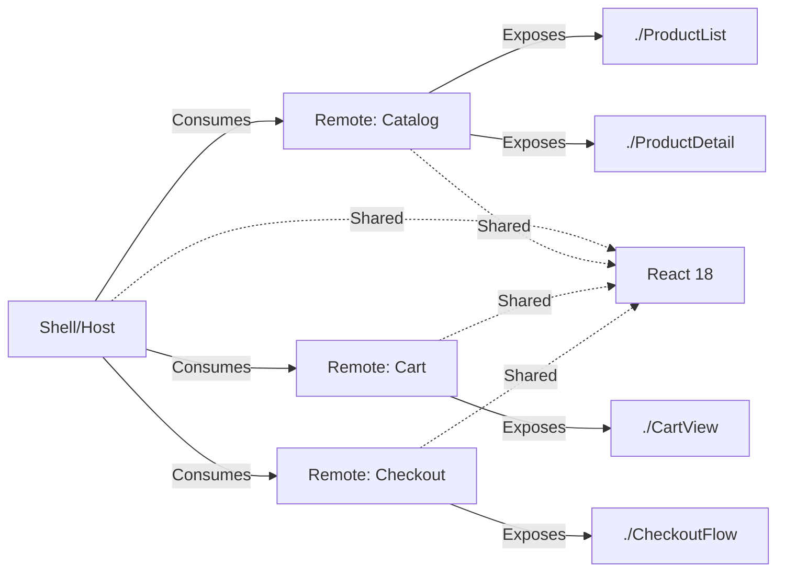

# Module Federation

## Q1: What is Webpack Module Federation and how does it work?

### Answer:
Webpack Module Federation is a revolutionary feature in Webpack 5 that enables JavaScript applications to dynamically load code from other applications at runtime. It allows multiple independent builds to form a single application, where each build can expose and consume modules from other builds, creating a true micro frontend architecture with shared dependencies.

Module Federation works by creating a "container" that exposes modules and can consume modules from other containers. At runtime, the application loads remote modules as if they were local, with Webpack handling the module resolution, dependency sharing, and version management automatically.

### Architecture:



### Code Example:

```javascript
// Remote application (product-catalog)
// webpack.config.js
const ModuleFederationPlugin = require('webpack/lib/container/ModuleFederationPlugin');

module.exports = {
  plugins: [
    new ModuleFederationPlugin({
      name: 'productCatalog',
      filename: 'remoteEntry.js',
      exposes: {
        './ProductList': './src/components/ProductList',
        './ProductDetail': './src/components/ProductDetail'
      },
      shared: {
        react: {
          singleton: true,
          requiredVersion: '^18.0.0',
          strictVersion: true
        },
        'react-dom': {
          singleton: true,
          requiredVersion: '^18.0.0'
        }
      }
    })
  ]
};

// Host application (shell)
// webpack.config.js
module.exports = {
  plugins: [
    new ModuleFederationPlugin({
      name: 'shell',
      remotes: {
        productCatalog: 'productCatalog@http://localhost:3001/remoteEntry.js',
        shoppingCart: 'shoppingCart@http://localhost:3002/remoteEntry.js'
      },
      shared: {
        react: { singleton: true, requiredVersion: '^18.0.0' },
        'react-dom': { singleton: true, requiredVersion: '^18.0.0' }
      }
    })
  ]
};

// Using remote modules in host
import React, { lazy, Suspense } from 'react';

const ProductList = lazy(() => import('productCatalog/ProductList'));
const CartView = lazy(() => import('shoppingCart/CartView'));

function App() {
  return (
    <Suspense fallback={<div>Loading...</div>}>
      <ProductList />
      <CartView />
    </Suspense>
  );
}
```

### Key Points:
- Runtime integration without build-time coupling
- Shared dependencies loaded once (singleton pattern)
- Each micro frontend deployed independently
- Automatic dependency resolution and version management
- Supports any JavaScript framework
- Better performance than iframes

### Common Pitfalls:
- Not configuring shared dependencies correctly
- Version mismatches breaking application
- Missing error boundaries for remote failures
- Not handling network failures gracefully
- Circular dependencies between remotes

### Interview Tips:
- Explain host vs remote relationship
- Discuss singleton shared dependencies
- Mention version management challenges
- Show awareness of deployment complexity
- Compare to older micro frontend approaches

### Further Reading:
- [Module Federation Documentation](https://webpack.js.org/concepts/module-federation/)
- [Module Federation Examples](https://github.com/module-federation/module-federation-examples)

---

## Q2: How do you handle shared dependencies in Module Federation?

### Answer:
Shared dependencies in Module Federation prevent loading duplicate copies of libraries like React, reducing bundle size and preventing issues from multiple framework instances. The `shared` configuration defines which dependencies should be shared between host and remotes, with options for version requirements, singleton mode, and fallback behavior.

Proper shared dependency management is critical - incorrect configuration can lead to version conflicts, duplicate loads, or application crashes. The strategy depends on whether dependencies must be singletons (React, React-DOM), can have multiple versions (utility libraries), or should never be shared (incompatible APIs).

### Configuration Example:

```javascript
// Advanced shared dependency configuration
const ModuleFederationPlugin = require('webpack/lib/container/ModuleFederationPlugin');
const packageJson = require('./package.json');

module.exports = {
  plugins: [
    new ModuleFederationPlugin({
      name: 'myApp',
      shared: {
        // Singleton: only one version loaded
        react: {
          singleton: true,  // Error if multiple versions
          requiredVersion: packageJson.dependencies.react,
          strictVersion: true  // Fail if version doesn't match
        },

        'react-dom': {
          singleton: true,
          requiredVersion: packageJson.dependencies['react-dom']
        },

        // Allowed multiple versions
        lodash: {
          singleton: false,  // Each remote can have different version
          requiredVersion: false
        },

        // Eager loading (loaded immediately)
        'react-router-dom': {
          singleton: true,
          eager: true,  // Don't code-split this dependency
          requiredVersion: '^6.0.0'
        },

        // Package scope sharing
        '@material-ui': {
          singleton: true,
          requiredVersion: false
        }
      }
    })
  ]
};

// Automatic package.json sharing
const deps = packageJson.dependencies;

module.exports = {
  plugins: [
    new ModuleFederationPlugin({
      shared: {
        ...deps,  // Share all dependencies
        react: {
          singleton: true,
          requiredVersion: deps.react
        },
        'react-dom': {
          singleton: true,
          requiredVersion: deps['react-dom']
        }
      }
    })
  ]
};
```

### Version Conflict Handling:

```javascript
// Host requires React 18.2.0
// Remote A has React 18.1.0
// Remote B has React 18.2.0

// Strategy 1: Strict version (fail fast)
shared: {
  react: {
    singleton: true,
    strictVersion: true,  // App won't load if versions don't match
    requiredVersion: '18.2.0'
  }
}

// Strategy 2: Lenient version (use highest)
shared: {
  react: {
    singleton: true,
    strictVersion: false,  // Use highest compatible version
    requiredVersion: '^18.0.0'
  }
}

// Strategy 3: Fallback version
shared: {
  react: {
    singleton: true,
    requiredVersion: '^18.0.0',
    eager: false,
    import: 'react'  // Fallback if remote doesn't provide
  }
}
```

### Error Handling:

```javascript
// Handle remote module loading failures
import React, { lazy, Suspense, Component } from 'react';

class ErrorBoundary extends Component {
  constructor(props) {
    super(props);
    this.state = { hasError: false };
  }

  static getDerivedStateFromError(error) {
    return { hasError: true };
  }

  componentDidCatch(error, errorInfo) {
    console.error('Remote module failed:', error, errorInfo);
  }

  render() {
    if (this.state.hasError) {
      return <div>Failed to load module. Please refresh.</div>;
    }
    return this.props.children;
  }
}

const RemoteComponent = lazy(() =>
  import('remote/Component')
    .catch(err => {
      console.error('Failed to load remote:', err);
      return { default: () => <div>Module unavailable</div> };
    })
);

function App() {
  return (
    <ErrorBoundary>
      <Suspense fallback={<div>Loading...</div>}>
        <RemoteComponent />
      </Suspense>
    </ErrorBoundary>
  );
}
```

### Key Points:
- Use singleton for React, React-DOM (prevents multiple instances)
- Configure requiredVersion to prevent incompatibilities
- Use strictVersion for critical dependencies
- Implement error boundaries for remote failures
- Share common dependencies, not all dependencies
- Test version compatibility thoroughly

### Common Pitfalls:
- Not using singleton for React (multiple React instances crash)
- Sharing too many dependencies (increased complexity)
- Not handling version mismatches
- Missing error boundaries
- Not testing cross-version compatibility

### Interview Tips:
- Explain singleton pattern importance
- Discuss version conflict strategies
- Mention error handling for remote failures
- Show awareness of bundle size implications
- Discuss testing strategies

### Further Reading:
- [Shared Dependencies Guide](https://webpack.js.org/concepts/module-federation/#shared-dependencies)
- [Module Federation Best Practices](https://www.angulararchitects.io/aktuelles/the-microfrontend-revolution-module-federation-in-webpack-5/)

---

## Q3: How do you implement dynamic remotes in Module Federation?

### Answer:
Dynamic remotes allow loading remote modules from URLs determined at runtime rather than build time, enabling flexible deployment strategies, A/B testing, feature flags, and environment-specific configurations. Instead of hard-coding remote URLs in webpack config, you load them dynamically based on runtime conditions, API responses, or user permissions.

This approach is essential for production systems where remote locations change based on environment (dev/staging/prod), multi-tenant scenarios, or when implementing canary deployments and gradual rollouts.

### Code Example:

```javascript
// webpack.config.js - No hard-coded remotes
module.exports = {
  plugins: [
    new ModuleFederationPlugin({
      name: 'shell',
      remotes: {},  // Empty - loaded dynamically
      shared: ['react', 'react-dom']
    })
  ]
};

// Dynamic remote loading utility
const remoteCache = new Map();

export async function loadRemote(url, scope, module) {
  // Check cache first
  const cacheKey = `${url}#${scope}#${module}`;
  if (remoteCache.has(cacheKey)) {
    return remoteCache.get(cacheKey);
  }

  // Load remote container
  await loadScript(url);

  // Initialize shared scope
  await __webpack_init_sharing__('default');
  const container = window[scope];
  await container.init(__webpack_share_scopes__.default);

  // Get module factory
  const factory = await container.get(module);
  const Module = factory();

  // Cache result
  remoteCache.set(cacheKey, Module);
  return Module;
}

function loadScript(url) {
  return new Promise((resolve, reject) => {
    const existingScript = document.querySelector(`script[src="${url}"]`);
    if (existingScript) {
      resolve();
      return;
    }

    const script = document.createElement('script');
    script.src = url;
    script.type = 'text/javascript';
    script.async = true;
    script.onload = resolve;
    script.onerror = reject;
    document.head.appendChild(script);
  });
}

// React component using dynamic remote
import React, { lazy, Suspense, useEffect, useState } from 'react';

function DynamicMicroFrontend({ remoteName, moduleName }) {
  const [Component, setComponent] = useState(null);
  const [error, setError] = useState(null);

  useEffect(() => {
    // Fetch remote configuration from API
    fetch('/api/micro-frontends/config')
      .then(res => res.json())
      .then(config => {
        const remoteUrl = config[remoteName];
        return loadRemote(remoteUrl, remoteName, moduleName);
      })
      .then(module => {
        setComponent(() => module.default);
      })
      .catch(err => {
        console.error('Failed to load remote:', err);
        setError(err.message);
      });
  }, [remoteName, moduleName]);

  if (error) {
    return <div>Failed to load: {error}</div>;
  }

  if (!Component) {
    return <div>Loading...</div>;
  }

  return <Component />;
}

// Usage with environment-based URLs
const MFE_URLS = {
  development: {
    productCatalog: 'http://localhost:3001/remoteEntry.js',
    shoppingCart: 'http://localhost:3002/remoteEntry.js'
  },
  production: {
    productCatalog: 'https://catalog.example.com/remoteEntry.js',
    shoppingCart: 'https://cart.example.com/remoteEntry.js'
  }
};

function App() {
  const env = process.env.NODE_ENV;
  const config = MFE_URLS[env];

  return (
    <div>
      <DynamicMicroFrontend
        remoteName="productCatalog"
        remoteUrl={config.productCatalog}
        moduleName="./ProductList"
      />
    </div>
  );
}

// A/B testing with dynamic remotes
async function loadABTestRemote() {
  const userId = getCurrentUserId();
  const variant = await getABTestVariant(userId, 'new-checkout');

  const checkoutUrl = variant === 'A'
    ? 'https://checkout-v1.example.com/remoteEntry.js'
    : 'https://checkout-v2.example.com/remoteEntry.js';

  return loadRemote(checkoutUrl, 'checkout', './CheckoutFlow');
}

// Feature flag based loading
async function loadFeatureFlaggedRemote(featureName) {
  const flags = await fetch('/api/feature-flags').then(r => r.json());

  if (flags[featureName]) {
    return loadRemote(
      'https://new-feature.example.com/remoteEntry.js',
      'newFeature',
      './Component'
    );
  }

  // Fallback to old version
  return loadRemote(
    'https://old-feature.example.com/remoteEntry.js',
    'oldFeature',
    './Component'
  );
}
```

### Key Points:
- Dynamic remotes enable runtime URL configuration
- Essential for multi-environment deployments
- Enables A/B testing and feature flags
- Supports canary deployments
- Requires proper error handling
- Cache remote loads to avoid duplicate fetches

### Common Pitfalls:
- Not caching dynamically loaded remotes
- Missing error handling for network failures
- Not invalidating cache when versions update
- Security issues with user-controlled URLs
- Complex debugging due to runtime loading

### Interview Tips:
- Explain use cases (environments, A/B testing)
- Discuss caching strategy
- Mention error handling requirements
- Show awareness of security considerations
- Compare to static remote configuration

### Further Reading:
- [Dynamic Remotes Guide](https://webpack.js.org/concepts/module-federation/#dynamic-remote-containers)
- [Runtime Loading Best Practices](https://www.angulararchitects.io/aktuelles/the-microfrontend-revolution-part-2-module-federation-with-angular/)
