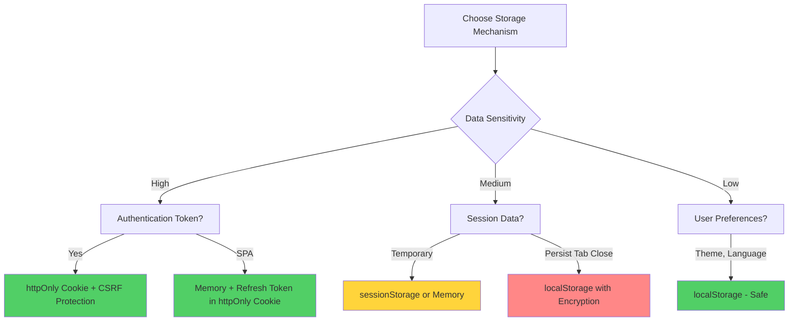
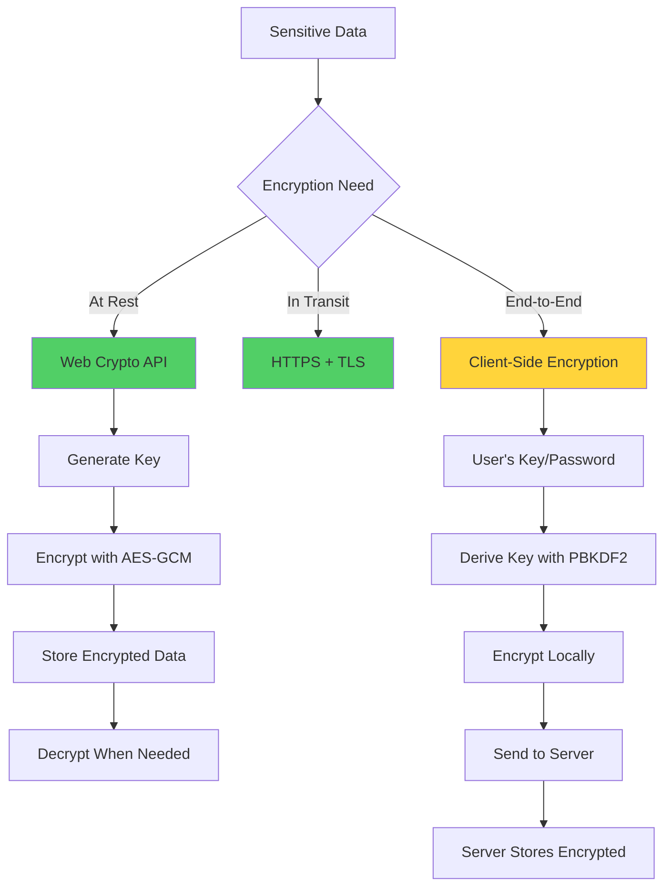
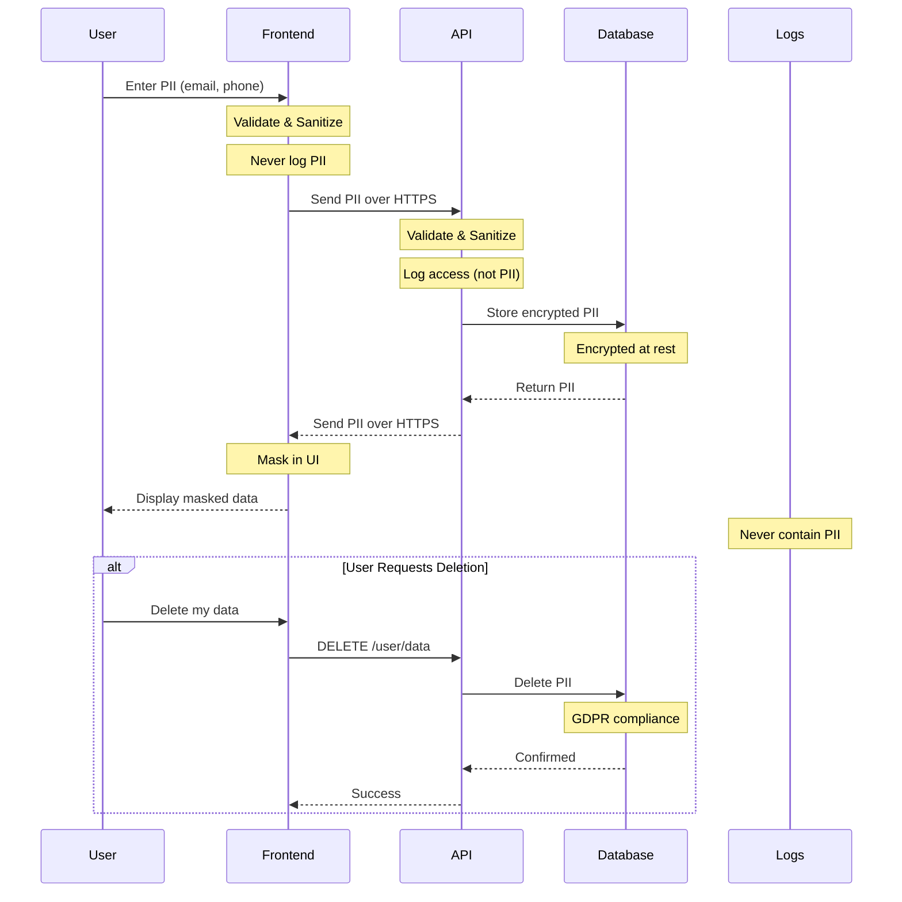
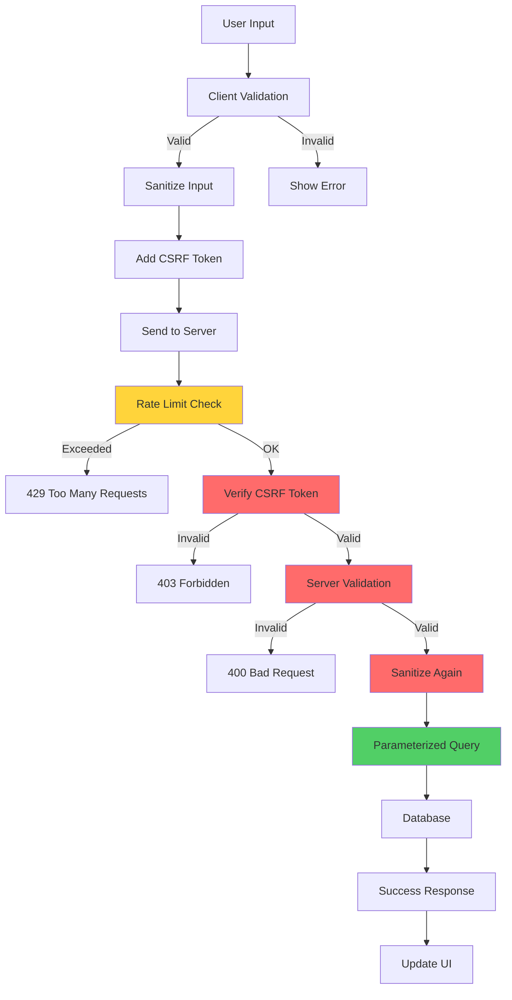
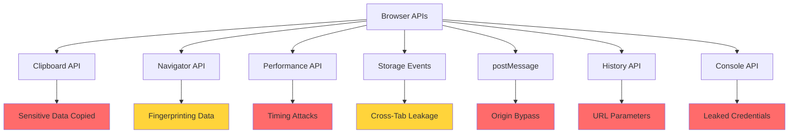

# Secure Data Handling

## Q1: How do you choose between localStorage, sessionStorage, cookies, and memory for storing sensitive data?

### Answer:
Choosing the right storage mechanism is critical for application security. Each option has distinct security characteristics: localStorage persists across sessions but is vulnerable to XSS; sessionStorage is temporary and XSS-vulnerable; httpOnly cookies are immune to XSS but require CSRF protection; and in-memory storage is most secure but doesn't persist across page refreshes.

The choice depends on your security requirements, data sensitivity, and user experience needs. For authentication tokens in high-security applications, use httpOnly cookies with refresh tokens. For temporary session data, use memory storage with a refresh mechanism. Never store sensitive data like passwords, credit cards, or API keys in localStorage or sessionStorage.

### Storage Comparison:



### Storage Options Deep Dive:

**Detailed Comparison Table:**

| Feature | localStorage | sessionStorage | httpOnly Cookie | Memory (JS Variable) |
|---------|--------------|----------------|-----------------|----------------------|
| **XSS Protection** | ❌ No | ❌ No | ✅ Yes | ✅ Yes |
| **CSRF Protection** | ✅ Yes | ✅ Yes | ❌ No (needs SameSite) | ✅ Yes |
| **Persists Browser Close** | ✅ Yes | ❌ No | ✅ Yes (configurable) | ❌ No |
| **Persists Tab Close** | ✅ Yes | ❌ No | ✅ Yes (configurable) | ❌ No |
| **Cross-Tab Sharing** | ✅ Yes | ❌ No | ✅ Yes | ❌ No |
| **Size Limit** | ~5-10 MB | ~5-10 MB | ~4 KB | Limited by RAM |
| **Server Access** | ❌ No | ❌ No | ✅ Yes (auto-sent) | ❌ No |
| **Client Access** | ✅ Yes | ✅ Yes | ⚠️ No (if httpOnly) | ✅ Yes |
| **Automatically Sent** | ❌ No | ❌ No | ✅ Yes | ❌ No |
| **Use Case** | Non-sensitive prefs | Temp wizard state | Auth tokens | Sensitive runtime data |

### Code Examples:

```javascript
// 1. localStorage - ONLY for non-sensitive data
// ✅ GOOD: User preferences
localStorage.setItem('theme', 'dark');
localStorage.setItem('language', 'en');

// ❌ BAD: Sensitive data (vulnerable to XSS)
localStorage.setItem('authToken', 'eyJhbGc...'); // DON'T DO THIS
localStorage.setItem('creditCard', '4111-1111-1111-1111'); // NEVER!

// Reading from localStorage
const theme = localStorage.getItem('theme');

// Remove item
localStorage.removeItem('theme');

// Clear all
localStorage.clear();

// Listen for storage changes (cross-tab communication)
window.addEventListener('storage', (e) => {
  if (e.key === 'theme') {
    console.log('Theme changed to:', e.newValue);
    applyTheme(e.newValue);
  }
});

// 2. sessionStorage - Temporary, per-tab data
// ✅ GOOD: Multi-step form wizard
sessionStorage.setItem('wizardStep', '3');
sessionStorage.setItem('formDraft', JSON.stringify(formData));

// ❌ BAD: Still vulnerable to XSS
sessionStorage.setItem('tempToken', token); // Avoid for sensitive data

// sessionStorage is isolated per tab
// Tab 1:
sessionStorage.setItem('data', 'tab1');
// Tab 2:
sessionStorage.setItem('data', 'tab2'); // Different value, different tab

// 3. httpOnly Cookies - Best for authentication
// Backend (Node.js/Express)
app.post('/auth/login', async (req, res) => {
  const user = await authenticateUser(req.body.username, req.body.password);

  if (user) {
    const token = generateJWT(user);

    // Set httpOnly cookie (immune to XSS)
    res.cookie('authToken', token, {
      httpOnly: true,      // Cannot be accessed via JavaScript
      secure: true,        // Only sent over HTTPS
      sameSite: 'strict',  // CSRF protection
      maxAge: 3600000,     // 1 hour in milliseconds
      path: '/',           // Available for all routes
      domain: '.example.com' // Available for subdomains
    });

    res.json({ success: true, user: { id: user.id, name: user.name } });
  }
});

// Frontend - Cookie sent automatically with requests
// No JavaScript access needed!
async function fetchUserProfile() {
  // authToken cookie automatically included
  const response = await fetch('/api/user/profile', {
    credentials: 'include' // Include cookies in request
  });
  return response.json();
}

// 4. In-Memory Storage - Most Secure
class SecureTokenManager {
  // Private field - only accessible within this class
  #accessToken = null;
  #refreshToken = null;

  constructor() {
    // Tokens only exist in memory
    this.#accessToken = null;
    this.#refreshToken = null;
  }

  setTokens(accessToken, refreshToken) {
    this.#accessToken = accessToken;
    // Refresh token stored in httpOnly cookie (server-side)
    this.#refreshToken = null; // Never store refresh token in memory
  }

  getAccessToken() {
    return this.#accessToken;
  }

  clearTokens() {
    this.#accessToken = null;
    this.#refreshToken = null;
  }

  async refreshAccessToken() {
    try {
      // Refresh token sent via httpOnly cookie
      const response = await fetch('/api/auth/refresh', {
        method: 'POST',
        credentials: 'include'
      });

      if (response.ok) {
        const { accessToken } = await response.json();
        this.#accessToken = accessToken;
        return accessToken;
      }
    } catch (error) {
      console.error('Token refresh failed:', error);
      this.clearTokens();
      // Redirect to login
      window.location.href = '/login';
    }
    return null;
  }
}

// Global instance
const tokenManager = new SecureTokenManager();

// Axios interceptor for automatic token injection
import axios from 'axios';

const api = axios.create({
  baseURL: '/api',
  withCredentials: true // Include cookies
});

api.interceptors.request.use(
  async (config) => {
    const token = tokenManager.getAccessToken();

    if (token) {
      config.headers.Authorization = `Bearer ${token}`;
    }

    return config;
  },
  (error) => Promise.reject(error)
);

api.interceptors.response.use(
  (response) => response,
  async (error) => {
    const originalRequest = error.config;

    // If 401 and haven't retried yet
    if (error.response?.status === 401 && !originalRequest._retry) {
      originalRequest._retry = true;

      // Try to refresh token
      const newToken = await tokenManager.refreshAccessToken();

      if (newToken) {
        originalRequest.headers.Authorization = `Bearer ${newToken}`;
        return api(originalRequest);
      }
    }

    return Promise.reject(error);
  }
);

// 5. Hybrid Approach - Best of Both Worlds
// Access token in memory + Refresh token in httpOnly cookie
app.post('/auth/login', async (req, res) => {
  const user = await authenticateUser(req.body.username, req.body.password);

  if (user) {
    // Short-lived access token (15 minutes)
    const accessToken = generateJWT(user, { expiresIn: '15m' });

    // Long-lived refresh token (7 days)
    const refreshToken = generateRefreshToken(user, { expiresIn: '7d' });

    // Store refresh token in httpOnly cookie
    res.cookie('refreshToken', refreshToken, {
      httpOnly: true,
      secure: true,
      sameSite: 'strict',
      maxAge: 7 * 24 * 60 * 60 * 1000, // 7 days
      path: '/api/auth/refresh' // Only sent to refresh endpoint
    });

    // Send access token in response (stored in memory by client)
    res.json({
      success: true,
      accessToken,
      user: { id: user.id, name: user.name }
    });
  }
});

// React component using hybrid approach
import { create } from 'zustand';

const useAuthStore = create((set, get) => ({
  accessToken: null,
  user: null,

  login: async (username, password) => {
    const response = await fetch('/api/auth/login', {
      method: 'POST',
      headers: { 'Content-Type': 'application/json' },
      body: JSON.stringify({ username, password }),
      credentials: 'include'
    });

    if (response.ok) {
      const { accessToken, user } = await response.json();
      set({ accessToken, user });
      return true;
    }
    return false;
  },

  logout: async () => {
    await fetch('/api/auth/logout', {
      method: 'POST',
      credentials: 'include'
    });
    set({ accessToken: null, user: null });
  },

  refreshToken: async () => {
    const response = await fetch('/api/auth/refresh', {
      method: 'POST',
      credentials: 'include'
    });

    if (response.ok) {
      const { accessToken } = await response.json();
      set({ accessToken });
      return accessToken;
    }

    // Refresh failed, logout
    get().logout();
    return null;
  }
}));
```

### Storage Security Decision Tree:

```javascript
// Helper function to choose storage mechanism
function chooseStorageMechanism(data) {
  const { sensitivity, persistsRefresh, needsCrossTabs, size } = data;

  // High sensitivity data
  if (sensitivity === 'high') {
    if (data.type === 'authToken') {
      return {
        storage: 'httpOnly-cookie',
        fallback: 'memory-with-refresh-token',
        recommendation: 'Use httpOnly cookie with SameSite=Strict and CSRF protection'
      };
    }
    return {
      storage: 'memory',
      fallback: 'encrypted-sessionStorage',
      recommendation: 'Keep in memory only, never persist'
    };
  }

  // Medium sensitivity
  if (sensitivity === 'medium') {
    if (persistsRefresh) {
      return {
        storage: 'sessionStorage',
        recommendation: 'Encrypt before storing, clear on logout'
      };
    }
    return {
      storage: 'memory',
      recommendation: 'Use memory for current session'
    };
  }

  // Low sensitivity
  if (needsCrossTabs) {
    return {
      storage: 'localStorage',
      recommendation: 'Safe for preferences and non-sensitive data'
    };
  }

  return {
    storage: 'sessionStorage',
    recommendation: 'Per-tab preferences'
  };
}

// Usage examples
console.log(chooseStorageMechanism({
  type: 'authToken',
  sensitivity: 'high',
  persistsRefresh: true
}));
// → { storage: 'httpOnly-cookie', ... }

console.log(chooseStorageMechanism({
  type: 'theme',
  sensitivity: 'low',
  needsCrossTabs: true
}));
// → { storage: 'localStorage', ... }
```

### Key Points:
- httpOnly cookies provide the strongest XSS protection for authentication tokens
- In-memory storage is most secure but requires refresh token mechanism
- localStorage and sessionStorage are vulnerable to XSS attacks
- Always use CSRF protection (SameSite cookies, CSRF tokens) with cookies
- Never store passwords, credit cards, or API keys in browser storage
- Use encryption if you must store sensitive data client-side (not recommended)
- Consider data lifetime requirements when choosing storage

### Common Pitfalls:
- Storing JWT tokens in localStorage (XSS vulnerability)
- Not setting httpOnly flag on authentication cookies
- Forgetting SameSite attribute on cookies (CSRF vulnerability)
- Storing sensitive data in sessionStorage thinking it's secure
- Not implementing token refresh mechanism with in-memory storage
- Mixing storage strategies inconsistently across the application

### Interview Tips:
- Explain the XSS vs CSRF trade-off between storage options
- Discuss the hybrid approach (access token in memory + refresh token in httpOnly cookie)
- Mention that httpOnly cookies cannot be accessed by JavaScript (XSS protection)
- Explain why localStorage is acceptable for non-sensitive data
- Discuss token refresh patterns for in-memory storage
- Show awareness of storage size limitations

### Further Reading:
- [OWASP Session Management Cheat Sheet](https://cheatsheetseries.owasp.org/cheatsheets/Session_Management_Cheat_Sheet.html)
- [Web Storage Security Best Practices](https://developer.mozilla.org/en-US/docs/Web/API/Web_Storage_API/Using_the_Web_Storage_API#security_considerations)

---

## Q2: How do you properly encrypt sensitive data on the client-side?

### Answer:
Client-side encryption should be used sparingly and only when absolutely necessary, as true security requires server-side encryption. When client-side encryption is needed, use the Web Crypto API for cryptographic operations. Common use cases include end-to-end encryption, encrypting data before storing locally, and protecting sensitive data in transit.

The Web Crypto API provides secure, built-in cryptographic functions like AES-GCM for symmetric encryption, RSA-OAEP for asymmetric encryption, and various hashing algorithms. Never implement your own cryptography or use weak algorithms. Remember that client-side code can be inspected, so key management is critical and often requires server coordination.

### Encryption Architecture:



### Web Crypto API Implementation:

```javascript
// utils/crypto.js - Secure encryption utilities

class CryptoService {
  /**
   * Generate a cryptographic key
   * @param {string} algorithm - 'AES-GCM' or 'AES-CBC'
   * @param {number} length - Key length (128, 192, or 256 bits)
   * @returns {Promise<CryptoKey>}
   */
  async generateKey(algorithm = 'AES-GCM', length = 256) {
    return await window.crypto.subtle.generateKey(
      {
        name: algorithm,
        length: length
      },
      true, // extractable
      ['encrypt', 'decrypt']
    );
  }

  /**
   * Derive key from password using PBKDF2
   * @param {string} password - User password
   * @param {Uint8Array} salt - Random salt
   * @returns {Promise<CryptoKey>}
   */
  async deriveKeyFromPassword(password, salt) {
    // Import password as key material
    const keyMaterial = await window.crypto.subtle.importKey(
      'raw',
      new TextEncoder().encode(password),
      { name: 'PBKDF2' },
      false,
      ['deriveBits', 'deriveKey']
    );

    // Derive actual encryption key
    return await window.crypto.subtle.deriveKey(
      {
        name: 'PBKDF2',
        salt: salt,
        iterations: 100000, // Recommended minimum
        hash: 'SHA-256'
      },
      keyMaterial,
      { name: 'AES-GCM', length: 256 },
      false, // not extractable
      ['encrypt', 'decrypt']
    );
  }

  /**
   * Encrypt data using AES-GCM
   * @param {string} plaintext - Data to encrypt
   * @param {CryptoKey} key - Encryption key
   * @returns {Promise<{ciphertext: string, iv: string}>}
   */
  async encrypt(plaintext, key) {
    // Generate random initialization vector
    const iv = window.crypto.getRandomValues(new Uint8Array(12));

    // Convert plaintext to bytes
    const encodedText = new TextEncoder().encode(plaintext);

    // Encrypt
    const ciphertext = await window.crypto.subtle.encrypt(
      {
        name: 'AES-GCM',
        iv: iv
      },
      key,
      encodedText
    );

    // Return as base64 for easy storage
    return {
      ciphertext: this.arrayBufferToBase64(ciphertext),
      iv: this.arrayBufferToBase64(iv)
    };
  }

  /**
   * Decrypt data using AES-GCM
   * @param {string} ciphertext - Base64 encrypted data
   * @param {string} iv - Base64 initialization vector
   * @param {CryptoKey} key - Decryption key
   * @returns {Promise<string>}
   */
  async decrypt(ciphertext, iv, key) {
    try {
      // Convert from base64
      const ciphertextBuffer = this.base64ToArrayBuffer(ciphertext);
      const ivBuffer = this.base64ToArrayBuffer(iv);

      // Decrypt
      const decryptedBuffer = await window.crypto.subtle.decrypt(
        {
          name: 'AES-GCM',
          iv: ivBuffer
        },
        key,
        ciphertextBuffer
      );

      // Convert back to string
      return new TextDecoder().decode(decryptedBuffer);
    } catch (error) {
      console.error('Decryption failed:', error);
      throw new Error('Failed to decrypt data');
    }
  }

  /**
   * Hash data using SHA-256
   * @param {string} data - Data to hash
   * @returns {Promise<string>}
   */
  async hash(data) {
    const buffer = new TextEncoder().encode(data);
    const hashBuffer = await window.crypto.subtle.digest('SHA-256', buffer);
    return this.arrayBufferToBase64(hashBuffer);
  }

  /**
   * Generate random salt
   * @param {number} length - Salt length in bytes
   * @returns {Uint8Array}
   */
  generateSalt(length = 16) {
    return window.crypto.getRandomValues(new Uint8Array(length));
  }

  /**
   * Generate random token
   * @param {number} length - Token length in bytes
   * @returns {string}
   */
  generateRandomToken(length = 32) {
    const buffer = window.crypto.getRandomValues(new Uint8Array(length));
    return this.arrayBufferToBase64(buffer);
  }

  // Helper methods
  arrayBufferToBase64(buffer) {
    const bytes = new Uint8Array(buffer);
    let binary = '';
    for (let i = 0; i < bytes.byteLength; i++) {
      binary += String.fromCharCode(bytes[i]);
    }
    return btoa(binary);
  }

  base64ToArrayBuffer(base64) {
    const binary = atob(base64);
    const bytes = new Uint8Array(binary.length);
    for (let i = 0; i < binary.length; i++) {
      bytes[i] = binary.charCodeAt(i);
    }
    return bytes.buffer;
  }

  /**
   * Export key as JSON (for storage)
   * @param {CryptoKey} key - Key to export
   * @returns {Promise<string>}
   */
  async exportKey(key) {
    const exported = await window.crypto.subtle.exportKey('jwk', key);
    return JSON.stringify(exported);
  }

  /**
   * Import key from JSON
   * @param {string} keyData - JSON key data
   * @returns {Promise<CryptoKey>}
   */
  async importKey(keyData) {
    const jwk = JSON.parse(keyData);
    return await window.crypto.subtle.importKey(
      'jwk',
      jwk,
      { name: 'AES-GCM' },
      true,
      ['encrypt', 'decrypt']
    );
  }
}

// Export singleton instance
export const cryptoService = new CryptoService();

// Practical Usage Examples

// Example 1: Password-based encryption (for local storage)
async function encryptAndStoreData(password, sensitiveData) {
  try {
    // Generate or retrieve salt
    let salt = localStorage.getItem('encryption_salt');
    if (!salt) {
      const saltBuffer = cryptoService.generateSalt();
      salt = cryptoService.arrayBufferToBase64(saltBuffer);
      localStorage.setItem('encryption_salt', salt);
    }

    // Derive key from password
    const saltBuffer = cryptoService.base64ToArrayBuffer(salt);
    const key = await cryptoService.deriveKeyFromPassword(password, saltBuffer);

    // Encrypt data
    const { ciphertext, iv } = await cryptoService.encrypt(
      JSON.stringify(sensitiveData),
      key
    );

    // Store encrypted data
    sessionStorage.setItem('encrypted_data', ciphertext);
    sessionStorage.setItem('encryption_iv', iv);

    console.log('Data encrypted and stored successfully');
  } catch (error) {
    console.error('Encryption failed:', error);
    throw error;
  }
}

async function decryptStoredData(password) {
  try {
    // Retrieve salt and encrypted data
    const salt = localStorage.getItem('encryption_salt');
    const ciphertext = sessionStorage.getItem('encrypted_data');
    const iv = sessionStorage.getItem('encryption_iv');

    if (!salt || !ciphertext || !iv) {
      throw new Error('No encrypted data found');
    }

    // Derive key from password
    const saltBuffer = cryptoService.base64ToArrayBuffer(salt);
    const key = await cryptoService.deriveKeyFromPassword(password, saltBuffer);

    // Decrypt data
    const decrypted = await cryptoService.decrypt(ciphertext, iv, key);
    return JSON.parse(decrypted);
  } catch (error) {
    console.error('Decryption failed:', error);
    throw new Error('Invalid password or corrupted data');
  }
}

// Example 2: End-to-End Encryption (messaging)
class E2EEncryption {
  constructor() {
    this.privateKey = null;
    this.publicKey = null;
  }

  /**
   * Generate RSA key pair for asymmetric encryption
   */
  async generateKeyPair() {
    const keyPair = await window.crypto.subtle.generateKey(
      {
        name: 'RSA-OAEP',
        modulusLength: 2048,
        publicExponent: new Uint8Array([1, 0, 1]),
        hash: 'SHA-256'
      },
      true,
      ['encrypt', 'decrypt']
    );

    this.privateKey = keyPair.privateKey;
    this.publicKey = keyPair.publicKey;

    return keyPair;
  }

  /**
   * Export public key to share with others
   */
  async exportPublicKey() {
    const exported = await window.crypto.subtle.exportKey(
      'spki',
      this.publicKey
    );
    return cryptoService.arrayBufferToBase64(exported);
  }

  /**
   * Import someone else's public key
   */
  async importPublicKey(publicKeyString) {
    const publicKeyBuffer = cryptoService.base64ToArrayBuffer(publicKeyString);
    return await window.crypto.subtle.importKey(
      'spki',
      publicKeyBuffer,
      {
        name: 'RSA-OAEP',
        hash: 'SHA-256'
      },
      true,
      ['encrypt']
    );
  }

  /**
   * Encrypt message with recipient's public key
   */
  async encryptMessage(message, recipientPublicKey) {
    const encoded = new TextEncoder().encode(message);
    const encrypted = await window.crypto.subtle.encrypt(
      { name: 'RSA-OAEP' },
      recipientPublicKey,
      encoded
    );
    return cryptoService.arrayBufferToBase64(encrypted);
  }

  /**
   * Decrypt message with own private key
   */
  async decryptMessage(encryptedMessage) {
    const encrypted = cryptoService.base64ToArrayBuffer(encryptedMessage);
    const decrypted = await window.crypto.subtle.decrypt(
      { name: 'RSA-OAEP' },
      this.privateKey,
      encrypted
    );
    return new TextDecoder().decode(decrypted);
  }
}

// Example 3: Secure form data handling
class SecureFormHandler {
  constructor(password) {
    this.password = password;
    this.key = null;
  }

  async initialize() {
    const salt = cryptoService.generateSalt();
    this.key = await cryptoService.deriveKeyFromPassword(this.password, salt);
  }

  async encryptField(fieldName, value) {
    if (!this.key) await this.initialize();

    const { ciphertext, iv } = await cryptoService.encrypt(value, this.key);

    return {
      field: fieldName,
      encrypted: ciphertext,
      iv: iv,
      timestamp: Date.now()
    };
  }

  async decryptField(encryptedField) {
    if (!this.key) await this.initialize();

    return await cryptoService.decrypt(
      encryptedField.encrypted,
      encryptedField.iv,
      this.key
    );
  }
}

// React Component Example
import { useState, useEffect } from 'react';
import { cryptoService } from '../utils/crypto';

function SecureNoteEditor() {
  const [note, setNote] = useState('');
  const [password, setPassword] = useState('');
  const [isLocked, setIsLocked] = useState(true);

  const lockNote = async () => {
    if (!password || !note) return;

    try {
      await encryptAndStoreData(password, { note, timestamp: Date.now() });
      setNote('');
      setPassword('');
      setIsLocked(true);
      alert('Note encrypted and saved');
    } catch (error) {
      alert('Failed to encrypt note');
    }
  };

  const unlockNote = async () => {
    try {
      const data = await decryptStoredData(password);
      setNote(data.note);
      setIsLocked(false);
    } catch (error) {
      alert('Incorrect password');
    }
  };

  return (
    <div>
      <h2>Secure Note Editor</h2>

      {isLocked ? (
        <div>
          <input
            type="password"
            value={password}
            onChange={(e) => setPassword(e.target.value)}
            placeholder="Enter password to unlock"
          />
          <button onClick={unlockNote}>Unlock</button>
        </div>
      ) : (
        <div>
          <textarea
            value={note}
            onChange={(e) => setNote(e.target.value)}
            placeholder="Your secure note..."
            rows={10}
            cols={50}
          />
          <button onClick={lockNote}>Lock and Save</button>
        </div>
      )}
    </div>
  );
}
```

### Key Points:
- Always use Web Crypto API, never implement your own cryptography
- AES-GCM is preferred for symmetric encryption (authenticated encryption)
- Use PBKDF2 with high iteration count (100,000+) for password-based encryption
- Generate random IV for each encryption operation
- Client-side encryption doesn't protect against server compromise
- Key management is the hardest part of client-side encryption
- HTTPS/TLS handles encryption in transit, don't duplicate this effort

### Common Pitfalls:
- Implementing custom encryption algorithms (always use standard crypto APIs)
- Reusing initialization vectors (IV) across encryptions
- Storing encryption keys in localStorage or code
- Using weak passwords for key derivation
- Not using authenticated encryption (use AES-GCM, not AES-CBC alone)
- Thinking client-side encryption alone provides complete security
- Not handling key rotation or password changes

### Interview Tips:
- Explain that client-side encryption is for specific use cases (E2E encryption)
- Emphasize Web Crypto API for all cryptographic operations
- Discuss the difference between encryption at rest, in transit, and end-to-end
- Mention key derivation from passwords using PBKDF2
- Explain why AES-GCM is preferred (provides authentication)
- Discuss the challenges of key management in client-side encryption
- Show awareness that server-side encryption is usually more appropriate

### Further Reading:
- [Web Crypto API Documentation](https://developer.mozilla.org/en-US/docs/Web/API/Web_Crypto_API)
- [OWASP Cryptographic Storage Cheat Sheet](https://cheatsheetseries.owasp.org/cheatsheets/Cryptographic_Storage_Cheat_Sheet.html)
- [Practical Cryptography for Developers](https://cryptobook.nakov.com/)

---

## Q3: How do you handle PII (Personally Identifiable Information) securely in a frontend application?

### Answer:
Handling PII requires following data minimization principles, implementing proper security controls, ensuring compliance with regulations (GDPR, CCPA), and maintaining data privacy throughout the application lifecycle. PII includes any data that can identify an individual: names, email addresses, phone numbers, IP addresses, biometric data, and more.

The key principles are: collect only necessary PII, never store unnecessary PII client-side, mask sensitive data in the UI, implement proper access controls, provide data deletion mechanisms, encrypt PII in transit and at rest, and maintain audit logs. Frontend applications should treat PII as highly sensitive and minimize its exposure in browser storage, logs, and error reports.

### PII Data Flow:



### PII Categories and Handling:

```javascript
// PII Classification and Handling Rules
const PII_CATEGORIES = {
  HIGHLY_SENSITIVE: {
    fields: ['ssn', 'creditCard', 'passport', 'biometric', 'healthData'],
    storage: 'NEVER store client-side',
    display: 'Always mask',
    logging: 'NEVER log',
    transmission: 'HTTPS + additional encryption'
  },
  SENSITIVE: {
    fields: ['email', 'phone', 'address', 'dateOfBirth', 'ipAddress'],
    storage: 'Avoid client-side; if needed, encrypt',
    display: 'Mask when possible',
    logging: 'Hash or pseudonymize',
    transmission: 'HTTPS only'
  },
  MODERATE: {
    fields: ['name', 'username', 'location', 'preferences'],
    storage: 'Allowed with caution',
    display: 'Show with consent',
    logging: 'Allowed with care',
    transmission: 'HTTPS only'
  }
};

// PII Utilities
class PIIHandler {
  /**
   * Mask email address
   * user@example.com → u***@example.com
   */
  static maskEmail(email) {
    if (!email || typeof email !== 'string') return '';

    const [localPart, domain] = email.split('@');
    if (!domain) return email;

    const masked = localPart.charAt(0) + '***';
    return `${masked}@${domain}`;
  }

  /**
   * Mask phone number
   * +1-555-123-4567 → +1-***-***-4567
   */
  static maskPhone(phone) {
    if (!phone || typeof phone !== 'string') return '';

    const cleaned = phone.replace(/\D/g, '');
    const length = cleaned.length;

    if (length < 4) return '***';

    const lastFour = cleaned.slice(-4);
    const masked = '*'.repeat(length - 4);

    return `***-***-${lastFour}`;
  }

  /**
   * Mask credit card
   * 4111-1111-1111-1111 → ****-****-****-1111
   */
  static maskCreditCard(cardNumber) {
    if (!cardNumber || typeof cardNumber !== 'string') return '';

    const cleaned = cardNumber.replace(/\D/g, '');
    if (cleaned.length < 4) return '****';

    const lastFour = cleaned.slice(-4);
    return `****-****-****-${lastFour}`;
  }

  /**
   * Mask SSN
   * 123-45-6789 → ***-**-6789
   */
  static maskSSN(ssn) {
    if (!ssn || typeof ssn !== 'string') return '';

    const cleaned = ssn.replace(/\D/g, '');
    if (cleaned.length !== 9) return '***-**-****';

    const lastFour = cleaned.slice(-4);
    return `***-**-${lastFour}`;
  }

  /**
   * Mask address (show city/state only)
   */
  static maskAddress(address) {
    if (!address) return '';

    return {
      ...address,
      street: '***',
      unit: '***',
      postalCode: address.postalCode ? address.postalCode.slice(0, 3) + '**' : '***',
      city: address.city,
      state: address.state
    };
  }

  /**
   * Pseudonymize user ID for logging
   */
  static async pseudonymizeUserId(userId) {
    const encoder = new TextEncoder();
    const data = encoder.encode(userId + SALT);
    const hashBuffer = await crypto.subtle.digest('SHA-256', data);
    const hashArray = Array.from(new Uint8Array(hashBuffer));
    return hashArray.map(b => b.toString(16).padStart(2, '0')).join('').slice(0, 16);
  }

  /**
   * Check if string contains PII patterns
   */
  static containsPII(text) {
    if (!text) return false;

    const patterns = {
      email: /[a-zA-Z0-9._%+-]+@[a-zA-Z0-9.-]+\.[a-zA-Z]{2,}/,
      phone: /(\+\d{1,3}[-.]?)?\(?\d{3}\)?[-.]?\d{3}[-.]?\d{4}/,
      ssn: /\d{3}-?\d{2}-?\d{4}/,
      creditCard: /\d{4}[-\s]?\d{4}[-\s]?\d{4}[-\s]?\d{4}/
    };

    return Object.values(patterns).some(pattern => pattern.test(text));
  }

  /**
   * Sanitize object by removing/masking PII
   */
  static sanitizeForLogging(obj) {
    const sanitized = { ...obj };

    // Fields to completely remove
    const removeFields = [
      'password', 'ssn', 'creditCard', 'cvv', 'pin',
      'passport', 'driverLicense', 'healthData'
    ];

    // Fields to mask
    const maskFields = {
      email: this.maskEmail,
      phone: this.maskPhone,
      address: this.maskAddress
    };

    // Remove sensitive fields
    removeFields.forEach(field => {
      if (field in sanitized) {
        sanitized[field] = '[REDACTED]';
      }
    });

    // Mask PII fields
    Object.entries(maskFields).forEach(([field, maskFn]) => {
      if (field in sanitized) {
        sanitized[field] = maskFn(sanitized[field]);
      }
    });

    return sanitized;
  }
}

// React Components for PII Display

// Component 1: Masked PII Display with Reveal
import { useState } from 'react';
import { Eye, EyeOff } from 'lucide-react';

function MaskedPIIField({ value, type, label }) {
  const [revealed, setRevealed] = useState(false);

  const getMaskedValue = () => {
    if (revealed) return value;

    switch (type) {
      case 'email':
        return PIIHandler.maskEmail(value);
      case 'phone':
        return PIIHandler.maskPhone(value);
      case 'ssn':
        return PIIHandler.maskSSN(value);
      case 'creditCard':
        return PIIHandler.maskCreditCard(value);
      default:
        return value;
    }
  };

  return (
    <div className="pii-field">
      <label>{label}</label>
      <div className="pii-value">
        <span>{getMaskedValue()}</span>
        <button
          onClick={() => setRevealed(!revealed)}
          aria-label={revealed ? 'Hide' : 'Reveal'}
        >
          {revealed ? <EyeOff size={16} /> : <Eye size={16} />}
        </button>
      </div>
    </div>
  );
}

// Component 2: PII Input with Validation
function PIIInput({ type, label, value, onChange, onBlur }) {
  const [focused, setFocused] = useState(false);
  const [error, setError] = useState(null);

  const validate = (val) => {
    switch (type) {
      case 'email':
        const emailRegex = /^[^\s@]+@[^\s@]+\.[^\s@]+$/;
        return emailRegex.test(val) ? null : 'Invalid email format';

      case 'phone':
        const phoneRegex = /^\+?[\d\s-()]+$/;
        return phoneRegex.test(val) ? null : 'Invalid phone format';

      case 'ssn':
        const ssnRegex = /^\d{3}-?\d{2}-?\d{4}$/;
        return ssnRegex.test(val) ? null : 'Invalid SSN format';

      default:
        return null;
    }
  };

  const handleBlur = () => {
    setFocused(false);
    const validationError = validate(value);
    setError(validationError);
    onBlur?.(value, validationError);
  };

  const handleChange = (e) => {
    const newValue = e.target.value;
    onChange(newValue);

    // Clear error on change
    if (error) setError(null);
  };

  return (
    <div className="pii-input">
      <label>{label}</label>
      <input
        type={type === 'ssn' || type === 'creditCard' ? 'password' : 'text'}
        value={value}
        onChange={handleChange}
        onFocus={() => setFocused(true)}
        onBlur={handleBlur}
        autoComplete="off"
        data-lpignore="true" // Disable LastPass
        data-form-type="other" // Hint to browsers
      />
      {error && <span className="error">{error}</span>}
    </div>
  );
}

// Secure logging wrapper
class SecureLogger {
  static log(level, message, data = {}) {
    // Sanitize data before logging
    const sanitized = PIIHandler.sanitizeForLogging(data);

    // Check message for PII
    if (PIIHandler.containsPII(message)) {
      console.warn('Attempted to log PII in message, sanitizing');
      message = '[Message contained PII - redacted]';
    }

    console[level](`[${level.toUpperCase()}]`, message, sanitized);

    // Send to logging service (with sanitized data)
    this.sendToLoggingService({
      level,
      message,
      data: sanitized,
      timestamp: new Date().toISOString(),
      userAgent: navigator.userAgent
    });
  }

  static async sendToLoggingService(logEntry) {
    try {
      await fetch('/api/logs', {
        method: 'POST',
        headers: { 'Content-Type': 'application/json' },
        body: JSON.stringify(logEntry)
      });
    } catch (error) {
      // Fail silently to avoid recursive logging
    }
  }

  static info(message, data) {
    this.log('info', message, data);
  }

  static error(message, data) {
    this.log('error', message, data);
  }

  static warn(message, data) {
    this.log('warn', message, data);
  }
}

// Error boundary that sanitizes PII in error reports
class PIISafeErrorBoundary extends React.Component {
  constructor(props) {
    super(props);
    this.state = { hasError: false };
  }

  static getDerivedStateFromError(error) {
    return { hasError: true };
  }

  componentDidCatch(error, errorInfo) {
    // Sanitize error before logging
    const sanitizedError = {
      message: error.message,
      stack: this.sanitizeStackTrace(error.stack),
      componentStack: this.sanitizeStackTrace(errorInfo.componentStack)
    };

    SecureLogger.error('React Error Boundary', sanitizedError);
  }

  sanitizeStackTrace(stack) {
    if (!stack) return '';

    // Remove potential PII from stack traces
    return stack
      .replace(/\b[A-Za-z0-9._%+-]+@[A-Za-z0-9.-]+\.[A-Z|a-z]{2,}\b/g, '[EMAIL]')
      .replace(/\b\d{3}-?\d{2}-?\d{4}\b/g, '[SSN]')
      .replace(/\b\d{4}[-\s]?\d{4}[-\s]?\d{4}[-\s]?\d{4}\b/g, '[CARD]');
  }

  render() {
    if (this.state.hasError) {
      return <h1>Something went wrong.</h1>;
    }

    return this.props.children;
  }
}

// GDPR Compliance - Data Deletion
async function requestDataDeletion(userId) {
  try {
    const response = await fetch('/api/user/delete', {
      method: 'DELETE',
      headers: {
        'Content-Type': 'application/json',
        'Authorization': `Bearer ${token}`
      },
      body: JSON.stringify({ userId })
    });

    if (response.ok) {
      // Clear all local data
      localStorage.clear();
      sessionStorage.clear();

      // Clear cookies
      document.cookie.split(";").forEach((c) => {
        document.cookie = c
          .replace(/^ +/, "")
          .replace(/=.*/, "=;expires=" + new Date().toUTCString() + ";path=/");
      });

      return true;
    }
  } catch (error) {
    SecureLogger.error('Data deletion failed', { userId: await PIIHandler.pseudonymizeUserId(userId) });
  }

  return false;
}

// Data Export (GDPR Right to Access)
async function exportUserData(userId) {
  const response = await fetch(`/api/user/export?userId=${userId}`, {
    headers: { 'Authorization': `Bearer ${token}` }
  });

  if (response.ok) {
    const blob = await response.blob();
    const url = window.URL.createObjectURL(blob);
    const a = document.createElement('a');
    a.href = url;
    a.download = `user-data-${Date.now()}.json`;
    a.click();
  }
}
```

### Key Points:
- Minimize PII collection - only collect what's absolutely necessary
- Never store highly sensitive PII (SSN, credit cards) client-side
- Always mask PII in UI unless user explicitly reveals it
- Sanitize logs and error reports to prevent PII leakage
- Implement GDPR/CCPA compliance (data deletion, export)
- Use HTTPS for all PII transmission
- Pseudonymize PII in analytics and logging
- Implement audit trails for PII access

### Common Pitfalls:
- Logging PII in console.log or error tracking services
- Storing unmasked PII in browser storage
- Including PII in URL parameters or query strings
- Not masking PII in UI by default
- Forgetting to sanitize PII before sending to analytics
- Not implementing data deletion mechanisms
- Exposing PII in client-side error messages
- Caching responses containing PII without proper controls

### Interview Tips:
- Define PII clearly with examples (email, phone, SSN, IP address)
- Discuss data minimization principle
- Explain masking vs encryption vs pseudonymization
- Mention GDPR and CCPA compliance requirements
- Show awareness of PII in logs and error tracking
- Discuss the importance of secure data deletion
- Explain why PII should never be in URLs or localStorage
- Mention audit trails for compliance

### Further Reading:
- [GDPR Compliance Guide](https://gdpr.eu/)
- [OWASP Privacy Top 10](https://owasp.org/www-project-top-10-privacy-risks/)
- [NIST Privacy Framework](https://www.nist.gov/privacy-framework)

---

## Q4: How do you secure forms and handle user input safely?

### Answer:
Secure form handling requires multiple layers of protection: client-side validation for UX, server-side validation for security, CSRF protection, input sanitization, rate limiting, and proper error handling. Forms are a primary attack vector for XSS, CSRF, SQL injection, and other injection attacks.

Effective form security involves: validating all input on both client and server, sanitizing user data, using parameterized queries, implementing CSRF tokens, adding rate limiting, providing secure file uploads, and handling errors without exposing sensitive information. Never trust client-side validation alone as it can be easily bypassed.

### Secure Form Architecture:



### Comprehensive Secure Form Implementation:

```javascript
// Frontend - React Secure Form Component
import { useState, useCallback } from 'react';
import DOMPurify from 'dompurify';
import { useCSRF } from './hooks/useCSRF';

// Form validation schemas
const validators = {
  required: (value) => {
    if (!value || value.trim() === '') {
      return 'This field is required';
    }
    return null;
  },

  email: (value) => {
    const emailRegex = /^[^\s@]+@[^\s@]+\.[^\s@]+$/;
    if (!emailRegex.test(value)) {
      return 'Invalid email address';
    }
    return null;
  },

  minLength: (min) => (value) => {
    if (value.length < min) {
      return `Must be at least ${min} characters`;
    }
    return null;
  },

  maxLength: (max) => (value) => {
    if (value.length > max) {
      return `Must be at most ${max} characters`;
    }
    return null;
  },

  pattern: (regex, message) => (value) => {
    if (!regex.test(value)) {
      return message;
    }
    return null;
  },

  custom: (fn) => (value) => {
    return fn(value);
  }
};

// Sanitizers
const sanitizers = {
  trim: (value) => value.trim(),

  stripHtml: (value) => {
    return value.replace(/<[^>]*>/g, '');
  },

  sanitizeHtml: (value, options = {}) => {
    return DOMPurify.sanitize(value, {
      ALLOWED_TAGS: options.allowedTags || ['b', 'i', 'em', 'strong'],
      ALLOWED_ATTR: options.allowedAttr || [],
      ...options
    });
  },

  normalizeWhitespace: (value) => {
    return value.replace(/\s+/g, ' ').trim();
  },

  removeNullBytes: (value) => {
    return value.replace(/\0/g, '');
  },

  alphanumeric: (value) => {
    return value.replace(/[^a-zA-Z0-9]/g, '');
  },

  numeric: (value) => {
    return value.replace(/[^0-9]/g, '');
  }
};

// Secure Form Hook
function useSecureForm(schema, onSubmit) {
  const [values, setValues] = useState({});
  const [errors, setErrors] = useState({});
  const [touched, setTouched] = useState({});
  const [isSubmitting, setIsSubmitting] = useState(false);
  const { csrfToken, fetchCSRFToken } = useCSRF();

  const validateField = useCallback((name, value) => {
    const field = schema[name];
    if (!field) return null;

    // Run validators
    for (const validator of field.validators || []) {
      const error = validator(value);
      if (error) return error;
    }

    return null;
  }, [schema]);

  const sanitizeValue = useCallback((name, value) => {
    const field = schema[name];
    if (!field || !field.sanitizers) return value;

    let sanitized = value;
    for (const sanitizer of field.sanitizers) {
      sanitized = sanitizer(sanitized);
    }

    return sanitized;
  }, [schema]);

  const handleChange = useCallback((name) => (e) => {
    const rawValue = e.target.value;

    // Sanitize value
    const sanitizedValue = sanitizeValue(name, rawValue);

    // Update value
    setValues(prev => ({ ...prev, [name]: sanitizedValue }));

    // Validate if touched
    if (touched[name]) {
      const error = validateField(name, sanitizedValue);
      setErrors(prev => ({ ...prev, [name]: error }));
    }
  }, [sanitizeValue, validateField, touched]);

  const handleBlur = useCallback((name) => () => {
    setTouched(prev => ({ ...prev, [name]: true }));
    const error = validateField(name, values[name] || '');
    setErrors(prev => ({ ...prev, [name]: error }));
  }, [validateField, values]);

  const validateAll = useCallback(() => {
    const newErrors = {};
    let isValid = true;

    Object.keys(schema).forEach(name => {
      const error = validateField(name, values[name] || '');
      if (error) {
        newErrors[name] = error;
        isValid = false;
      }
    });

    setErrors(newErrors);
    setTouched(
      Object.keys(schema).reduce((acc, key) => ({ ...acc, [key]: true }), {})
    );

    return isValid;
  }, [schema, values, validateField]);

  const handleSubmit = useCallback(async (e) => {
    e.preventDefault();

    if (isSubmitting) return;

    // Validate all fields
    if (!validateAll()) {
      return;
    }

    setIsSubmitting(true);

    try {
      // Ensure CSRF token is available
      const token = csrfToken || await fetchCSRFToken();

      // Submit with CSRF token
      await onSubmit(values, token);

      // Reset form on success
      setValues({});
      setErrors({});
      setTouched({});
    } catch (error) {
      // Handle submission error
      console.error('Form submission failed:', error);

      // Set general error
      setErrors(prev => ({
        ...prev,
        _form: error.message || 'Submission failed'
      }));
    } finally {
      setIsSubmitting(false);
    }
  }, [
    isSubmitting,
    validateAll,
    csrfToken,
    fetchCSRFToken,
    onSubmit,
    values
  ]);

  return {
    values,
    errors,
    touched,
    isSubmitting,
    handleChange,
    handleBlur,
    handleSubmit,
    setValues,
    setErrors
  };
}

// Secure Registration Form Example
function RegistrationForm() {
  const schema = {
    username: {
      validators: [
        validators.required,
        validators.minLength(3),
        validators.maxLength(20),
        validators.pattern(
          /^[a-zA-Z0-9_-]+$/,
          'Username can only contain letters, numbers, hyphens, and underscores'
        )
      ],
      sanitizers: [
        sanitizers.trim,
        sanitizers.normalizeWhitespace,
        sanitizers.removeNullBytes
      ]
    },
    email: {
      validators: [
        validators.required,
        validators.email,
        validators.maxLength(254)
      ],
      sanitizers: [
        sanitizers.trim,
        sanitizers.removeNullBytes
      ]
    },
    password: {
      validators: [
        validators.required,
        validators.minLength(8),
        validators.custom((value) => {
          if (!/[A-Z]/.test(value)) return 'Must contain uppercase letter';
          if (!/[a-z]/.test(value)) return 'Must contain lowercase letter';
          if (!/[0-9]/.test(value)) return 'Must contain number';
          if (!/[^A-Za-z0-9]/.test(value)) return 'Must contain special character';
          return null;
        })
      ],
      sanitizers: [] // Don't sanitize passwords
    },
    confirmPassword: {
      validators: [
        validators.required,
        validators.custom((value, formValues) => {
          if (value !== formValues.password) {
            return 'Passwords do not match';
          }
          return null;
        })
      ],
      sanitizers: []
    },
    bio: {
      validators: [
        validators.maxLength(500)
      ],
      sanitizers: [
        sanitizers.trim,
        sanitizers.normalizeWhitespace,
        (value) => sanitizers.sanitizeHtml(value, {
          ALLOWED_TAGS: ['b', 'i', 'em', 'strong', 'a'],
          ALLOWED_ATTR: ['href']
        })
      ]
    }
  };

  const handleRegistration = async (formData, csrfToken) => {
    const response = await fetch('/api/auth/register', {
      method: 'POST',
      headers: {
        'Content-Type': 'application/json',
        'X-CSRF-Token': csrfToken
      },
      body: JSON.stringify({
        username: formData.username,
        email: formData.email,
        password: formData.password,
        bio: formData.bio
      }),
      credentials: 'include'
    });

    if (!response.ok) {
      const error = await response.json();
      throw new Error(error.message || 'Registration failed');
    }

    const data = await response.json();
    console.log('Registration successful:', data);

    // Redirect or update UI
    window.location.href = '/dashboard';
  };

  const form = useSecureForm(schema, handleRegistration);

  return (
    <form onSubmit={form.handleSubmit} noValidate>
      <div className="form-field">
        <label htmlFor="username">Username *</label>
        <input
          id="username"
          type="text"
          value={form.values.username || ''}
          onChange={form.handleChange('username')}
          onBlur={form.handleBlur('username')}
          disabled={form.isSubmitting}
          aria-invalid={!!form.errors.username}
          aria-describedby={form.errors.username ? 'username-error' : undefined}
          autoComplete="username"
        />
        {form.touched.username && form.errors.username && (
          <span id="username-error" className="error" role="alert">
            {form.errors.username}
          </span>
        )}
      </div>

      <div className="form-field">
        <label htmlFor="email">Email *</label>
        <input
          id="email"
          type="email"
          value={form.values.email || ''}
          onChange={form.handleChange('email')}
          onBlur={form.handleBlur('email')}
          disabled={form.isSubmitting}
          aria-invalid={!!form.errors.email}
          aria-describedby={form.errors.email ? 'email-error' : undefined}
          autoComplete="email"
        />
        {form.touched.email && form.errors.email && (
          <span id="email-error" className="error" role="alert">
            {form.errors.email}
          </span>
        )}
      </div>

      <div className="form-field">
        <label htmlFor="password">Password *</label>
        <input
          id="password"
          type="password"
          value={form.values.password || ''}
          onChange={form.handleChange('password')}
          onBlur={form.handleBlur('password')}
          disabled={form.isSubmitting}
          aria-invalid={!!form.errors.password}
          aria-describedby={form.errors.password ? 'password-error' : undefined}
          autoComplete="new-password"
        />
        {form.touched.password && form.errors.password && (
          <span id="password-error" className="error" role="alert">
            {form.errors.password}
          </span>
        )}
      </div>

      <div className="form-field">
        <label htmlFor="confirmPassword">Confirm Password *</label>
        <input
          id="confirmPassword"
          type="password"
          value={form.values.confirmPassword || ''}
          onChange={form.handleChange('confirmPassword')}
          onBlur={form.handleBlur('confirmPassword')}
          disabled={form.isSubmitting}
          aria-invalid={!!form.errors.confirmPassword}
          aria-describedby={form.errors.confirmPassword ? 'confirm-error' : undefined}
          autoComplete="new-password"
        />
        {form.touched.confirmPassword && form.errors.confirmPassword && (
          <span id="confirm-error" className="error" role="alert">
            {form.errors.confirmPassword}
          </span>
        )}
      </div>

      <div className="form-field">
        <label htmlFor="bio">Bio (optional)</label>
        <textarea
          id="bio"
          value={form.values.bio || ''}
          onChange={form.handleChange('bio')}
          onBlur={form.handleBlur('bio')}
          disabled={form.isSubmitting}
          maxLength={500}
          rows={4}
        />
        {form.touched.bio && form.errors.bio && (
          <span className="error" role="alert">
            {form.errors.bio}
          </span>
        )}
      </div>

      {form.errors._form && (
        <div className="form-error" role="alert">
          {form.errors._form}
        </div>
      )}

      <button
        type="submit"
        disabled={form.isSubmitting}
        aria-busy={form.isSubmitting}
      >
        {form.isSubmitting ? 'Registering...' : 'Register'}
      </button>
    </form>
  );
}

// Backend - Secure Form Handling (Node.js/Express)
import express from 'express';
import { body, validationResult } from 'express-validator';
import rateLimit from 'express-rate-limit';
import DOMPurify from 'isomorphic-dompurify';
import bcrypt from 'bcryptjs';

const app = express();

// Rate limiting for registration
const registrationLimiter = rateLimit({
  windowMs: 15 * 60 * 1000, // 15 minutes
  max: 5, // 5 attempts per window
  message: 'Too many registration attempts, please try again later',
  standardHeaders: true,
  legacyHeaders: false,
});

// CSRF protection middleware (from previous examples)
const csrfProtection = require('./middleware/csrf');

// Registration endpoint with comprehensive security
app.post('/api/auth/register',
  registrationLimiter,
  csrfProtection,
  [
    // Validation rules
    body('username')
      .trim()
      .isLength({ min: 3, max: 20 })
      .withMessage('Username must be 3-20 characters')
      .matches(/^[a-zA-Z0-9_-]+$/)
      .withMessage('Username can only contain letters, numbers, hyphens, and underscores')
      .custom(async (username) => {
        const existing = await User.findOne({ username });
        if (existing) {
          throw new Error('Username already taken');
        }
      }),

    body('email')
      .trim()
      .isEmail()
      .withMessage('Invalid email address')
      .normalizeEmail()
      .custom(async (email) => {
        const existing = await User.findOne({ email });
        if (existing) {
          throw new Error('Email already registered');
        }
      }),

    body('password')
      .isLength({ min: 8 })
      .withMessage('Password must be at least 8 characters')
      .matches(/[A-Z]/)
      .withMessage('Password must contain uppercase letter')
      .matches(/[a-z]/)
      .withMessage('Password must contain lowercase letter')
      .matches(/[0-9]/)
      .withMessage('Password must contain number')
      .matches(/[^A-Za-z0-9]/)
      .withMessage('Password must contain special character'),

    body('bio')
      .optional()
      .trim()
      .isLength({ max: 500 })
      .withMessage('Bio must be at most 500 characters')
      .customSanitizer((value) => {
        return DOMPurify.sanitize(value, {
          ALLOWED_TAGS: ['b', 'i', 'em', 'strong', 'a'],
          ALLOWED_ATTR: ['href']
        });
      })
  ],
  async (req, res) => {
    // Check validation results
    const errors = validationResult(req);
    if (!errors.isEmpty()) {
      return res.status(400).json({
        message: 'Validation failed',
        errors: errors.array()
      });
    }

    const { username, email, password, bio } = req.body;

    try {
      // Hash password
      const hashedPassword = await bcrypt.hash(password, 12);

      // Create user
      const user = await User.create({
        username,
        email,
        password: hashedPassword,
        bio: bio || '',
        createdAt: new Date(),
        ipAddress: req.ip,
        userAgent: req.get('user-agent')
      });

      // Log registration (without PII)
      logger.info('User registered', {
        userId: user.id,
        timestamp: new Date()
      });

      res.status(201).json({
        message: 'Registration successful',
        user: {
          id: user.id,
          username: user.username,
          email: user.email
        }
      });
    } catch (error) {
      logger.error('Registration failed', {
        error: error.message
      });

      res.status(500).json({
        message: 'Registration failed'
      });
    }
  }
);

// Secure file upload handling
import multer from 'multer';
import path from 'path';

const fileUpload = multer({
  limits: {
    fileSize: 5 * 1024 * 1024, // 5MB
    files: 1
  },
  fileFilter: (req, file, cb) => {
    // Whitelist allowed file types
    const allowedTypes = /jpeg|jpg|png|gif|pdf/;
    const extname = allowedTypes.test(
      path.extname(file.originalname).toLowerCase()
    );
    const mimetype = allowedTypes.test(file.mimetype);

    if (extname && mimetype) {
      return cb(null, true);
    }

    cb(new Error('Invalid file type'));
  }
});

app.post('/api/upload',
  csrfProtection,
  fileUpload.single('file'),
  async (req, res) => {
    if (!req.file) {
      return res.status(400).json({ error: 'No file uploaded' });
    }

    // Additional validation: scan file content
    // In production, use virus scanning service

    res.json({
      message: 'File uploaded successfully',
      filename: req.file.filename
    });
  }
);
```

### Key Points:
- Always validate on both client and server (server is security boundary)
- Sanitize all user input before processing or storing
- Use CSRF tokens for all state-changing operations
- Implement rate limiting to prevent brute force and DoS
- Use parameterized queries to prevent SQL injection
- Validate file uploads (type, size, content)
- Provide clear error messages without exposing system details
- Log security events (failed validations, suspicious activity)

### Common Pitfalls:
- Relying solely on client-side validation
- Not sanitizing HTML input (XSS vulnerability)
- Trusting file extensions without validating MIME types
- Not implementing rate limiting on sensitive forms
- Exposing detailed error messages to users
- Not validating hidden form fields
- Forgetting CSRF protection on form submissions
- Not implementing proper file upload validation

### Interview Tips:
- Emphasize defense-in-depth: validate everywhere
- Explain why client validation is UX, server validation is security
- Discuss CSRF tokens and SameSite cookies
- Mention rate limiting for brute force prevention
- Show awareness of SQL injection via parameterized queries
- Discuss file upload security (type, size, content validation)
- Explain importance of sanitizing vs validating
- Mention accessibility (ARIA labels for errors)

### Further Reading:
- [OWASP Input Validation Cheat Sheet](https://cheatsheetseries.owasp.org/cheatsheets/Input_Validation_Cheat_Sheet.html)
- [OWASP File Upload Cheat Sheet](https://cheatsheetseries.owasp.org/cheatsheets/File_Upload_Cheat_Sheet.html)
- [Express Validator Documentation](https://express-validator.github.io/docs/)

---

## Q5: How do you prevent data exposure through browser APIs?

### Answer:
Browser APIs can inadvertently expose sensitive data through various channels: clipboard API, navigator properties, performance API, storage events, postMessage, browser history, and console logs. Attackers can exploit these APIs through XSS attacks or malicious extensions to steal data.

Prevention strategies include: validating postMessage origins, sanitizing clipboard data, minimizing data in performance timings, avoiding sensitive data in URLs, implementing CSP, using Permissions API appropriately, and being cautious with console logging. The key principle is to assume that any data exposed to browser APIs can be accessed by malicious scripts.

### Data Exposure Vectors:



### Secure Browser API Usage:

```javascript
// 1. postMessage Security
// VULNERABLE: No origin validation
window.addEventListener('message', (event) => {
  // Process any message from any origin - DANGEROUS!
  const data = event.data;
  processData(data);
});

// SECURE: Validate origin and message content
window.addEventListener('message', (event) => {
  // Whitelist trusted origins
  const trustedOrigins = [
    'https://example.com',
    'https://trusted-partner.com'
  ];

  if (!trustedOrigins.includes(event.origin)) {
    console.warn('Untrusted message origin:', event.origin);
    return;
  }

  // Validate message structure
  if (!isValidMessageFormat(event.data)) {
    console.warn('Invalid message format');
    return;
  }

  // Process trusted message
  processData(event.data);
});

function isValidMessageFormat(data) {
  return (
    data &&
    typeof data === 'object' &&
    data.type &&
    typeof data.type === 'string'
  );
}

// Secure postMessage sender
function sendSecureMessage(targetWindow, message, targetOrigin) {
  // Always specify targetOrigin, never use '*'
  if (targetOrigin === '*') {
    throw new Error('Wildcard origin not allowed');
  }

  // Validate message before sending
  const sanitizedMessage = sanitizeMessage(message);

  targetWindow.postMessage(sanitizedMessage, targetOrigin);
}

// 2. Clipboard API Security
class SecureClipboard {
  /**
   * Copy to clipboard with sanitization
   */
  static async copy(text, options = {}) {
    try {
      // Request permission if needed
      const permission = await navigator.permissions.query({
        name: 'clipboard-write'
      });

      if (permission.state === 'denied') {
        throw new Error('Clipboard access denied');
      }

      // Sanitize before copying
      const sanitized = options.sanitize !== false
        ? this.sanitizeForClipboard(text)
        : text;

      await navigator.clipboard.writeText(sanitized);

      // Optional: Clear clipboard after timeout
      if (options.clearAfter) {
        setTimeout(() => {
          this.clear();
        }, options.clearAfter);
      }

      return true;
    } catch (error) {
      console.error('Clipboard copy failed:', error);
      return false;
    }
  }

  /**
   * Read from clipboard with validation
   */
  static async read() {
    try {
      const permission = await navigator.permissions.query({
        name: 'clipboard-read'
      });

      if (permission.state === 'denied') {
        throw new Error('Clipboard read access denied');
      }

      const text = await navigator.clipboard.readText();

      // Validate clipboard content
      return this.validateClipboardContent(text);
    } catch (error) {
      console.error('Clipboard read failed:', error);
      return null;
    }
  }

  /**
   * Clear clipboard (write empty string)
   */
  static async clear() {
    try {
      await navigator.clipboard.writeText('');
    } catch (error) {
      console.error('Clipboard clear failed:', error);
    }
  }

  static sanitizeForClipboard(text) {
    // Remove null bytes
    let sanitized = text.replace(/\0/g, '');

    // Limit length to prevent DoS
    if (sanitized.length > 100000) {
      sanitized = sanitized.substring(0, 100000);
    }

    return sanitized;
  }

  static validateClipboardContent(text) {
    // Check for suspicious patterns
    if (text.includes('<script')) {
      console.warn('Suspicious clipboard content detected');
      return null;
    }

    return text;
  }

  /**
   * Copy sensitive data with security measures
   */
  static async copySensitive(text) {
    // Copy with auto-clear after 30 seconds
    await this.copy(text, {
      sanitize: false, // Don't modify sensitive data
      clearAfter: 30000 // Clear after 30 seconds
    });

    // Show warning to user
    console.info('Sensitive data copied - will auto-clear in 30 seconds');
  }
}

// Usage
async function copyAccessToken() {
  const token = await getAccessToken();
  await SecureClipboard.copySensitive(token);
  showNotification('Token copied - will auto-clear in 30 seconds');
}

// 3. Navigator API - Prevent Fingerprinting
class PrivacyNavigator {
  /**
   * Get safe navigator properties
   */
  static getSafeProperties() {
    return {
      // Safe to share
      language: navigator.language,
      onLine: navigator.onLine,
      cookieEnabled: navigator.cookieEnabled,

      // Minimize fingerprinting
      userAgent: this.normalizeUserAgent(),
      platform: this.normalizePlatform()
    };
  }

  static normalizeUserAgent() {
    // Return generic user agent to reduce fingerprinting
    return navigator.userAgent.replace(/\d+\.\d+\.\d+/g, 'X.X.X');
  }

  static normalizePlatform() {
    const platform = navigator.platform.toLowerCase();
    if (platform.includes('win')) return 'Windows';
    if (platform.includes('mac')) return 'MacOS';
    if (platform.includes('linux')) return 'Linux';
    return 'Unknown';
  }

  /**
   * Detect if running in suspicious environment
   */
  static detectSuspiciousEnvironment() {
    const flags = [];

    // Check for automation tools
    if (navigator.webdriver) {
      flags.push('webdriver');
    }

    // Check for unusual properties
    if (navigator.plugins.length === 0) {
      flags.push('no_plugins');
    }

    // Check for headless browser
    if (!window.chrome && /HeadlessChrome/.test(navigator.userAgent)) {
      flags.push('headless');
    }

    return flags;
  }
}

// 4. Performance API - Prevent Timing Attacks
class SecurePerformance {
  /**
   * Safe performance measurement
   */
  static measure(name, startMark, endMark) {
    try {
      performance.measure(name, startMark, endMark);

      // Add random jitter to prevent timing attacks
      const measure = performance.getEntriesByName(name)[0];
      if (measure) {
        // Add 0-5ms random jitter
        const jitter = Math.random() * 5;
        return measure.duration + jitter;
      }
    } catch (error) {
      console.error('Performance measurement failed:', error);
    }
    return null;
  }

  /**
   * Clear sensitive performance data
   */
  static clearSensitiveMarks() {
    // Clear all marks that might leak information
    performance.clearMarks();
    performance.clearMeasures();
    performance.clearResourceTimings();
  }

  /**
   * Sanitize performance entry before logging
   */
  static sanitizeEntry(entry) {
    return {
      name: this.sanitizeName(entry.name),
      duration: Math.round(entry.duration),
      entryType: entry.entryType
      // Omit: startTime (can leak info), other timing details
    };
  }

  static sanitizeName(name) {
    // Remove query parameters from URLs
    try {
      const url = new URL(name);
      return `${url.origin}${url.pathname}`;
    } catch {
      return name;
    }
  }
}

// 5. Storage Events - Prevent Cross-Tab Leakage
class SecureStorage {
  /**
   * Set item with encryption
   */
  static async setItem(key, value, options = {}) {
    try {
      let finalValue = value;

      // Encrypt if sensitive
      if (options.encrypt) {
        const { cryptoService } = await import('./crypto');
        const key = await cryptoService.generateKey();
        const { ciphertext, iv } = await cryptoService.encrypt(
          JSON.stringify(value),
          key
        );
        finalValue = { ciphertext, iv, encrypted: true };
      }

      localStorage.setItem(key, JSON.stringify(finalValue));
    } catch (error) {
      console.error('Storage set failed:', error);
    }
  }

  /**
   * Listen to storage events securely
   */
  static addSecureListener(callback) {
    window.addEventListener('storage', (event) => {
      // Validate storage event
      if (!this.isValidStorageEvent(event)) {
        console.warn('Invalid storage event');
        return;
      }

      // Process only non-sensitive keys
      if (this.isSensitiveKey(event.key)) {
        console.warn('Sensitive key modified:', event.key);
        return;
      }

      callback(event);
    });
  }

  static isValidStorageEvent(event) {
    return (
      event.key &&
      typeof event.key === 'string' &&
      event.storageArea === localStorage
    );
  }

  static isSensitiveKey(key) {
    const sensitivePatterns = [
      'token',
      'password',
      'secret',
      'key',
      'auth',
      'session'
    ];

    return sensitivePatterns.some(pattern =>
      key.toLowerCase().includes(pattern)
    );
  }
}

// 6. History API - Prevent URL Leakage
class SecureHistory {
  /**
   * Push state without sensitive data
   */
  static pushState(state, title, url) {
    // Sanitize URL (remove sensitive query parameters)
    const sanitizedUrl = this.sanitizeUrl(url);

    // Remove sensitive data from state
    const sanitizedState = this.sanitizeState(state);

    history.pushState(sanitizedState, title, sanitizedUrl);
  }

  static sanitizeUrl(url) {
    try {
      const urlObj = new URL(url, window.location.origin);

      // Remove sensitive query parameters
      const sensitiveParams = [
        'token',
        'password',
        'secret',
        'key',
        'auth',
        'session',
        'api_key'
      ];

      sensitiveParams.forEach(param => {
        urlObj.searchParams.delete(param);
      });

      return urlObj.toString();
    } catch {
      return url;
    }
  }

  static sanitizeState(state) {
    if (!state || typeof state !== 'object') return state;

    const sanitized = { ...state };

    // Remove sensitive properties
    const sensitiveKeys = ['token', 'password', 'secret', 'key'];
    sensitiveKeys.forEach(key => {
      delete sanitized[key];
    });

    return sanitized;
  }
}

// 7. Console API - Prevent Log Leakage
class SecureConsole {
  /**
   * Log without sensitive data
   */
  static log(message, data = {}) {
    // Sanitize data before logging
    const sanitized = this.sanitize(data);

    console.log(message, sanitized);
  }

  static sanitize(obj) {
    if (!obj || typeof obj !== 'object') return obj;

    const sanitized = {};

    for (const [key, value] of Object.entries(obj)) {
      // Redact sensitive keys
      if (this.isSensitiveKey(key)) {
        sanitized[key] = '[REDACTED]';
        continue;
      }

      // Recursively sanitize nested objects
      if (typeof value === 'object' && value !== null) {
        sanitized[key] = this.sanitize(value);
      } else {
        sanitized[key] = value;
      }
    }

    return sanitized;
  }

  static isSensitiveKey(key) {
    const sensitivePatterns = [
      'password',
      'token',
      'secret',
      'key',
      'auth',
      'ssn',
      'credit',
      'card'
    ];

    return sensitivePatterns.some(pattern =>
      key.toLowerCase().includes(pattern)
    );
  }

  /**
   * Disable console in production
   */
  static disableInProduction() {
    if (process.env.NODE_ENV === 'production') {
      console.log = () => {};
      console.debug = () => {};
      console.info = () => {};
      console.warn = () => {};
      // Keep console.error for monitoring
    }
  }
}

// Initialize secure console
if (process.env.NODE_ENV === 'production') {
  SecureConsole.disableInProduction();
}
```

### Key Points:
- Always validate postMessage origin against whitelist
- Sanitize clipboard data and implement auto-clear for sensitive data
- Minimize fingerprinting surface through Navigator API
- Add jitter to performance timings to prevent timing attacks
- Never store sensitive data in URLs or history state
- Sanitize all console logs in production
- Be cautious with storage events in cross-tab scenarios
- Implement CSP to restrict dangerous APIs

### Common Pitfalls:
- Using wildcard (*) origin in postMessage
- Copying sensitive data to clipboard without auto-clear
- Logging PII or credentials to console
- Including tokens or secrets in URL parameters
- Not validating data received through browser APIs
- Exposing detailed timing information via Performance API
- Trusting data from storage events without validation
- Not implementing CSP to restrict API usage

### Interview Tips:
- Explain postMessage origin validation importance
- Discuss clipboard security for sensitive data
- Mention browser fingerprinting risks via Navigator API
- Show awareness of timing attacks via Performance API
- Explain why sensitive data shouldn't be in URLs
- Discuss CSP as defense-in-depth for API restrictions
- Mention the balance between functionality and privacy
- Show awareness of cross-tab data leakage

### Further Reading:
- [MDN Web APIs Security](https://developer.mozilla.org/en-US/docs/Web/Security)
- [OWASP HTML5 Security Cheat Sheet](https://cheatsheetseries.owasp.org/cheatsheets/HTML5_Security_Cheat_Sheet.html)
- [Permissions API Documentation](https://developer.mozilla.org/en-US/docs/Web/API/Permissions_API)
