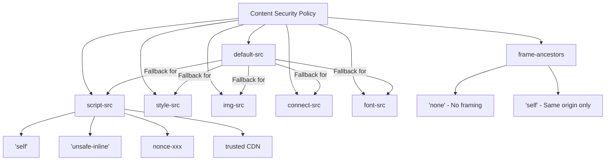
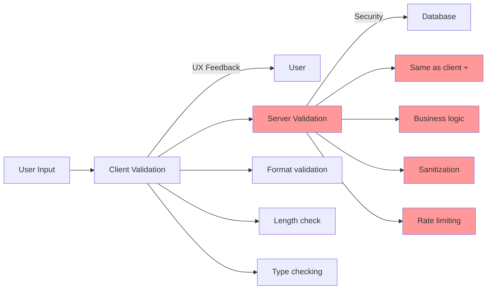
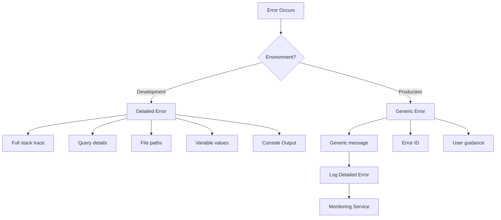

# Security Best Practices

## Q1: How do you implement Content Security Policy (CSP) effectively?

### Answer:
Content Security Policy (CSP) is a security layer that helps detect and mitigate certain types of attacks including XSS and data injection attacks. CSP works by defining approved sources of content that browsers should load, specified through HTTP headers or meta tags. An effective CSP implementation starts restrictive and gradually loosens as needed, uses nonces or hashes for inline scripts, and implements reporting to detect violations.

CSP is defense-in-depth - it doesn't replace input validation and output encoding, but adds another security layer. Start with a restrictive policy in report-only mode, analyze violations, adjust the policy, then enforce it in production.

### CSP Directive Hierarchy:



### Code Example - Progressive CSP Implementation:

```javascript
// Level 1: Restrictive CSP (Start here)
const strictCSP = {
  "default-src": ["'self'"],
  "script-src": ["'self'"],
  "style-src": ["'self'"],
  "img-src": ["'self'", "data:", "https:"],
  "font-src": ["'self'"],
  "connect-src": ["'self'"],
  "frame-ancestors": ["'none'"],
  "base-uri": ["'self'"],
  "form-action": ["'self'"]
};

// Level 2: Allow trusted CDNs
const cdnCSP = {
  ...strictCSP,
  "script-src": [
    "'self'",
    "https://cdn.jsdelivr.net",
    "https://unpkg.com"
  ],
  "style-src": [
    "'self'",
    "https://cdn.jsdelivr.net",
    "https://fonts.googleapis.com"
  ],
  "font-src": [
    "'self'",
    "https://fonts.gstatic.com"
  ]
};

// Level 3: Inline scripts with nonces (React/Next.js)
function generateCSPWithNonce(nonce) {
  return {
    "default-src": ["'self'"],
    "script-src": [
      "'self'",
      `'nonce-${nonce}'`,  // Allow scripts with this nonce
      "'strict-dynamic'"    // Trust scripts loaded by nonce
    ],
    "style-src": [
      "'self'",
      "'unsafe-inline'"  // Styles often need this
    ],
    "img-src": ["'self'", "data:", "https:"],
    "connect-src": ["'self'", "https://api.example.com"],
    "frame-ancestors": ["'none'"],
    "base-uri": ["'self'"],
    "form-action": ["'self'"],
    "upgrade-insecure-requests": []  // Upgrade HTTP to HTTPS
  };
}

// Express.js CSP implementation
const crypto = require('crypto');
const helmet = require('helmet');

app.use((req, res, next) => {
  // Generate nonce for this request
  res.locals.nonce = crypto.randomBytes(16).toString('base64');
  next();
});

app.use((req, res, next) => {
  const csp = generateCSPWithNonce(res.locals.nonce);

  helmet.contentSecurityPolicy({
    directives: csp,
    reportOnly: false  // Set to true for testing
  })(req, res, next);
});

// React component using nonce
function SecureApp({ nonce }) {
  return (
    <html>
      <head>
        <script nonce={nonce} src="/app.js" />
        <script nonce={nonce}>
          {`console.log('This inline script is allowed');`}
        </script>
      </head>
      <body>
        <div id="root"></div>
      </body>
    </html>
  );
}

// Next.js CSP implementation
// next.config.js
const crypto = require('crypto');

module.exports = {
  async headers() {
    // Generate hash for specific inline scripts
    const scriptHash = crypto
      .createHash('sha256')
      .update("console.log('Hello')")
      .digest('base64');

    return [
      {
        source: '/:path*',
        headers: [
          {
            key: 'Content-Security-Policy',
            value: [
              "default-src 'self'",
              `script-src 'self' 'sha256-${scriptHash}'`,
              "style-src 'self' 'unsafe-inline'",
              "img-src 'self' data: https:",
              "font-src 'self'",
              "connect-src 'self' https://api.example.com",
              "frame-ancestors 'none'",
              "base-uri 'self'",
              "form-action 'self'"
            ].join('; ')
          }
        ]
      }
    ];
  }
};

// CSP Violation Reporting
const cspWithReporting = {
  ...strictCSP,
  "report-uri": ["/api/csp-violation-report"],
  "report-to": ["csp-endpoint"]
};

// Report-To header configuration
const reportToHeader = JSON.stringify({
  group: "csp-endpoint",
  max_age: 10886400,
  endpoints: [{ url: "https://example.com/csp-reports" }]
});

// Handle CSP violation reports
app.post('/api/csp-violation-report', express.json(), (req, res) => {
  const violation = req.body['csp-report'];

  console.error('CSP Violation:', {
    documentURI: violation['document-uri'],
    violatedDirective: violation['violated-directive'],
    blockedURI: violation['blocked-uri'],
    sourceFile: violation['source-file'],
    lineNumber: violation['line-number']
  });

  // Log to monitoring service
  // logToSentry(violation);

  res.status(204).end();
});
```

### CSP Testing & Migration:

```javascript
// Step 1: Start with report-only mode
app.use(helmet.contentSecurityPolicy({
  directives: strictCSP,
  reportOnly: true  // Only report violations, don't block
}));

// Step 2: Collect violation reports (run for 1-2 weeks)
// Analyze: What's being blocked? Is it legitimate?

// Step 3: Adjust policy based on reports
const adjustedCSP = {
  ...strictCSP,
  // Add legitimate sources found in violation reports
  "script-src": ["'self'", "https://legitimate-cdn.com"],
  "style-src": ["'self'", "'unsafe-inline'"]  // If needed
};

// Step 4: Switch to enforcement mode
app.use(helmet.contentSecurityPolicy({
  directives: adjustedCSP,
  reportOnly: false  // Now enforce!
}));

// Step 5: Monitor ongoing violations
// Unexpected violations may indicate XSS attempts
```

### Key Points:
- Start restrictive (`default-src 'self'`) and loosen as needed
- Use nonces or hashes for inline scripts (avoid `'unsafe-inline'`)
- Implement CSP reporting to detect violations
- Use report-only mode first to test policy
- Set `frame-ancestors` to prevent clickjacking
- Include `upgrade-insecure-requests` to force HTTPS
- Test CSP with browser dev tools

### Common Pitfalls:
- Using `'unsafe-inline'` and `'unsafe-eval'` (defeats CSP purpose)
- Not implementing reporting (blind to violations)
- Making policy too permissive (allows attacks)
- Forgetting to update CSP when adding new resources
- Using deprecated `X-Content-Security-Policy` header

### Interview Tips:
- Explain CSP directive hierarchy (default-src as fallback)
- Discuss nonces vs hashes for inline scripts
- Mention report-only mode for testing
- Show awareness of strict-dynamic
- Explain how CSP mitigates XSS attacks
- Discuss CSP level 2 vs level 3 features

### Further Reading:
- [Content Security Policy Reference](https://content-security-policy.com/)
- [CSP Evaluator Tool](https://csp-evaluator.withgoogle.com/)
- [MDN CSP Documentation](https://developer.mozilla.org/en-US/docs/Web/HTTP/CSP)

---

## Q2: What are input validation best practices?

### Answer:
Input validation is the practice of ensuring that user-provided data meets expected criteria before processing. Proper validation prevents injection attacks, data corruption, and unexpected application behavior. The key principle is: **validate on both client and server**, with client-side for UX and server-side for security.

Validation should be whitelist-based (define what's allowed) rather than blacklist-based (define what's blocked), as blacklists can be bypassed. Validate data type, format, length, range, and business logic constraints.

### Validation Layers:



### Code Example - Comprehensive Validation:

```javascript
// Client-side validation (React)
import { z } from 'zod';

// Define validation schema with Zod
const userSchema = z.object({
  username: z.string()
    .min(3, 'Username must be at least 3 characters')
    .max(20, 'Username must be at most 20 characters')
    .regex(/^[a-zA-Z0-9_]+$/, 'Username can only contain letters, numbers, and underscores'),

  email: z.string()
    .email('Invalid email address')
    .max(255, 'Email must be at most 255 characters'),

  password: z.string()
    .min(12, 'Password must be at least 12 characters')
    .regex(/[A-Z]/, 'Password must contain at least one uppercase letter')
    .regex(/[a-z]/, 'Password must contain at least one lowercase letter')
    .regex(/[0-9]/, 'Password must contain at least one number')
    .regex(/[!@#$%^&*]/, 'Password must contain at least one special character'),

  age: z.number()
    .int('Age must be an integer')
    .min(13, 'Must be at least 13 years old')
    .max(120, 'Invalid age'),

  website: z.string()
    .url('Invalid URL')
    .optional(),

  phoneNumber: z.string()
    .regex(/^\+?[1-9]\d{1,14}$/, 'Invalid phone number format')
    .optional()
});

function RegistrationForm() {
  const [formData, setFormData] = useState({
    username: '',
    email: '',
    password: '',
    age: '',
    website: '',
    phoneNumber: ''
  });

  const [errors, setErrors] = useState({});

  const handleSubmit = async (e) => {
    e.preventDefault();

    try {
      // Client-side validation
      const validatedData = userSchema.parse({
        ...formData,
        age: parseInt(formData.age)
      });

      // Clear errors
      setErrors({});

      // Submit to server
      const response = await fetch('/api/register', {
        method: 'POST',
        headers: { 'Content-Type': 'application/json' },
        body: JSON.stringify(validatedData)
      });

      if (!response.ok) {
        const serverErrors = await response.json();
        setErrors(serverErrors);
      }

    } catch (error) {
      if (error instanceof z.ZodError) {
        // Convert Zod errors to form errors
        const formErrors = {};
        error.errors.forEach(err => {
          formErrors[err.path[0]] = err.message;
        });
        setErrors(formErrors);
      }
    }
  };

  return (
    <form onSubmit={handleSubmit}>
      <input
        type="text"
        value={formData.username}
        onChange={(e) => setFormData({ ...formData, username: e.target.value })}
        placeholder="Username"
      />
      {errors.username && <span className="error">{errors.username}</span>}

      {/* More form fields... */}
    </form>
  );
}

// Server-side validation (Express + Joi)
const Joi = require('joi');

const userValidationSchema = Joi.object({
  username: Joi.string()
    .alphanum()
    .min(3)
    .max(20)
    .required(),

  email: Joi.string()
    .email()
    .max(255)
    .required(),

  password: Joi.string()
    .min(12)
    .pattern(/^(?=.*[a-z])(?=.*[A-Z])(?=.*\d)(?=.*[!@#$%^&*])[A-Za-z\d!@#$%^&*]{12,}$/)
    .required(),

  age: Joi.number()
    .integer()
    .min(13)
    .max(120)
    .required(),

  website: Joi.string()
    .uri()
    .optional(),

  phoneNumber: Joi.string()
    .pattern(/^\+?[1-9]\d{1,14}$/)
    .optional()
});

app.post('/api/register', async (req, res) => {
  try {
    // Server-side validation (CRITICAL - never skip!)
    const { error, value } = userValidationSchema.validate(req.body, {
      abortEarly: false  // Return all errors, not just first
    });

    if (error) {
      const errors = {};
      error.details.forEach(detail => {
        errors[detail.path[0]] = detail.message;
      });

      return res.status(400).json(errors);
    }

    // Additional business logic validation
    const existingUser = await User.findOne({ email: value.email });
    if (existingUser) {
      return res.status(400).json({ email: 'Email already registered' });
    }

    // Sanitize data (remove any unexpected fields)
    const sanitizedData = {
      username: value.username,
      email: value.email.toLowerCase(),  // Normalize
      password: await bcrypt.hash(value.password, 10),  // Hash password
      age: value.age,
      website: value.website,
      phoneNumber: value.phoneNumber
    };

    // Create user
    const user = await User.create(sanitizedData);

    res.status(201).json({ success: true, userId: user.id });

  } catch (err) {
    console.error(err);
    res.status(500).json({ error: 'Internal server error' });
  }
});
```

### Whitelist vs Blacklist:

```javascript
// BAD - Blacklist approach (can be bypassed)
function validateUsername(username) {
  const blocked = ['<', '>', '&', '"', "'", ';', '--'];
  for (const char of blocked) {
    if (username.includes(char)) {
      return false;
    }
  }
  return true;
}
// Problem: Attackers find new characters to exploit

// GOOD - Whitelist approach (only allow expected)
function validateUsernameWhitelist(username) {
  const allowedPattern = /^[a-zA-Z0-9_-]{3,20}$/;
  return allowedPattern.test(username);
}
// Only allows: letters, numbers, underscore, hyphen, 3-20 chars

// File upload validation - Whitelist approach
const ALLOWED_MIME_TYPES = [
  'image/jpeg',
  'image/png',
  'image/webp',
  'application/pdf'
];

const ALLOWED_EXTENSIONS = ['.jpg', '.jpeg', '.png', '.webp', '.pdf'];

function validateFileUpload(file) {
  // Check MIME type (whitelist)
  if (!ALLOWED_MIME_TYPES.includes(file.mimetype)) {
    throw new Error('Invalid file type');
  }

  // Check extension (whitelist)
  const ext = path.extname(file.originalname).toLowerCase();
  if (!ALLOWED_EXTENSIONS.includes(ext)) {
    throw new Error('Invalid file extension');
  }

  // Check file size
  const MAX_SIZE = 5 * 1024 * 1024; // 5MB
  if (file.size > MAX_SIZE) {
    throw new Error('File too large');
  }

  // Verify file content matches extension
  // (prevent .exe renamed to .jpg)
  const fileSignature = file.buffer.slice(0, 4).toString('hex');
  const validSignatures = {
    'ffd8ffe0': '.jpg',
    'ffd8ffe1': '.jpg',
    '89504e47': '.png',
    '25504446': '.pdf'
  };

  if (!validSignatures[fileSignature]) {
    throw new Error('File signature does not match extension');
  }

  return true;
}
```

### Validation Utilities:

```javascript
// Comprehensive validation library
class Validator {
  static isEmail(email) {
    const regex = /^[^\s@]+@[^\s@]+\.[^\s@]+$/;
    return regex.test(email);
  }

  static isURL(url) {
    try {
      new URL(url);
      return true;
    } catch {
      return false;
    }
  }

  static isPhoneNumber(phone) {
    // E.164 format
    const regex = /^\+?[1-9]\d{1,14}$/;
    return regex.test(phone);
  }

  static isCreditCard(cc) {
    // Luhn algorithm
    const digits = cc.replace(/\D/g, '');
    let sum = 0;
    let isEven = false;

    for (let i = digits.length - 1; i >= 0; i--) {
      let digit = parseInt(digits[i]);

      if (isEven) {
        digit *= 2;
        if (digit > 9) digit -= 9;
      }

      sum += digit;
      isEven = !isEven;
    }

    return sum % 10 === 0;
  }

  static isStrongPassword(password) {
    return (
      password.length >= 12 &&
      /[A-Z]/.test(password) &&
      /[a-z]/.test(password) &&
      /[0-9]/.test(password) &&
      /[!@#$%^&*]/.test(password)
    );
  }

  static sanitizeHTML(html) {
    // Remove all HTML tags
    return html.replace(/<[^>]*>/g, '');
  }

  static sanitizeSQLString(str) {
    // Escape single quotes
    return str.replace(/'/g, "''");
  }

  static sanitizeFilename(filename) {
    // Remove directory traversal attempts
    return filename.replace(/[^a-zA-Z0-9._-]/g, '_');
  }

  static isWithinRange(value, min, max) {
    return value >= min && value <= max;
  }

  static hasValidLength(str, min, max) {
    return str.length >= min && str.length <= max;
  }
}

// Usage
if (!Validator.isEmail(email)) {
  throw new Error('Invalid email');
}

if (!Validator.isStrongPassword(password)) {
  throw new Error('Weak password');
}

const safeFilename = Validator.sanitizeFilename(userFilename);
```

### Key Points:
- **Always validate on both client and server** (client for UX, server for security)
- **Whitelist > Blacklist** (define what's allowed, not what's blocked)
- **Validate type, format, length, range** comprehensively
- **Sanitize after validation** (remove/escape dangerous characters)
- **Use validation libraries** (Zod, Joi, Yup) for consistency
- **Check file uploads** thoroughly (MIME type, extension, signature, size)
- **Validate business logic** (uniqueness, authorization, state transitions)

### Common Pitfalls:
- Client-side validation only (security vulnerability)
- Blacklist approach (easy to bypass)
- Not validating length (buffer overflow, DOS)
- Not checking file signatures (spoofed extensions)
- Trusting Content-Type header (can be forged)
- Not sanitizing after validation
- Inconsistent validation between client and server

### Interview Tips:
- Emphasize server-side validation is mandatory
- Discuss whitelist vs blacklist trade-offs
- Mention specific validation libraries (Zod, Joi)
- Explain file upload security (MIME type vs signature)
- Show awareness of business logic validation
- Discuss regex for format validation

### Further Reading:
- [OWASP Input Validation Cheat Sheet](https://cheatsheetseries.owasp.org/cheatsheets/Input_Validation_Cheat_Sheet.html)
- [Zod Documentation](https://zod.dev/)
- [Joi Documentation](https://joi.dev/)

---

## Q3: What are secure coding patterns for error handling?

### Answer:
Secure error handling prevents information disclosure while maintaining good user experience and debuggability. The principle is: **generic errors for users, detailed errors for developers**. Expose minimal information in production error messages, log detailed errors server-side, and never expose stack traces, database queries, or internal paths to users.

Error handling must balance security (don't reveal system details), usability (help users understand what went wrong), and debuggability (help developers fix issues). Implement different error strategies for development vs production environments.

### Error Handling Architecture:



### Code Example - Secure Error Handling:

```javascript
// Express.js error handling middleware
const isDevelopment = process.env.NODE_ENV === 'development';

// Custom error class
class AppError extends Error {
  constructor(message, statusCode, isOperational = true) {
    super(message);
    this.statusCode = statusCode;
    this.isOperational = isOperational;  // Expected errors vs bugs
    this.errorId = require('crypto').randomUUID();
    this.timestamp = new Date().toISOString();

    Error.captureStackTrace(this, this.constructor);
  }
}

// Error handler middleware (must be last!)
app.use((err, req, res, next) => {
  err.statusCode = err.statusCode || 500;
  err.status = err.status || 'error';

  if (isDevelopment) {
    // Development: Show everything
    return res.status(err.statusCode).json({
      status: err.status,
      error: err,
      message: err.message,
      stack: err.stack,
      errorId: err.errorId
    });
  }

  // Production: Hide details
  if (err.isOperational) {
    // Operational errors (expected): safe to show message
    return res.status(err.statusCode).json({
      status: 'error',
      message: err.message,
      errorId: err.errorId  // For support/debugging
    });
  }

  // Programming errors (bugs): don't expose details
  console.error('UNEXPECTED ERROR:', err);

  // Log to monitoring service
  logErrorToMonitoring(err, req);

  return res.status(500).json({
    status: 'error',
    message: 'Something went wrong. Please try again later.',
    errorId: err.errorId
  });
});

// Async error wrapper
const catchAsync = (fn) => {
  return (req, res, next) => {
    fn(req, res, next).catch(next);
  };
};

// Usage
app.post('/api/users', catchAsync(async (req, res) => {
  const user = await User.findById(req.body.userId);

  if (!user) {
    // Operational error - safe to expose
    throw new AppError('User not found', 404);
  }

  if (!user.isActive) {
    // Operational error - safe to expose
    throw new AppError('User account is deactivated', 403);
  }

  // ... rest of logic
}));

// Safe error messages
const ERROR_MESSAGES = {
  // Good - Generic but helpful
  INVALID_CREDENTIALS: 'Invalid email or password',
  UNAUTHORIZED: 'You are not authorized to perform this action',
  NOT_FOUND: 'The requested resource was not found',
  SERVER_ERROR: 'Something went wrong. Please try again later.',

  // Bad - Reveals too much information
  // USER_NOT_FOUND: 'No user with email john@example.com found in database',
  // QUERY_FAILED: 'SELECT * FROM users WHERE email = ? failed: syntax error',
  // FILE_ERROR: '/var/www/app/uploads/user-files/secret.txt not found'
};

// Frontend error handling (React)
function SecureErrorBoundary({ children }) {
  const [hasError, setHasError] = useState(false);
  const [errorId, setErrorId] = useState(null);

  useEffect(() => {
    const handleError = (error, errorInfo) => {
      const id = generateErrorId();
      setErrorId(id);

      // Log to monitoring service
      if (process.env.NODE_ENV === 'production') {
        logErrorToSentry(error, errorInfo, id);
      } else {
        console.error('Error:', error, errorInfo);
      }

      setHasError(true);
    };

    window.addEventListener('error', handleError);
    return () => window.removeEventListener('error', handleError);
  }, []);

  if (hasError) {
    return (
      <div className="error-container">
        <h1>Something went wrong</h1>
        <p>We're working to fix the issue. Please try again later.</p>
        {errorId && (
          <p className="error-id">
            Error ID: <code>{errorId}</code>
            <br />
            <small>Please include this ID when contacting support.</small>
          </p>
        )}
        <button onClick={() => window.location.reload()}>
          Reload Page
        </button>
      </div>
    );
  }

  return children;
}

// API error handling
async function secureApiCall(url, options) {
  try {
    const response = await fetch(url, options);

    if (!response.ok) {
      const error = await response.json();

      // Display user-friendly error
      if (error.errorId) {
        throw new Error(`${error.message} (Error ID: ${error.errorId})`);
      }

      throw new Error(error.message || 'Request failed');
    }

    return await response.json();

  } catch (error) {
    // Never expose network errors directly
    if (error.message.includes('fetch')) {
      throw new Error('Unable to connect. Please check your internet connection.');
    }

    if (error.message.includes('timeout')) {
      throw new Error('Request timed out. Please try again.');
    }

    // Re-throw application errors
    throw error;
  }
}
```

### Error Logging Strategy:

```javascript
// Structured error logging
class ErrorLogger {
  static log(error, context = {}) {
    const logEntry = {
      timestamp: new Date().toISOString(),
      errorId: error.errorId || generateErrorId(),
      message: error.message,
      stack: error.stack,
      statusCode: error.statusCode,
      isOperational: error.isOperational,
      context: {
        url: context.url,
        method: context.method,
        userId: context.userId,
        ip: context.ip,
        userAgent: context.userAgent
      },
      environment: process.env.NODE_ENV
    };

    // Don't log sensitive data!
    if (context.body) {
      logEntry.context.body = this.sanitizeBody(context.body);
    }

    // Log to appropriate service
    if (process.env.NODE_ENV === 'production') {
      // Send to logging service (Sentry, DataDog, etc.)
      this.sendToMonitoring(logEntry);
    } else {
      // Development: console
      console.error(logEntry);
    }

    return logEntry.errorId;
  }

  static sanitizeBody(body) {
    // Remove sensitive fields before logging
    const sanitized = { ...body };
    const sensitiveFields = ['password', 'token', 'secret', 'apiKey', 'creditCard', 'ssn'];

    sensitiveFields.forEach(field => {
      if (sanitized[field]) {
        sanitized[field] = '[REDACTED]';
      }
    });

    return sanitized;
  }

  static sendToMonitoring(logEntry) {
    // Integration with Sentry, DataDog, etc.
    if (typeof Sentry !== 'undefined') {
      Sentry.captureException(new Error(logEntry.message), {
        extra: logEntry
      });
    }
  }
}

// Usage in middleware
app.use((err, req, res, next) => {
  const errorId = ErrorLogger.log(err, {
    url: req.url,
    method: req.method,
    userId: req.user?.id,
    ip: req.ip,
    userAgent: req.get('user-agent'),
    body: req.body
  });

  // Send error ID to client
  res.status(err.statusCode || 500).json({
    status: 'error',
    message: err.isOperational ? err.message : 'Internal server error',
    errorId
  });
});
```

### Validation Error Handling:

```javascript
// Good - Specific validation errors are safe
app.post('/api/register', async (req, res) => {
  const { error, value } = userSchema.validate(req.body);

  if (error) {
    // Safe to expose validation errors
    return res.status(400).json({
      status: 'fail',
      errors: error.details.map(detail => ({
        field: detail.path[0],
        message: detail.message
      }))
    });
  }

  // ... proceed
});

// Bad - Database errors expose too much
app.post('/api/register', async (req, res) => {
  try {
    const user = await User.create(req.body);
    res.json(user);
  } catch (error) {
    // DON'T DO THIS - exposes database structure!
    res.status(500).json({
      error: error.message
      // "duplicate key error on users.email"
    });
  }
});

// Good - Generic database errors
app.post('/api/register', async (req, res) => {
  try {
    const user = await User.create(req.body);
    res.json(user);
  } catch (error) {
    // Check for known database errors
    if (error.code === 11000) {  // MongoDB duplicate key
      return res.status(400).json({
        status: 'fail',
        message: 'Email already registered'
      });
    }

    // Log actual error for debugging
    console.error('Registration error:', error);

    // Generic error to user
    res.status(500).json({
      status: 'error',
      message: 'Registration failed. Please try again.'
    });
  }
});
```

### Key Points:
- **Different errors for dev vs production** (detailed vs generic)
- **Never expose**: stack traces, database queries, file paths, internal IPs
- **Generate error IDs** for support/debugging
- **Log detailed errors server-side** with context
- **Sanitize logs** (remove passwords, tokens, PII)
- **Provide user guidance** (what went wrong, what to do)
- **Use operational vs programmer error distinction**

### Common Pitfalls:
- Exposing stack traces in production
- Revealing database structure in error messages
- Logging passwords or tokens
- Generic "Error 500" with no context
- Inconsistent error formats across API
- Not providing error IDs for support
- Exposing file system paths

### Interview Tips:
- Discuss development vs production error handling
- Explain information disclosure risks
- Mention error logging and monitoring
- Show awareness of sensitive data in logs
- Discuss user-friendly error messages
- Explain error ID pattern for support

### Further Reading:
- [OWASP Error Handling Cheat Sheet](https://cheatsheetseries.owasp.org/cheatsheets/Error_Handling_Cheat_Sheet.html)
- [Node.js Error Handling Best Practices](https://www.joyent.com/node-js/production/design/errors)
- [Sentry Error Monitoring](https://sentry.io/)
