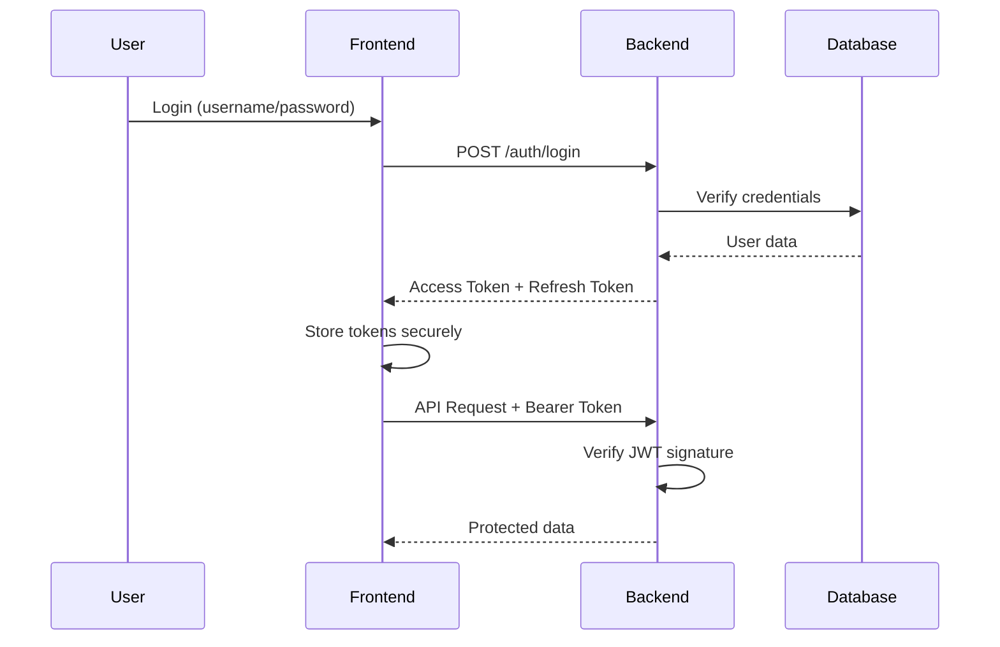
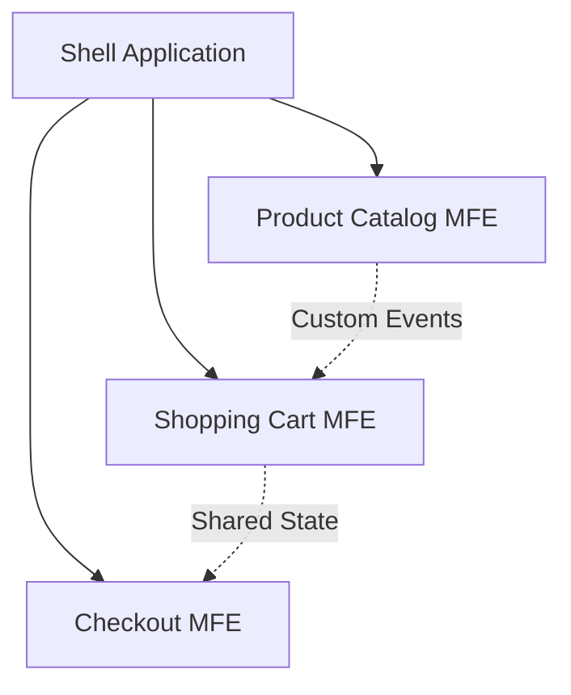

# Security & Micro Frontend Topics - Design Document

**Date:** 2025-12-15
**Status:** Approved
**Topics:** Security (with JWT), Micro Frontend

## Overview

Add two comprehensive interview preparation topics to the documentation site:
1. **Security** - Frontend security covering JWT authentication, XSS/CSRF, secure data handling, HTTPS/CORS, vulnerabilities, and best practices
2. **Micro Frontend** - Architecture patterns, module federation, routing, state management, deployment, and communication

## Requirements

### Content Specifications
- **Format:** Interview Q&A style
- **Scope:** 25-30 Q&A per topic
- **Structure:** 7 files per topic (introduction + 6 subtopic files)
- **Features:** Code snippets, Mermaid diagrams, visual aids, external links
- **i18n:** Full Vietnamese translations

### Technical Requirements
- Follow existing Docusaurus structure
- Use autogenerated sidebar
- Support both English and Vietnamese (i18n)
- Include syntax-highlighted code examples
- Use Mermaid for flow diagrams

## Architecture

### Directory Structure

```
docs/
├── Security/
│   ├── _category_.json
│   ├── introduction.md
│   ├── authentication-jwt.md
│   ├── xss-csrf-protection.md
│   ├── secure-data-handling.md
│   ├── https-cors.md
│   ├── common-vulnerabilities.md
│   └── security-best-practices.md
│
└── MicroFrontend/
    ├── _category_.json
    ├── introduction.md
    ├── architecture-patterns.md
    ├── module-federation.md
    ├── routing-navigation.md
    ├── state-management.md
    ├── deployment-strategies.md
    └── communication-patterns.md

i18n/vi/docusaurus-plugin-content-docs/current/
├── Security/
│   ├── _category_.json
│   └── [same files as English, translated]
└── MicroFrontend/
    ├── _category_.json
    └── [same files as English, translated]
```

### Q&A Distribution

#### Security Topic (25-30 Q&A)
- `introduction.md` - Overview, learning path
- `authentication-jwt.md` - 6-8 Q&A (JWT basics, implementation, token handling, refresh tokens, security)
- `xss-csrf-protection.md` - 5-6 Q&A (Cross-Site Scripting, CSRF attacks, prevention techniques)
- `secure-data-handling.md` - 4-5 Q&A (localStorage, cookies, sessionStorage, sensitive data)
- `https-cors.md` - 3-4 Q&A (HTTPS, CORS policies, secure communication)
- `common-vulnerabilities.md` - 4-5 Q&A (OWASP Top 10 frontend-specific vulnerabilities)
- `security-best-practices.md` - 3-4 Q&A (CSP, input validation, secure coding patterns)

#### Micro Frontend Topic (25-30 Q&A)
- `introduction.md` - Overview, when to use micro frontends
- `architecture-patterns.md` - 4-5 Q&A (Build-time vs runtime integration, iframe approach, web components)
- `module-federation.md` - 5-6 Q&A (Webpack Module Federation, shared dependencies, versioning)
- `routing-navigation.md` - 4-5 Q&A (Routing strategies, navigation between micro frontends)
- `state-management.md` - 4-5 Q&A (Shared state, communication, event bus patterns)
- `deployment-strategies.md` - 4-5 Q&A (Independent deployment, versioning, rollback strategies)
- `communication-patterns.md` - 4-5 Q&A (Custom events, shared state, pub/sub, messaging)

## Content Format

### Standard Q&A Template

```markdown
## Q[number]: [Question title]

### Answer:
[Clear, concise answer with key concepts - 2-3 paragraphs]

### Code Example:
```javascript
// Practical implementation example
// Well-commented, production-ready code
```

### Key Points:
- Critical concept 1
- Critical concept 2
- Critical concept 3

### Common Pitfalls:
- What to avoid and why
- Common mistakes developers make

### Interview Tips:
- How to answer effectively in interviews
- What interviewers are looking for
- Key points to emphasize

### Further Reading:
- [Official documentation](url)
- [Relevant article](url)
```

### Example Q&A

```markdown
## Q3: How do you implement JWT authentication in a React application?

### Answer:
JWT authentication in React involves storing tokens securely, sending them with API requests, and handling token refresh. The typical flow includes login (receive token), storage (httpOnly cookies or memory), automatic inclusion in requests (axios interceptor), and refresh logic before expiration.

The most critical decision is where to store the token. While localStorage is convenient, it's vulnerable to XSS attacks. For sensitive applications, use httpOnly cookies (immune to XSS) or keep tokens in memory with proper refresh mechanisms.

### Code Example:
```javascript
// Token interceptor with axios
import axios from 'axios';

const api = axios.create({
  baseURL: 'https://api.example.com'
});

// Automatically attach token to all requests
api.interceptors.request.use(
  (config) => {
    const token = getAccessToken(); // From secure storage
    if (token) {
      config.headers.Authorization = `Bearer ${token}`;
    }
    return config;
  },
  (error) => Promise.reject(error)
);

// Handle token expiration
api.interceptors.response.use(
  (response) => response,
  async (error) => {
    if (error.response?.status === 401) {
      // Token expired, attempt refresh
      const newToken = await refreshAccessToken();
      if (newToken) {
        error.config.headers.Authorization = `Bearer ${newToken}`;
        return axios.request(error.config);
      }
    }
    return Promise.reject(error);
  }
);
```

### Key Points:
- Never store tokens in localStorage for sensitive apps (use httpOnly cookies)
- Implement automatic token refresh before expiration
- Clear tokens on logout and handle 401 responses properly
- Use interceptors to centralize token management
- Validate JWT on the backend, never trust client-side validation

### Common Pitfalls:
- Storing sensitive tokens in localStorage (vulnerable to XSS)
- Not implementing token refresh (poor UX when token expires)
- Forgetting to clear tokens on logout
- Not handling token expiration gracefully
- Trusting JWT payload without backend validation

### Interview Tips:
- Mention security trade-offs (localStorage vs cookies vs memory)
- Discuss token expiration and refresh strategies
- Show awareness of XSS and CSRF protection
- Explain the difference between access tokens and refresh tokens
- Demonstrate knowledge of httpOnly and secure cookie flags

### Further Reading:
- [JWT.io - Introduction](https://jwt.io/introduction)
- [OWASP JWT Cheat Sheet](https://cheatsheetseries.owasp.org/cheatsheets/JSON_Web_Token_for_Java_Cheat_Sheet.html)
- [Where to Store JWT in Browser](https://stormpath.com/blog/where-to-store-your-jwts-cookies-vs-html5-web-storage)
```

## Visual Aids Strategy

### Mermaid Diagrams

Use Mermaid for flow diagrams, sequence diagrams, and architecture:

**Example - JWT Authentication Flow:**


**Example - Micro Frontend Architecture:**


### Diagram Distribution
- **Security:** ~5-7 diagrams
  - JWT authentication flow
  - XSS attack vector
  - CSRF attack & prevention
  - CORS flow
  - Secure storage comparison

- **Micro Frontend:** ~6-8 diagrams
  - Architecture patterns comparison
  - Module Federation setup
  - Routing flow
  - Communication patterns
  - Deployment pipeline

### Static Images
Store complex architecture diagrams in:
- `static/img/security/`
- `static/img/microfrontend/`

## Internationalization (i18n)

### Translation Strategy

**File structure mirrors English exactly:**
```
i18n/vi/docusaurus-plugin-content-docs/current/Security/
i18n/vi/docusaurus-plugin-content-docs/current/MicroFrontend/
```

**Translation guidelines:**
1. Translate all Q&A questions and answers
2. Code examples stay in English with Vietnamese comments
3. Technical terms: Vietnamese with English in parentheses on first use
   - Example: "Mã thông báo truy cập (Access Token)"
4. External links: Keep URLs, translate descriptions

**Example Vietnamese Q&A:**

```markdown
## C3: Làm thế nào để triển khai xác thực JWT trong ứng dụng React?

### Câu trả lời:
Xác thực JWT trong React bao gồm lưu trữ token an toàn, gửi chúng với các API requests, và xử lý làm mới token. Luồng điển hình bao gồm đăng nhập (nhận token), lưu trữ (httpOnly cookies hoặc bộ nhớ), tự động thêm vào requests (axios interceptor), và logic làm mới trước khi hết hạn.

### Ví dụ Code:
```javascript
// Token interceptor với axios
// Tự động đính kèm token vào tất cả requests
api.interceptors.request.use(
  (config) => {
    const token = getAccessToken(); // Từ storage an toàn
    if (token) {
      config.headers.Authorization = `Bearer ${token}`;
    }
    return config;
  }
);
```

### Điểm chính:
- Không bao giờ lưu token trong localStorage cho ứng dụng nhạy cảm
- Triển khai tự động làm mới token trước khi hết hạn
- Xóa tokens khi logout và xử lý 401 responses đúng cách
```

## Category Configuration

### Security Category

**English** (`docs/Security/_category_.json`):
```json
{
  "label": "Security",
  "position": 7,
  "link": {
    "type": "generated-index",
    "description": "Master frontend security interview questions covering JWT authentication, XSS/CSRF protection, secure data handling, HTTPS/CORS, and security best practices."
  }
}
```

**Vietnamese** (`i18n/vi/docusaurus-plugin-content-docs/current/Security/_category_.json`):
```json
{
  "label": "Bảo mật",
  "link": {
    "description": "Nắm vững các câu hỏi phỏng vấn về bảo mật frontend bao gồm xác thực JWT, bảo vệ XSS/CSRF, xử lý dữ liệu an toàn, HTTPS/CORS, và các phương pháp bảo mật tốt nhất."
  }
}
```

### Micro Frontend Category

**English** (`docs/MicroFrontend/_category_.json`):
```json
{
  "label": "Micro Frontend",
  "position": 8,
  "link": {
    "type": "generated-index",
    "description": "Master micro frontend architecture patterns, module federation, routing strategies, state management, and deployment approaches for scalable web applications."
  }
}
```

**Vietnamese** (`i18n/vi/docusaurus-plugin-content-docs/current/MicroFrontend/_category_.json`):
```json
{
  "label": "Micro Frontend",
  "link": {
    "description": "Nắm vững các mẫu kiến trúc micro frontend, module federation, chiến lược routing, quản lý state, và cách triển khai cho ứng dụng web có khả năng mở rộng."
  }
}
```

## File Naming Conventions

- Use kebab-case for all files: `authentication-jwt.md`, `xss-csrf-protection.md`
- Use `sidebar_position` in frontmatter to control order
- `introduction.md` always at position 1

**Frontmatter example:**
```markdown
---
sidebar_position: 2
---

# Authentication & JWT
```

## Implementation Phases

### Phase 1: Security Topic - English Content
1. Create directory structure
2. Write _category_.json
3. Create all 7 markdown files
4. Write 25-30 Q&A with code examples
5. Add Mermaid diagrams
6. Review and test locally

### Phase 2: Micro Frontend Topic - English Content
1. Create directory structure
2. Write _category_.json
3. Create all 7 markdown files
4. Write 25-30 Q&A with code examples
5. Add Mermaid diagrams
6. Review and test locally

### Phase 3: Vietnamese Translations - Security
1. Create i18n directory structure
2. Translate _category_.json
3. Translate all 7 markdown files
4. Add Vietnamese comments to code examples
5. Review translations

### Phase 4: Vietnamese Translations - Micro Frontend
1. Create i18n directory structure
2. Translate _category_.json
3. Translate all 7 markdown files
4. Add Vietnamese comments to code examples
5. Review translations

### Phase 5: Testing & Quality Assurance
1. Test English version navigation
2. Test Vietnamese version navigation
3. Verify all links work
4. Verify all diagrams render
5. Test code syntax highlighting
6. Mobile responsiveness check

## Success Criteria

- [ ] Two new topics visible in sidebar (Security, Micro Frontend)
- [ ] 25-30 Q&A per topic with comprehensive answers
- [ ] All code examples syntax-highlighted and functional
- [ ] 5-8 diagrams per topic rendering correctly
- [ ] Full Vietnamese translations available
- [ ] All external links working
- [ ] Consistent formatting across all files
- [ ] Mobile-responsive layout
- [ ] Search functionality includes new content
- [ ] Build completes without errors

## Technical Considerations

### Security Topic - Key Content Areas
1. **JWT Authentication:** Token structure, signing algorithms, storage options, refresh mechanisms
2. **XSS Protection:** Input sanitization, Content Security Policy, escape output
3. **CSRF Protection:** CSRF tokens, SameSite cookies, double-submit cookies
4. **Secure Data Handling:** localStorage vs sessionStorage vs cookies vs memory
5. **HTTPS/CORS:** SSL/TLS, CORS policies, preflight requests
6. **Common Vulnerabilities:** OWASP Top 10 frontend-specific
7. **Best Practices:** CSP headers, input validation, secure coding patterns

### Micro Frontend Topic - Key Content Areas
1. **Architecture Patterns:** Build-time vs runtime integration, iframe, web components, JavaScript-based
2. **Module Federation:** Webpack 5 Module Federation, shared dependencies, remote modules
3. **Routing:** Shell-based routing, app-level routing, hash vs history mode
4. **State Management:** Isolated state, shared state, communication patterns
5. **Deployment:** Independent deployment, versioning strategies, canary releases
6. **Communication:** Custom events, event bus, shared state management, pub/sub patterns
7. **Performance:** Code splitting, lazy loading, bundle optimization

## Resources for Content Creation

### Security Resources
- [OWASP Top 10](https://owasp.org/www-project-top-ten/)
- [MDN Web Security](https://developer.mozilla.org/en-US/docs/Web/Security)
- [JWT.io](https://jwt.io/)
- [Web Security Academy](https://portswigger.net/web-security)

### Micro Frontend Resources
- [Micro Frontends - Martin Fowler](https://martinfowler.com/articles/micro-frontends.html)
- [Webpack Module Federation](https://webpack.js.org/concepts/module-federation/)
- [Single-SPA Documentation](https://single-spa.js.org/)
- [Micro Frontend Architecture](https://micro-frontends.org/)

## Notes

- Prioritize frontend-specific security content over backend security
- JWT integrated into Security topic (not separate) to avoid redundancy
- Focus on practical, interview-ready answers with real-world examples
- Include "what interviewers look for" in each Q&A
- Balance theory with practical implementation
- Use production-ready code examples, not just snippets
